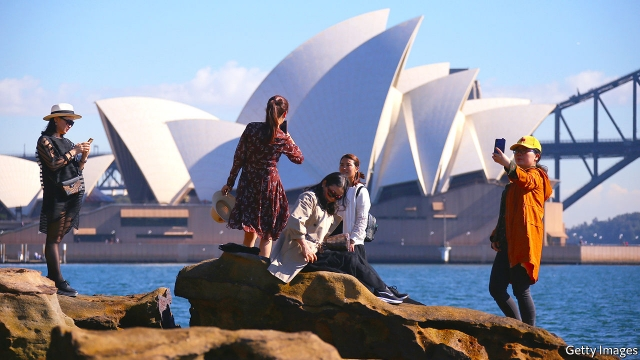
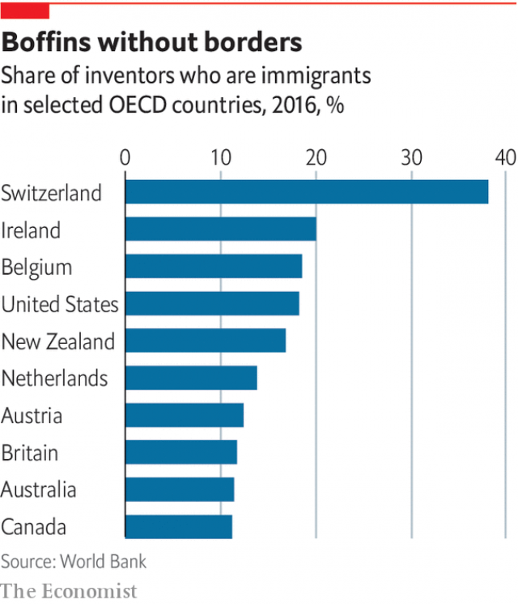

###### Skilled migrants

# How migration makes the world brainier 

 

> print-edition iconPrint edition | Special report | Nov 14th 2019 

MIGRATION SPREADS ideas. Often, good ones. Sometimes as simple as warm cassava buns stuffed with cheese. 

Cristina Talacko moved to Australia because she married an Australian. Her foreign law degrees did not allow her to practise there so she started her own business. She noticed that her friends loved it when she served pão de queijo, a light, fluffy, buttery snack from her native Brazil. So she went back to Brazil and studied how to make the buns in bulk. She could not find the right machinery in Australia, so she imported it from Brazil and started selling what for Aussies was a novel (and gluten-free) treat. Business boomed. Now Ms Talacko exports tasty tucker to 25 countries. 

Everywhere, immigrants are likelier than the native-born to start their own business. People who pack up and fly thousands of miles to start a new life obviously have get-up-and-go. Also, many countries do not recognise foreign qualifications, as Ms Talacko found, so migrants often become entrepreneurs. A survey in 2015 found that the most common surnames for founders of new firms in Italy were Hu, Chen and Singh, with Rossi a distant fourth. 

The benefit for the host country is more than monetary. Yes, Ms Talacko employs Australians and pays a lot of tax. But she has also added a new snack to the Australian menu, making life down under just a tiny bit more joyful. 

Fully 29% of Australia’s population was born abroad. That is twice the proportion in the United States, the world’s best-known nation of immigrants. Until 1973, under what was known as the “white Australia” policy, immigration was largely restricted to people of European origin. Since then, the policy has been colour-blind and unusually welcoming, yet also ruthlessly selective. 

Applicants for “skilled independent” visas are given points for such things as education, work experience, English proficiency and, crucially, age. The ideal age is 25-32, when would-be migrants have finished college (possibly at another country’s expense) and have their whole working life ahead of them. The applicants with the most points are given permanent residency without even needing a job offer. Some say it would be better to give employers more say, but the system works well enough. 

Australia’s annual intake of permanent migrants has risen since the 1980s, from 69,000 in 1984-85 (including 14,000 refugees) to around 200,000 from 2011 to 2018 (including 10,000-20,000 refugees). In addition, the number of foreign students at Australian universities doubled, to 400,000, between 2008 and 2018, making higher education the country’s third-largest export. 

Oz has been transformed. Big cities are now conspicuously multi-ethnic. In Bankstown, a suburb of Sydney, Lebanese restaurants vie for space with Vietnamese money-transfer shops; 32,000 residents speak more than 60 languages at home. The inflow of brains from all around the world has made Australia richer and more dynamic. Since 1973 its population has doubled; its economy has grown 21-fold. The country has enjoyed 28 years of unbroken economic growth. 

Nearly two-thirds of skilled migrants move to America, Britain, Canada and Australia 

Australia exemplifies several trends. First, as an exceptionally desirable destination, it can recruit exceptional immigrants. It takes recruiting very seriously. Globally, the most skilled migrants are the most mobile. They face fewer barriers, because more places want them. They also travel farther. Whereas 80% of refugees and 50% of low-skilled migrants move to a neighbouring country, only 20% of highly skilled migrants do. Half of them travel more than 4,000km. 

They cluster in a few superstar destinations. Three-quarters of skilled migrants go to the ten most popular countries, and nearly two-thirds move to just four: America, Britain, Canada and Australia (see chart). All four are rich, English-speaking and have top-notch universities—a crucial draw. Three were founded on the notion that immigrants could go there and create a new life; the other, Britain, has a long, if chequered, tradition of cosmopolitan tolerance. Immigrants know they can become American, Canadian, Australian or British. Few imagine that they can become Chinese or Japanese, and becoming German is not easy either. 

 

Within the superstar destination countries, migrants head for a few megastar cities. There are more foreign-born residents in Melbourne or Los Angeles than in the whole of mainland China. The proportions of foreign-born in Toronto, Sydney, New York and London are 46%, 45%, 38% and 38% respectively. 

In these cities, brainy people from all around the world come together and bounce ideas off each other. Silicon Valley could not function without engineers from elsewhere. London’s financial industry would be lost without number-crunchers from Italy, India and Indiana. Immigrants or their children founded 45% of America’s Fortune 500 companies, including Apple, Google and Levi Strauss. Two-fifths of America’s Nobel science prize-winners since 2000 have been immigrants. Globally, migrants are three times likelier to file patents than non-migrants. 

Skilled migrants make locals more productive. Commercial or scientific projects typically involve big teams with varied talents and expertise. The absence of just one specialist can delay or scupper the whole project. Drawing on a global talent pool makes it easier to fill such gaps, and pursue bigger ideas. Startups that win visas for foreign staff in America’s skilled-visa lottery are more likely to expand, according to a study by Stephen Dimmock of Nanyang Technical University. This is one reason why, when Mr Trump squeezed the number of such visas, it did not create jobs for Americans. It forced American firms to move talent-hungry operations offshore, finds Britta Glennon of Carnegie Mellon University. 

Immigrants bring new perspectives. They also bring knowledge of overseas markets, and connections. This speeds the flow of information between countries. Multinational firms that hire lots of skilled immigrants find it easier to do business with their home countries, says William Kerr of Harvard Business School. 

Sriraman Annaswamy, an Indian engineer who has settled in Australia, founded a multimillion-dollar consultancy to share his knowledge of the Indian analytics scene with Australian firms. He helps them tap the vast reservoir of talent in India. One client, a small machine-learning company, wanted 50 data scientists to help predict when water pipes needed to be fixed. A big telecoms firm needed analysts at short notice for a 2,000-person innovation centre. Neither could have found all that expertise in Australia. But Mr Annaswamy was able to find them Indian partners with the necessary brainpower. 

The most obvious benefits from migration are what economists call “static” gains—migrants from poorer to richer countries earn more the moment they arrive. “But the real gains are the dynamic ones,” says Caglar Ozden of the World Bank—the complex interplay of newcomers with natives and the outside world. “That is what created the US miracle [of the past two and a half centuries],” says Mr Ozden. It is also what has made Australia so rich. 

Not every Aussie is happy about mass immigration. Some are uncomfortable that their country is no longer solidly white. Plenty of Aboriginals are sorry that the white settlers came in the first place. But most grumbles about migrants are couched in non-racial terms. The most common gripes are that, as the population swells, cities become congested and homes become unaffordable. Another worry is geopolitical: that some Chinese migrants may be agents of influence for the dictatorship in Beijing. 

Mindful of such concerns, Australia’s conservative government has reduced the annual quota of permanent migrants (excluding refugees) from 190,000 to 160,000, starting this year. Still, public opinion remains robustly pro-immigration: 82% believe immigrants are good for Australia and 52% consider the current pace of immigration about right or too low, against 43% who want it reduced, a Scanlon Foundation poll finds. Many Aussies are fond of their South African dentist and would appreciate a plumber from absolutely anywhere. Anti-immigrant violence is rare. 

Australia’s unusually open immigration policy is underpinned by toughness. Successive governments have made it clear that Australia decides who can or cannot come. Those who try to migrate illegally are picked up at sea and, if no other country will take them, dumped in a camp on Nauru, a remote Pacific island. This policy is as cruel as it is controversial, but it has deterred irregular migrants from making the hazardous sea journey. And that makes it easier to win public assent for admitting lots of immigrants via the legal route. 

Allison Harell of the University of Quebec found that voters are more tolerant of immigration if they feel that their country is in control of its borders. This is easier for island-states like Australia and harder for those, such as the United States, that share a long land border with a developing country. When people think the government has lost control of its borders—as they did in Germany during the refugee crisis of 2015-16—they grow more hostile to migrants. Voters will support higher levels of immigration only if the process by which they are admitted is orderly and selective. They want to choose whom they let in—which is why footage of a “caravan” of thousands of Central Americans marching northwards and demanding to be let into the United States is probably a vote-winner for Mr Trump. 

A different worry is that if all rich countries copied Australia and poached the best foreign talent, poor countries would end up even poorer. It is immoral to cause a “brain drain”, goes the argument, because if all the doctors and engineers leave Liberia or Honduras, sick people there will die and bridges will fall down. 

This argument is too simplistic. Migrants send money home—a lot of it. An engineer who makes $7,000 a year in Zambia might make $70,000 in America and send back more than the entire amount he used to earn at home. 

Migrants also stay in touch with their home countries. Some spend a decade or two abroad, and then go back to start a business with the knowhow they have acquired in a more advanced country. That is, roughly speaking, how the Indian information-technology industry started. Mukesh Ambani, India’s richest industrialist, is a Stanford drop-out. Jack Ma, the founder of Alibaba, China’s biggest e-commerce firm, found out about the internet on a trip to America. A study by the Kauffman Foundation, a think-tank, found that two-thirds of Indian entrepreneurs who return home after working in America maintain at least monthly contact with former colleagues, swapping industry gossip and sharing ideas. 

What is more, the lure of earning big money overseas changes the incentives for people in poor countries. It prompts more of them to get educated and acquire marketable skills. Having acquired these skills, many who intended to emigrate never do, perhaps because they fall in love or their parents fall sick. Many who do emigrate, ultimately return. A study by Frédéric Docquier and Hillel Rapoport concluded that “high-skill emigration need not deplete a country’s human-capital stock”—and if well handled, can actually make the sending country richer. Big countries such as India, China and Brazil would benefit handsomely from sending out more migrants. However, once a country starts losing more than 20% of its university graduates, as some small African countries do, it starts to be a drag on growth.■ 

