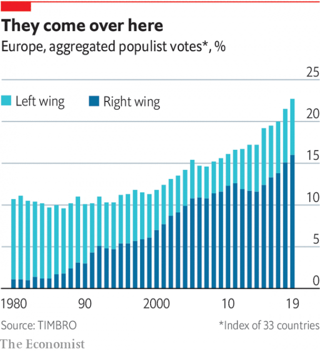

###### The backlash

# Why the arguments against immigration are so popular 

 

> print-edition iconPrint edition | Special report | Nov 14th 2019 

TO UNDERSTAND WHY people oppose immigration, it is worth visiting Tilbury, a port town outside London. Thurrock, the local parliamentary constituency, is 81% white British. Many residents moved here from London as the capital filled with migrants and house prices soared. London’s white-British population fell from 60% to 45% in a single decade, between 2001 and 2011. Some whites moved out because they sold their flats for tidy sums and bought nicer homes with gardens farther from the centre. Others did not like being a minority in the city where they grew up. 

During the Brexit-referendum campaign in 2016, Brexiteers argued that leaving the European Union was the only way for Britain to regain control of its borders. A whopping 72% of voters in Thurrock voted to leave. Most do not hate foreigners, but many feel beleaguered and disrespected. “We’re English, not British. If you say you’re English apparently you’re a racist,” says Trish Byne, who runs a tattoo and piercing shop in Tilbury with her husband, Tony. “In the UK, indigenous people are ignored,” says Tony. “The rights of minorities take precedence.” 

“We’re in favour of immigration, but controlled immigration,” says Trish. She wants immigrants to integrate, but fears that many try “to impose their cultures and language and religion”. She mentions no personal experiences of harm, but says: “In London, I’ve seen videos on YouTube of streets where English people cannot go because there is sharia law.” She adds, of refugees: “You don’t know what boat people have got in their backpacks, it could be terrorist weaponry. That is not me living in la-la land; that is what I’ve heard from people working on the docks.” 

Thoughtful writers such as Paul Collier and David Goodhart argue that if too many migrants arrive too quickly, it disrupts communities and inflicts unwelcome cultural change on the natives. Mr Goodhart complains that liberal politicians attach too little weight to the views of people who like things the way they were. This argument should be taken seriously—for some people, any kind of cultural change feels like a threat. The old find it hardest to adapt. “I was born here and it was a lovely village. Now it’s a concrete jungle and you can’t even hear people speaking English—it’s awful,” says Ann Hoyle, 76. But many of the things that voters fear about migrants are not true, and some of their objections can be answered, up to a point, with smarter policies. 

Whatever Trish may have seen online, there are no streets in London where the native-born cannot go. Islamist terrorism is a worry, but should be seen in perspective. Terrorists killed six people a year in Britain in the decade to 2017. A Brit is eight times likelier to be struck by lightning (though only half as likely to die from it). Young male native-born Brits and Americans are more likely to commit ordinary violent crimes than young male immigrants. 

In all rich democracies, locals grumble that immigrants drain the welfare state. “If I go to the doctor, I have to pay for it. Foreigners come and they get childbirth and operations all paid for. They should be made to pay, too. If they can’t, send them packing,” says Joan Smith, a 73-year-old in Tilbury. Again, this is not an accurate picture. Migrants pay taxes. In countries with flexible labour markets and thrifty welfare states, such as America and Britain, they generally pay their way, unlike the native-born. Over a lifetime, a typical migrant from Europe to Britain can expect to pay £78,000 more in taxes than he receives in benefits. 

Immigrants are a burden only if a host country’s policies set them up to be one, by making it too easy to draw benefits or too hard to work. Sweden committed both these errors with asylum-seekers during the European migrant crisis in 2015-16, showering them with free stuff while forcing them to remain idle for long periods. This was not sustainable, and the government curbed the flow of refugees by five-sixths. 

 

The simplest way to make sure that migrants do not abuse any given benefit is to make them ineligible for it, for five or ten years or permanently. “Build a wall around the welfare state, not around the country,” urged the late William Niskanen, an economist. In the United Arab Emirates, where migrants have no access to state benefits and no chance of citizenship, citizens do not seem to mind being outnumbered nine to one by foreign workers. 

Another fear, that migrants will steal jobs from locals, is as widespread as it seems logical. “Migrants in construction are much better workers than the English, who show up late and leave early,” says Danny Proctor, who manages building projects in Tilbury. “Foreigners aren’t lazy like that. I have a lot of plasterers from Lithuania and Poland. For 20 years they’ve been the best workers.” An English plasterer listening to Mr Proctor might despair. But the supply of jobs is not fixed. Migrants spend money as well as earning it, thus creating more demand for other people’s labour. Immigration slightly raises the wages of most native workers. The relatively small number of losers could be compensated out of the vastly larger gains that accrue to the immigrants themselves. 

The World Bank recommends that governments replace visa quotas with taxes to regulate immigration flows. They could do so via a surtax on immigrants’ incomes, or other means. They could earmark the proceeds for a popular cause, such as pensions or health care, or remit the cash directly to citizens. The more migrants they admit, the bigger the payout. This might make the native-born see immigration as less of a threat and more of an opportunity. 

William Bourke of Sustainable Australia, a party that campaigns to reduce immigration, argues that letting in too many newcomers leads to overcrowding, congestion, high house prices and environmental stress. “As people move from the developing world to the rich one, they move from a low carbon footprint to a high one.” 

The notion that Australia is overcrowded seems absurd. The empty plains of North Dakota are three times more densely populated. But migration in the rich world is highly concentrated. Newcomers head for the most dynamic cities, where everyone else wants to live, too. Congestion and high house prices are big problems in places like Sydney and London, but they can be eased by better policies. Restrictive zoning rules do more to inflate house prices than immigration does. Cities would accommodate many more people if they could build upwards. And immigrants’ taxes could cover the cost of the extra roads and subway lines needed. 

The impact of migration on climate change is probably small. Migrants who escape poverty might emit more carbon, but it is grotesque to argue that they should therefore remain poor. And there are two counter-arguments. First, migration stimulates scientific research, which will help curb global warming. An Indian in North America is 28,000 times more likely to file a patent than in India. 

Second, migration causes fertility to plunge. Migrants from poor countries to rich ones no longer want seven children. They want their kids to go to college, so they have small families. Ethnic Somali women have an average of 6.2 kids in Somalia but only 2.4 in Norway. Allowing more migration to rich countries would reduce the future global population, making environmental problems easier to tackle in the long run. 

Some opponents of immigration fret that it will increase inequality. Some think it unjust that people from poor places might come to rich ones to work as servants. But if the migrants thought that, they would not come. Workers from a poor country who start at the bottom in a rich one will, statistically, make their new home more unequal. But their moving will reduce global inequality. 

A deeper worry is that mass migration might undermine the traits that make the rich world rich, such as good institutions and the rule of law. Many migrants come from countries with terrible, crooked governments. Suppose enough of them arrived to replace the norms of, say, Japan with those of Haiti? 

Immigration sceptics cite many alarming anecdotes. Mexican mobsters sell drugs in America. A gang of Pakistani-British men sexually abused hundreds of young white girls in Yorkshire. The Chinese government snoops on Chinese overseas students to make sure they say nothing heretical about democracy or Taiwan. 

But step back and a more hopeful picture emerges. America’s population has risen 60-fold since 1800. It has absorbed migrants from Tsarist Russia, Hitler’s Germany, Ho Chi Minh’s Vietnam and nearly every other dictatorship of the past 200 years, without losing its democratic soul. On the contrary, migrants head to America because they prefer its institutions to the ones back home. 

By most measures, immigrants in the United States are integrating as well as ever. Their unemployment rate is a negligible 3.5%, lower than for the native-born. Only half of first-generation immigrants speak English “very well”, but by the second generation English dominates even among Hispanics, who are surrounded by other Spanish-speakers. Only 6% of second-generation Hispanic immigrants speak mostly Spanish. By the fourth generation, half of those with Hispanic forebears are so well integrated that they no longer identify as Hispanic. 

America’s success in absorbing immigrants is remarkable, but in recent decades it has been surpassed. The share of the population who are foreign-born is higher in Australia (29%), New Zealand (24%) and Canada (21%) than in the United States (14%). None of these new migrant magnets has a perfect immigration system. But all combine openness with order, selecting the migrants they want, processing their visas reasonably quickly and excluding unauthorised migrants fairly effectively. 

Australia shows that a well-run democracy can be twice as open to immigrants as America and still rank ten places higher on the UN’s Human Development Index. Singapore, where 45% of residents are foreign-born, shows that a well-run city-state can be more open still. It would be rash to open the gates suddenly and completely. But countries could open a bit and see how it goes.■ 

