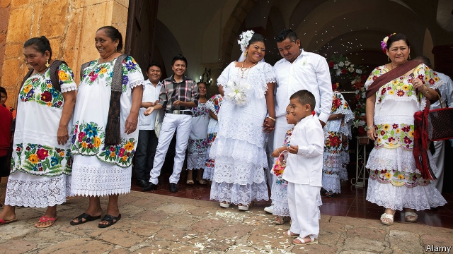

###### When “sí” means “we’ll see”

# Why planning weddings in Mexico is hard 

 

> print-edition iconPrint edition | The Americas | Nov 16th 2019 

MEXICAN WEDDINGS are big. At middle-class nuptials a 500-name guest list is not unusual. In the United States the average is 140, according to the Knot, a wedding-planning website. But a typical Mexican boda is smaller than it might be. Many guests do not turn up even after they have said they will. Sometimes two-fifths of them are no-shows, says Cecilia Lara, a caterer in Zacatecas, a state in central Mexico. Some cancel days, or even hours, in advance—too late to change the booze and food order. 

It seems to be a matter of culture. When Americans marry in Mexico the attrition rate is much lower, says Diego del Rio, who plans weddings for Mexican and American couples. Last-minute cancellations are almost unheard of. 

Why is Mexico’s dropout rate so high? Long guest lists are part of the problem. They mean that Mexicans can get two dozen wedding invitations a year. Attending them all would be costly. Social convention plays a part. Americans normally break the bad news quickly, says Mr del Rio, but that is not the Mexican way. Instead, the practice is to accept, and then find some excuse (car crashes and absent nannies are popular) or simply not turn up. A woman who organised her mother’s wedding in Oaxaca says the bride’s best friend cancelled on the morning of the event. Her reason: “new circumstances”.  

César Félix-Brasdefer, of Indiana University, has found similar contrasts between Mexican and American behaviour in other situations. In one study students from both countries acted out how they would refuse a request from a professor that they enroll in a class. Americans were more likely simply to say no. Mexicans used more “indirect” language, says Mr Félix-Brasdefer. He thinks Mexican culture prizes warmth and a sense of connectedness in social relations, and so discourages bluntness. 

Mexico’s writers have sought to understand this trait. In “Instructions for Living in Mexico”, Jorge Ibargüengoitia, who died in 1983, described his countrymen’s habit of deferring bad news until the last possible moment. Octavio Paz, Mexico’s greatest poet, wrote that even in a quarrel, Mexicans prefer “veiled expressions to outright insults”. 

Saying no is especially hard when the bride and groom ring up a week or two before the nuptials to ask if a guest is coming. When wedding planners are involved, they make those calls and get more honest answers. “If we ask them, they might tell us no,” says Ms Lara, who plans weddings as well as catering for them. “If the bride does it, they probably won’t.” Paz and his first wife, Elena Garro, avoided all this awkwardness. They wed in such haste that just four other people were at the ceremony. Alas, the marriage was not a happy one. 

