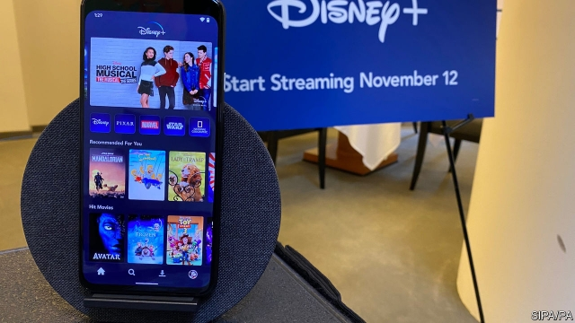

###### Netflix, Disney and the battle to control eyeballs

# Business this week 

 

> Nov 16th 2019 

Disney’s streaming video service went live, the latest in a lengthening line of challengers to Netflix’s dominance of the market. The trove of programming on Disney+ not only includes its archive of animated classics, but also catalogues of material from other studios that Disney owns, which include Marvel, Pixar and 20th Century Fox. Along with rivals like Amazon and Apple (but not Netflix) Disney wants to entice customers into its wider product range—in its case, theme parks and cruises. See article. 

Donald Trump increased the pressure on China to agree to a “phase one” trade deal, threatening to raise tariffs “substantially” if it does not. Whether America removes all tariffs or just those that are scheduled to come into effect in December remains a sticking-point in the negotiations. Diplomats are also searching for a neutral venue where the two countries’ presidents can sign a deal in front of the world’s cameras, after Chile cancelled the APEC summit in Santiago where the ceremony was supposed to take place. 

GDP in both Germany and Japan grew by just 0.1% in the third quarter compared with the previous three months. Germany avoided a recession (its economy shrank by 0.2% in the second quarter), helped in part by a welcome rise in the country’s exports, which have struggled during global trade tensions. Britain also dodged a recession, chalking up growth of 0.3% following a previous contraction. Solid performances in the construction and services sectors offset flat growth in agriculture and manufacturing. See article. 

Alibaba was reported to have secured approval from the Hong Kong stock exchange to sell shares in a secondary listing. The Chinese e-commerce giant listed on the New York bourse five years ago. It had been expected to float shares in Hong Kong earlier this year, before the outbreak of huge street protests; the threat of escalating unrest to the financial hub still remains. See article. 

The prospectus for Saudi Aramco’s IPO provided few details for investors, such as an indicative share price or an exact date for its stockmarket debut on the Riyadh exchange. Those particulars are expected to be announced soon. The prospectus did indicate that 1bn shares in the state-owned oil company will be offered to Saudi Arabia’s small investors. 

The California Trucking Association launched a legal challenge against the state’s new law giving wage and benefit protections to independent contractors. The rules are aimed at workers in the gig economy, though they will also apply to caretakers, maids, carers and many others. The truckers’ group says its drivers’ ability to set their own timetables will be hampered and interstate commerce undermined. Uber and others want a measure to be put before voters next year that would exempt them from the law, which comes into effect on January 1st. 

A deal that will see Ascension, an American hospital network, share patient data with Google attracted the ire of lawmakers worried about privacy. Suspicion about Google’s intentions in health is a running theme: it was also criticised for a collaboration with a British hospital in 2016, and with the University of Chicago a year later. It was also reported that Google wants to move into banking, which could set up a clash with financial regulators. 

In an update on the progress it is making towards regulatory approval to fly the 737 MAX aircraft, which has been grounded for most of the year following two crashes, Boeing said it was “possible” that deliveries to airlines could resume in December and that it hopes soon to secure consent for new pilot-training requirements. Southwest and American Airlines pushed back the dates for when they expect the 737 MAX can take off again until early March. 

British Steel, which has been in liquidation following a Brexit-induced slump in orders, received a takeover offer from Jingye, a Chinese steelmaker. There is some uncertainty about Jingye’s long-term commitment. BS specialises in railway tracks and construction girders, technology that Jingye lacks back home. 

Carl Icahn, an activist investor, revealed that he has built a 4.2% stake in HP and will push it to accept a takeover offer from Xerox. 

Tesla chose Berlin as the site for its first factory in Europe, making electric cars and batteries. “Berlin rocks,” raved Elon Musk, Tesla’s boss. Production should start in 2021. 

American connoisseurs of craft brew were crying in their ale upon the news that Anheuser-Busch InBev has struck a deal to buy Redhook, a pioneer in the small-brewers revolution that began 40 years ago. The global beer conglomerate decided now was the time to swallow the roughly 70% it does not already own of Craft Brew Alliance, which also owns Kona and other brands, after its share price fell flat. 

