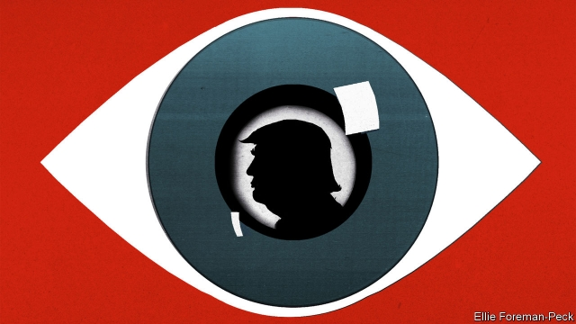
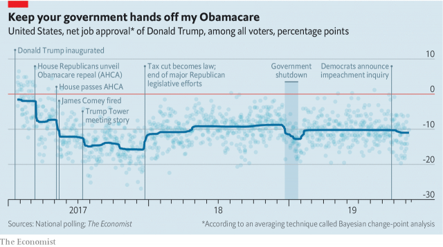

###### Teflon Don

# Democrats want impeachment hearings to change opinions on Donald Trump 

 

> print-edition iconPrint edition | United States | Nov 14th 2019 

BY 8AM ON November 13th, the line to get into the Ways and Means Committee room already stretched all the way down the long hallway, though the hearing was not scheduled to begin until ten. Cameras bristled at the building’s entrance. Congressional interns, journalists and political junkies jostled for position as if they were on a crowded train carriage, and police officers trying to keep a path open grew increasingly frustrated. 

The spectators were waiting to watch a political drama rarely seen in America. For nearly two months, Democrats have held their impeachment inquiry privately. Those hearings have become public. Over the next two weeks, Americans will hear testimony from witnesses concerning the allegation that President Donald Trump ordered military aid to Ukraine to be withheld until his counterpart, Volodymyr Zelensky, announced an investigation into Hunter Biden, son of a Democratic presidential front-runner, who served on the board of a Ukrainian natural-gas firm. 

These hearings may be the only time that Americans will get to hear from those who know most about the allegation. Republicans control the Senate and will vote on the rules governing a trial there. Unlike public impeachment hearings for Richard Nixon, these hearings are not designed to uncover new information; the witnesses have already testified in closed sessions. They are designed to build a case for Mr Trump’s impeachment, which means they must meaningfully shift public opinion about the president. That is not impossible, but neither does it look likely. 

A cynical strain of conventional wisdom says that nothing moves public opinion of Mr Trump. That is not quite true, though his approval rating moves in a narrower band than those of past presidents. It has a low ceiling in part because Mr Trump has made so little effort to broaden his appeal beyond his base. It has a high floor partly because he has done an outstanding job of cultivating that base, partly because America is deeply polarised and because, unlike in Nixon’s time, when Democrats and Republicans read the same newspapers and watched the same three main news networks, partisans today get their news from different sources, many of which exist to confirm viewers’ biases. 

But Mr Trump’s approval rating is not entirely insulated from external events (see chart). It stood at around 45% when he was inaugurated. His first few months generated ample headlines—a chaotic cabinet-filling process, Michael Flynn’s tenure as national security adviser and the failure of the first travel ban—but his rating did not decline until House Republicans introduced the American Health Care Act, their first effort to repeal Barack Obama’s Affordable Care Act (ACA). 

 

Over the next several months, Mr Trump’s popularity had an inverse relationship with that bill’s viability. Whenever it appeared to be dead, or dropped out of the news cycle, his rating rose; when Republicans revived their efforts to repeal the ACA, his rating fell—dropping to 37% in September 2017 when two Republican senators made a last-ditch repeal effort. 

Prominent Republican opposition to these efforts may have helped drive Mr Trump’s ratings down. John McCain, a late Republican senator from Arizona, voted against the bill. This may have allowed Republicans who liked Mr McCain to register their disapproval, just as support for impeachment among Democrats rose once it won the backing of Nancy Pelosi, the House Speaker. 

Two months after the last efforts to repeal the ACA failed, Congress passed, and Mr Trump ultimately signed, a tax-cut package that would have been favoured by any Republican president. His approval rating immediately improved. This could be taken as a sign that Americans approved of the tax cuts. But polls from the month before the law’s passage suggest it was unpopular. News coverage was intense in this period but as it subsequently lessened, Mr Trump’s approval rating increased. 

By early 2018, Congress had grown less ambitious, and Mr Trump’s approval rating recovered. It next dipped during the 2018-19 government shutdown, for which he claimed responsibility, claiming that he was “proud to shut down the government for border security.” When the government reopened, his rating recovered. 

This pattern should discomfit Democrats and traditional Republicans alike. Democrats have long hoped that Mr Trump would pay a price for his norm-breaking behaviour. But sticking thumbs in the eyes of allies while praising dictators, saying there were “very fine people on both sides” of a march where white supremacists faced off against protesters, spending taxpayer funds at his hotels and separating families at the border all appear to have had little effect on his overall approval rating. The public appears to have processed them as partisan battles, and reacted accordingly. 

Yet orthodox Republican policies, such as cutting taxes and health care, could just as well dent the president’s approval rating. As a candidate, Mr Trump happily trampled on Republican orthodoxies, promising to protect voters’ Medicare and Social Security while condemning the Iraq War—and voters loved him for it. Since the midterms, Republicans have passed no ambitious orthodox legislation, perhaps because Congress is divided (though not all divided Congresses have been as unproductive as the 116th), or perhaps because Republicans have realised that they are better off simply letting Mr Trump be his norm-breaking self, and earning credit with the White House and the conservative base by publicly defending him. 

Of course, Mr Trump is not the only one whom impeachment puts under a microscope. As one Republican strategist noted, impeachment “puts the prosecutors on trial every bit as much as the president.” In 1998, as congressional Republicans prepared to impeach Bill Clinton, voters went to the polls. House Republicans lost five seats—the first time since 1934 that the party controlling the White House added seats in a midterm—while Democrats won unlikely governors’ races, such as Alabama and South Carolina. Republicans were seen as zealous. The inquiry into Mr Trump may be more justified—focusing as it does on the subversion of American policy, rather than on lying under oath about an extramarital affair—but Democrats from swing states and districts face a similar risk. 

Since September 24th, when Ms Pelosi announced the start of an impeachment inquiry, Mr Trump’s approval rating has declined by just two points. If the House votes to impeach Mr Trump, the Senate is unlikely to remove him, whatever emerges over the next two weeks. Majorities of voters in swing states oppose removal. Unless a significant share of elected Republicans break with the president, that is unlikely to change. And the more partisan the hearings appear, the likelier voters are to process them as only partisan, and back their own team.■ 

