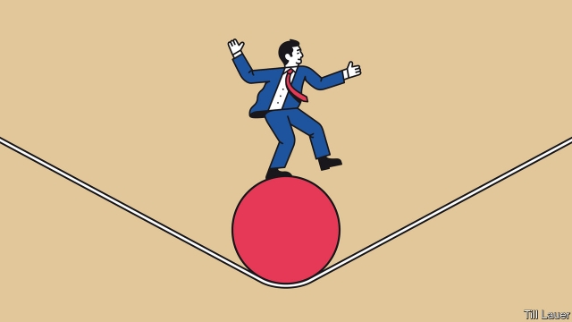

###### Banyan

# Japan’s prime minister breaks a record 

 

> print-edition iconPrint edition | Asia | Nov 23rd 2019 

THIS WEEK Shinzo Abe became the longest-serving prime minister in Japan’s history, with 2,886 days in office. He pipped Taro Katsura, who served three times in the early 20th century, a remote age. But to win the record for the longest uninterrupted spell in office, Mr Abe—who had a brief time as prime minister in 2006-7, dogged by ill health, before returning to power in 2012—will have to stay on until August 24th. Many remember the man he has to beat, not least Mr Abe: Eisaku Sato was his great-uncle. Mr Abe is also the son of a foreign minister and grandson of another notable post-war prime minister, Nobusuke Kishi. In Japan, fate favours some families over others. 

Sato’s time in office, from 1964 to 1972, was a golden age. East-West rivalry was a fixed, predictable thing, and Japan sat firmly under all-paid-for American protection. It was able to concentrate on breakneck growth of 10% a year, driven by exports to the West. Even the Vietnam war was good for pacifist Japan, generating demand. Meanwhile, a dose of inflation kept debts under control. 

When Mr Abe came to office in 2012 he inherited a very different Japan. The greying population was shrinking. The stockmarket was down two-thirds from its peak. Growth was slow and deflation was debilitating—not least because it constrained government revenues. Japanese feared the world was passing them by. Mr Abe changed the psychology. Japan, he declared, “is back.” 

The marketing was slick: “Abenomics” as a programme of structural reform never matched what it claimed on the label. But Mr Abe had luck: an upswing in global growth. He added gobs of deficit spending. Monetary tinkering led to a sharp fall in the currency, a tourist boom and higher stockmarket. Young Japanese out of college are now confident of a job—one reason Japan is not fertile ground for populism. Problems remain. Despite a push for more female employment, women still struggle to shine, not least in Mr Abe’s male-dominated government. Meanwhile, the state’s huge debts and welfare payments for the old are underpinned by an ever-smaller workforce. Yet the crisis this may one day generate will be for a future prime minister. 

The world takes notice of Japan once more—think, this year, of a new emperor’s enthronement and the success of the Rugby World Cup; next year the Tokyo Olympic Games will make a splash. Mr Abe, a tireless traveller, promotes open markets even as America turns inward. Improved relations with some other Asian democracies, especially Australia and India, are a hedge against a rising China and an unpredictable America. So too is a stronger defence posture, pushing the bounds of Japan’s pacifist constitution. 

Mr Abe, a nationalist, has never had truck with war-guilt masochism. Like his grandfather (whom the Americans imprisoned on suspicion of war crimes) and great-uncle before him, he views American protection as a necessary but temporary expedient. At Kishi’s grave in 2012 Mr Abe vowed to “recover the true independence” of Japan. Yet his dream of excising the pacifist parts of the constitution will almost certainly founder for lack of support. 

Even so, he and revisionist allies in his Liberal Democratic Party (LDP) have shifted Japan rightward, with some insidious consequences. The move has soured relations with neighbours including China and, most damagingly, South Korea. At home, it has undermined press freedom and shrunk the public space for airing contentious issues. Older Japanese are more worried about Mr Abe’s chest-thumping nationalism than the young—and in 2016 he lowered the voting age. 

No opposition troubles Mr Abe, so expect him to breeze through Sato’s record. In theory, he must step down by September 2021 at the latest: there are no term limits on being prime minister, but the LDP has a nine-year limit on its presidency, which he holds. The betting has long been that, basking in the success of the Olympics, he will announce his retirement as prime minister next autumn. But it is far from clear who within the LDP might succeed him. So another possibility emerges: that Mr Abe calls a snap general election next year before the start of the Olympic Games. 

That would give him the mandate to serve out his LDP presidency. Even then, it would not take much to rewrite the party constitution to allow him to serve longer. And so Mr Abe’s most telling legacy might prove to be the lack of a successor.■ 

