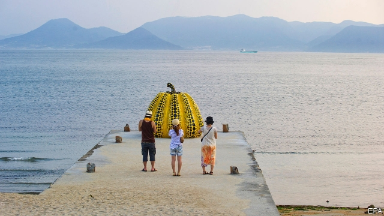

###### Home is where the art is

# Modern sculpture helps revive a dying corner of Japan 

 

> print-edition iconPrint edition | Asia | Nov 23rd 2019 

ON A WINDSWEPT beach on Honjima, a small island in the Seto Inland Sea in southern Japan, three stylised ships’ hulls sway in the breeze. They are suspended on poles and fixed to the sand with four rusty anchors each. Oval mirrors underneath reflect the tangled red netting from which the hulls are made and the lead-coloured sky above the deserted beach. The ships are the work of the Russian artist Alexander Ponomarev. They form one of many sea-themed artworks displayed on Honjima during the Setouchi Triennale, an art festival spanning 14 locations around the Inland Sea (which is known as Setouchi). 

The triennale and more permanent museums and installations on some of the bigger islands have turned Setouchi into a tourist destination. Honjima has become a hipster hot spot. Stylishly dressed visitors traverse the island on rented bicycles looking for scattered artworks before cycling back to the harbour to relax over a cappuccino in a café that also peddles designer furniture. That is a big change: before the artists and their fans arrived, Honjima was in apparently terminal decline. Fishing, the main local industry, was dying. Locals had been leaving in droves to seek opportunities elsewhere. The remaining islanders, most of them old, were left with crumbling houses and the environmental fallout from defunct industries. 

Now hundred of thousands of visitors travel to the islands every year (and more than 1m in the year of the triennale), up from 100,000 15 years ago. This has had pleasant consequences for everyone from hoteliers and restaurateurs to a local railway, which reports solid revenue growth. It has also slightly dampened the speed at which the islands lose inhabitants. A handful of new arrivals from elsewhere in Japan, some of them young families, are settling permanently every year. Takamatsu, the bustling port city from which ferries serve many of the islands, is awash with trendy bars and arty brunch joints. Two schools recently reopened on one island. 

Encouraging such trends was precisely the point of the triennale, says Shinobu Tsunekane from the organising committee in Takamatsu. Organisers wanted to slow the decline but also to instil pride in local customs: “People have been leaving because life on the islands is inconvenient—we want to make them happier and more comfortable with it again.” 

Outsiders are convinced enough by the idea to copy it. Remote rural areas all over Japan have started their own art festivals in the hope of attracting more visitors and, potentially, new residents. In Shandong province in China, the authorities are in the process of turning an island into an art site, citing the Setouchi region as a model. 

Locals are more equivocal. Islanders were initially wary, says Kenjiro Kaneshiro of the Fukutake Foundation. It runs the permanent museums and installations using funding from Benesse, an education conglomerate, and started to install art on the island of Naoshima in the 1990s. Research by Meng Qu of Hiroshima University suggests that some residents worried that their home would become a theme park. Such worries may not be entirely unfounded: a leaflet from Benesse outlining the company’s “vision” bangs on about the beauty of nature, the purity of village life and its superiority to sin-filled cities. There is not much discussion of the drawbacks of island life. 

Still, Mr Ponomarev’s ships on Honjima were constructed with the help of local craftsmen. The hulls mirror the shape of vessels used by the sailors on whom passing cargo ships used to depend to navigate treacherous currents to reach the ports of Kobe and Osaka. Wooden fishermen’s houses built by the island’s carpenters shelter exhibits exploring the dangers of the sea. On Naoshima and Teshima, the main islands colonised by Benesse, sculptures and museums are designed to fit into and reflect their surroundings. Islanders are consulted about new projects during occasional meetings. 

Some residents are thrilled. “I like all the art and the crowds that come to look at it,” says Naohisa Okuyama, who was born on Naoshima, left to work in the garment trade and returned to run a coffee shop. “I’m learning so much I didn’t know about before.” The owner of a joint selling coffee and rice balls on neighbouring Teshima is less effusive. On the one hand, the art scene has revived and changed her business. “I had to close my strawberry farm because there weren’t enough customers, but then the tourists came and I heard they liked coffee.” On the other hand, she says, the revival only goes so far. Professional jobs remain scarce. Her daughter left the island long ago to take a government job. 

Takahiro Kubo, a construction worker on Naoshima, concurs: “It’s good business for those of us who work in tourism or construction, less so for the rest.” On balance, he welcomes the transformation. The only thing he really worries about is overcrowding. “Outsiders are buying up houses. And try getting a ferry during the festival.” ■ 

