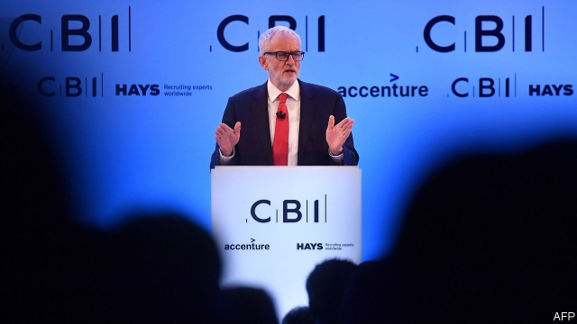

###### Holier than thou

# A woke business gathering seems oddly in tune with Labour 

 

> print-edition iconPrint edition | Britain | Nov 23rd 2019 

DEBATE HAS raged over whether it is the Confederation of British Industry (CBI), the Federation of Small Businesses, the British Chambers of Commerce or some other body that truly represents British business. The winner this year was the lucky group whose conference fell four weeks before the election. The leaders of all three main parties took turns on November 18th to woo CBI members packed into a Greenwich ballroom. 

None of the trio had an easy task. Jeremy Corbyn had just unleashed Labour’s latest nationalisation plan, of BT’s Openreach network (business folk tend not to be keen on nationalisation). Boris Johnson had to advocate Brexit to a strongly pro-EU audience. Jo Swinson had to win credibility for the Liberal Democrats. 

Oddly enough it was the message of Mr Corbyn, not popular among entrepreneurs, that chimed with an earnest conference programme. His exhortation to business to help “raise the platform on which our whole society stands” was of a piece with panels on how to make “profit with purpose” and on the role of firms in lessening social inequality. 

The CBI also joined Labour in lionising the hi-fi entrepreneur Julian Richer, a favourite of shadow chancellor John McDonnell. Mr Richer this year gave a big stake in his firm, Richer Sounds, to employees. On Monday the CBI launched his “Good Business Charter” scheme to give badges to companies that treat workers well. 

Like Labour, lots of business leaders are asking questions about the current economic model, though their answers are different, says Josh Hardie, the CBI’s deputy director-general. This summer America’s Business Roundtable, a lobby group, said firms should serve stakeholders as well as shareholders. Many big British businesses agree. Delegates at the CBI bash noted that Mr Corbyn’s emphasis on green issues matches firms’ growing keenness to fight climate change. Another called his speech measured and “from the heart”. 

Mr Johnson had better jokes. He warned his audience of a “nightmare in Downing Street” on Friday 13th in the event of a Labour win. But the audience wanted seriousness. His shelving of a planned cut to corporation tax, from 19% to 17%, seemed wise. Firms are keen to be seen to be paying their fair share. A package of smaller tax breaks was on offer instead. Mr Corbyn said he would review the apprenticeship levy. In a well-received speech, Ms Swinson promised to scrap business rates, a tax on property used for commerce. 

Hanging in the air was the “fuck business” remark made by Mr Johnson last year. The expletive was directed less at firms than at pro-EU bodies such as the CBI, he later let it be known. Carolyn Fairbairn, its director-general, has kept up the anti-Brexit broadsides. Another target is the Tories’ plan to deregulate business. They are pushing “massive deregulation” and Labour “massive state intervention”, she said. To some, that seemed out of whack. The Tories have yet to unveil proposals on deregulation, but Labour’s plans to nationalise industries and take a tenth of big firms’ equity (returning some dividends to workers) have been laid out in gory detail. 

Whoever wins next month, the government is likely to be at odds with the CBI. Ms Fairbairn’s term is up next year, which the Tories might welcome. But her successor, Lord Bilimoria, is a Europhile who called Brexit “a train crash in slow motion”. ■ 

