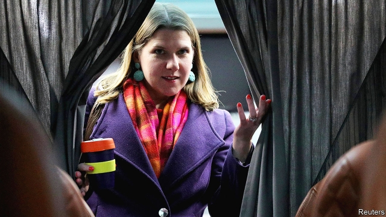
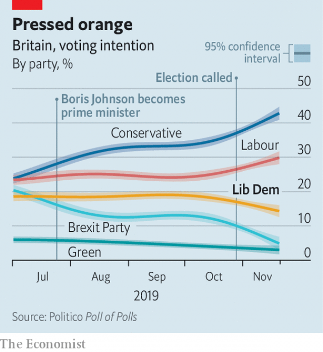

###### Stuck in the middle

# Britain’s Lib Dems unveil a manifesto to counter their polling squeeze 

 

> print-edition iconPrint edition | Britain | Nov 23rd 2019 

IT IS OFTEN claimed that elections are won in the centre ground. In this campaign voters have seen the Tories move right, notably towards a hard Brexit, while Labour shifts starkly left, especially over nationalisation (see article). This should help the centrist Liberal Democrats—the more so since the party has a fresh-faced and appealing new leader in Jo Swinson. 

Yet the Lib Dem story of the election so far is instead one of being squeezed, as both Labour and the Conservatives rise in the polls (see chart). In part this reflects a first-past-the-post system that always punishes third parties. Ms Swinson’s exclusion from this week’s televised debate between Boris Johnson and Jeremy Corbyn is an example of this. But it also seems that, paradoxically, the extremism of the two big parties is not helping the moderate Ms Swinson. Rather, voters who detest Mr Johnson seem more inclined to jump to Mr Corbyn, and vice versa. 

The Lib Dems’ manifesto, published on November 20th, represents a bid to tempt voters from the right as well as left. The pitch to ex-Tory voters came from Sir Ed Davey, the party’s finance spokesman, who heralded the Lib Dems as the “party of sound finance” and castigated Labour and the Tories as “fiscally incontinent”. Sir Ed outlined what amount to the toughest set of fiscal rules of the three main parties. The Lib Dems are targeting a surplus of 1% of GDP on the current budget (ie, excluding investment), whereas the other two parties are pledging merely to balance it—the Tories in three years’ time and Labour in five. Around a third of those who voted Conservative in the general election of 2017 voted Remain in 2016. It is those 5m people whom the Lib Dems seem to be targeting with this Osbornite language. 

At the same time, the party promised big increases in spending designed to woo Labour voters. As the only party unequivocally backing Remain, the Lib Dems have more fiscal room for manoeuvre than the others. Staying in the European Union would mean faster growth, raising tax receipts by £10bn ($12bn, or 1.4% of the current tax take) a year, the party reckons—an estimate which does not seem unreasonable to the public-finances wonks at the Institute for Fiscal Studies. On top of this the party promised to raise taxes to the tune of £37bn, mostly from higher corporation tax and an extra 1p on income tax. 

 

This leaves the party with a lot of cash to splash around. The priciest of its plans is a big expansion of child care, under which free, full-time nursery places would be offered for all two- to four-year-olds, raising the cost to the government from a current £3.7bn to over £10bn. More teachers and support for the low-paid are also promised. 

Could such a mix of policies improve the party’s position? Some Lib Dems claim the grim-looking polls are better at constituency level. Consider Wokingham, a safe Tory seat in Berkshire which voted by 57-43% for Remain. The Lib Dem candidate, Phillip Lee, is well-known as an anti-Brexit former Tory MP from the nearby seat of Bracknell, who defected soon after Mr Johnson became party leader. The Tory incumbent, Sir John Redwood, is a hardline Brexiteer. Local polls give Dr Lee a chance in what is a two-horse race. 

The party may also do well in London, which voted even more heavily for Remain. Tory-held seats like Richmond Park, Putney, Fulham and Wimbledon are vulnerable. Chuka Umunna, a former Labour MP who defected, hopes to take Westminster for the Lib Dems. Sam Gyimah, an ex-Tory MP, hopes to do the same in Kensington. Peter Kellner, a pollster, says that here tactical voting may work. Habitual Labour voters seem readier to back a Lib Dem who has a chance of defeating a Tory than Lib Dem voters are to support Labour. 

It looks harder for the Lib Dems outside London and the south-east. In Scotland they may have trouble fending off resurgent nationalists. And their anti-Brexit stance may not help them regain old strongholds in south-west England, most of which voted Leave in 2016. 

What’s more, the scope for tactical voting seems limited. In 1997, when it played a big role in Labour’s landslide, Tony Blair and the Lib Dems’ Paddy Ashdown were effusively friendly. Now Mr Corbyn and Ms Swinson are at daggers drawn. Ms Swinson says Labour’s leader is a Leaver, not a Remainer, and his failure to tackle anti-Semitism in his party makes him unfit for office. She has ruled out doing a formal deal with him or Mr Johnson in a hung parliament—but left the door open to backing either of them on a vote-by-vote basis, including on a second referendum. 

Ms Swinson’s election dilemma was neatly summarised after her speech to a receptive Confederation of British Industry this week. A questioner said he was a Remainer who liked both her and her policies, but added that since he dreaded a Corbyn government even more than a hard Brexit, he would be voting Tory. The squeeze is still on. ■ 

