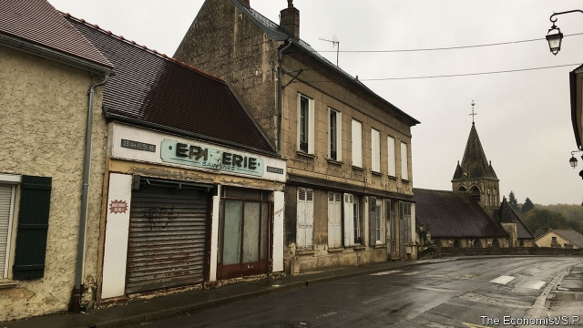

###### Their daily bread

# A septuagenarian mayor is tackling decline in his corner of rural France 

 

> print-edition iconPrint edition | Europe | Nov 23rd 2019 

IT IS MID-MORNING, but the cornflower-blue shutters at what was once a cheery café are closed and rusting. Near the church, the grocer’s is boarded up too, its paintwork peeling in the cold damp air. Even the boulangerie, which once sold the morning baguette to this village of some 1,100 people, has gone. Nestling amid forest and cereal fields in northern France, Saintines encapsulates many of the difficulties of rural decline—but also a distinctly French effort to fight it. 

Off the high street, past the abandoned former post office, lies the entrance to the town hall. Tucked inside, freshly baked baguettes are lined up in a wooden rack behind a counter that also serves as a rural post office. Customers can pick up a loaf, send a parcel, even register a new baby, all in the same spot. Jean-Pierre Desmoulins, the 73-year-old mayor, has turned bread into a public service, and the little town hall into a social hub. “It creates a meeting place, a point of social contact,” he says. “Sometimes, people spend half an hour here just chatting.” 

Saintines belongs to what might be called in-between France: neither remote enough for village life to revolve around farming seasons, nor close enough to big cities to be a mere dormitory. Over the years, the village has lost jobs and shops alike. Work at the local matchbox factory has all but disappeared, and with it the once-vibrant local cafés. Cars, like baguettes, are essential to daily life. Nearly 90% of village residents drive to work. 

The village fits a countrywide trend. Between 2003 and 2014 France lost 7,000 cafés, a drop of 17%. Over the past six years alone, the number of boulangeries in France has shrunk by 18%, to 30,000. The upshot is a loss of daily social contact, lives spent in the car and a new form of solitude. This is the potent mix that helped to mobilise the gilets jaunes (yellow jackets) protesters, who set up camps on the country’s road junctions and roundabouts a year ago, initially to protest about a green tax on motor fuel. Away from the violence seen in the cities, many of these places recreated a festive, communal spirit that has been lost in car-dependent semi-rural areas. Today there are more roundabouts in France than there are cafés or boulangeries. 

Yet for all the desolation, Saintines also dispels the myth of France as merely a centralised country run from Paris. Like almost every village across the country, it boasts its own town hall, displaying the national flag. France has 35,000 directly elected mayors—three times more than in neighbouring Germany. Half of them run villages with fewer than 500 people. And polls consistently show that French mayors are the most trusted of all France’s elected leaders. 

In Saintines, the non-partisan Mr Desmoulins has been mayor for fully 18 years. He runs three primary and two nursery classes in the village, to try to keep young families from moving away. The local population is growing. Standing in his town-hall bread shop on a weekday morning, the mayor greets clients by name. “A meal without a baguette,” he comments, “just isn’t a meal.” 

Not every mayor has an entrepreneurial streak like Mr Desmoulins. Many are livid at the government’s decision to abolish a residential tax that used to provide a big chunk of their revenues, even though the government says it will compensate them directly. At the mayors’ annual congress in Paris this week, President Emmanuel Macron promised to work with them, pointing to efforts such as the roll-out of fibre-optic networks and backing for a non-profit project to open 1,000 cafés in small villages. The stakes are not purely social. A study in 2016 by Jérôme Fourquet, a polling analyst, showed that the absence of a post office, grocer or café in a village, along with distance from a railway station, correlated with an increase in the vote for Marine Le Pen’s populist National Front (now the National Rally). 

Indeed Ms Le Pen came top in voting at European elections this year in Saintines. Mr Desmoulins, who plans to run yet again at municipal elections due next year, is pushing back. He has already put in his application to open a café under the new scheme. Nursery pupils in the village now get school lunches. Behind the bread counter, Brigitte Sraczyk, a town-hall employee who used to clean classrooms, sells about 50 baguettes a day and enjoys the social contact as much as her clients seem to. “Oh, I don’t go to shops with unmanned checkout tills,” says a pensioner, stepping in from the rain for a baguette and a natter. “A little ‘Bonjour Monsieur, Bonjour Madame’ every day never killed anybody.” ■ 

