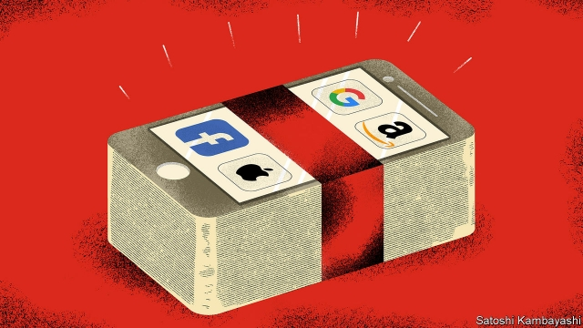
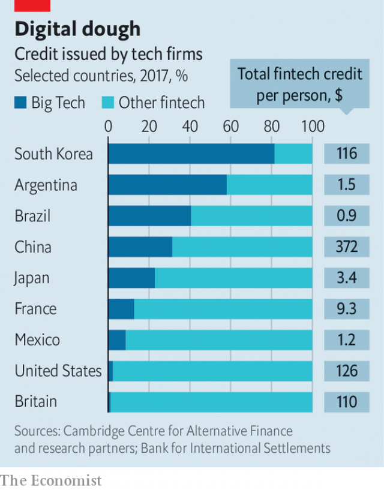

###### Plug and pay

# Big Tech takes aim at the low-profit retail-banking industry 

 

> print-edition iconPrint edition | Finance and economics | Nov 21st 2019 

THE ANNUAL Web Summit in Lisbon each year is Woodstock for geeks. Over three days in November, 70,000 tech buffs and investors gather on grounds the size of a small town. Rock stars, like Wikipedia’s boss or Huawei’s chairman, parade on the main stage. Elsewhere people queue for 3D-printed jeans or watch startups pitch from a boxing ring. Money managers announce dazzling funding rounds. Panellists predict a cashless future while gazing into a huge crystal ball. A credit-card mogul dishes out company-coloured macaroons. 

Yet the hype conceals rising nervousness among the fintech participants. After years of timidity Big Tech, with its billions of users and gigantic war chest, at last appears serious about crashing their party. “It’s the one group everyone is most scared about,” says Daniel Webber of FXC Intelligence, a data firm. Each of the so-called GAFA quartet is making moves. Amazon introduced a credit card for underbanked shoppers in June; Apple launched its own credit card in August. Facebook announced a new payments system on November 12th (its mooted cryptocurrency, Libra, however, has lost many of its backers and will face stiff regulatory scrutiny). The next day Google said it would start offering current (checking) accounts in America in 2020. 

Individually, each initiative is relatively minor, says Antony Jenkins, a former boss of Barclays, a bank, now at 10x, a fintech firm. But together they mark the acceleration of a trend that could reshape the finance industry. 

The GAFAs have long had an interest in finance. Yet until recently they focused on payments, each in its own way. Apple Pay and Google Pay are digital wallets: they hold a digital version of cards but do not process transactions. Neither charges merchants a fee. They simply store everything in one place and make payments more secure by masking customer details. Google collects transaction data; Apple does not. Otherwise holding a phone over a contactless terminal is the same as tapping a card. 

Facebook Pay stores card details for use on the group’s various apps (Facebook, Messenger, Instagram and WhatsApp) so customers need not enter them every time. Amazon Pay does the same, and also saves card details for payments on partner websites. Uniquely, it “processes” payments, a task others leave to specialist firms. When a purchase is made through Amazon Pay, it asks the card issuer if there are sufficient funds. If the answer is yes, the shop releases the goods (the money itself generally moves at the end of the day). 

What these systems share is their limited success. After eight years Google Pay has just 12m users in America, a market of 130m households. Only 14% of the country’s households with credit cards use Apple Pay at least twice a month. In October the number of customers who used Amazon Pay was just 5% of the number who used PayPal, says Second Measure, a data firm. This contrasts with the explosive growth of WeChat Pay and Alipay, China’s “super-apps”. These allow shoppers to pay for nearly anything, from tea to taxis, by scanning a QR code. Launched in 2013, they have over a billion users each. They process transactions worth a third of China’s consumption spending and are now big lenders in their own right (see chart). 

 

But the comparison is unfair. China was able to leapfrog the world because of permissive regulation and a lack of existing digital-payment methods. The rich world already had a decent credit-card system, points out Aaron Klein of Brookings, a think-tank, limiting the appetite for novel solutions. Financial red tape also binds more tightly in the West. To operate as payment institutions across America, newcomers need a licence in every state. 

That makes the GAFAs’ move into retail banking even more puzzling. Since the financial crisis, credit provision has become one of the world’s most regulated activities. That constrains returns on capital and profits. Western lenders’ valuations are a fraction of tech firms’, notes Sankar Krishnan of Capgemini, a consultancy. Why would Big Tech want to be a bank? 

The answer is twofold. The tech giants may not yet know exactly what they want, says Martin Threakall of Modulr, a fintech. Silicon Valley likes to place bets and see what sticks. And they probably do not actually want to be banks—as long as consumers do not notice. 

At bottom, a bank is a balance-sheet, a factory that turns capital into financial products (eg, loans and mortgages) and a sales force, says Dave Birch of Consult Hyperion, a consultancy. The first two are heavily regulated, and Big Tech is uninterested. That is why the giants have turned to banks to do the tedious bits. Apple’s card is issued by Goldman Sachs, and Amazon’s ones by Chase, Synchrony and American Express. Google’s accounts are backed by Citi and a banking union. 

Rather, the tech giants covet distribution. Their smarter systems and lack of branches should enable them to strip costs out, says Tara Reeves of OMERS Ventures, the venture-capital arm of a Canadian pension fund. More important, selling banking products should lead more people to use their payment systems. Apple and Google want one more reason for consumers to “keep their phone under the pillow at night”, says Lisa Ellis of MoffettNathanson, a research firm. Amazon wants payments in-house so users never leave its app. 

But above all, the GAFAs want data. They are already good at inferring consumers’ preferences from browsing patterns and location. But spending patterns are more useful. They could be used to assess ads’ performance or promote products. An investor says tech giants could even start dispensing financial advice. 

It may take them some time to get there. Current accounts are “sticky”: according to Novantas, a financial consultancy, only 8% of American retail customers switch bank each year. Yet they should enjoy having more choice. Free perks and a great user experience could sway them, especially if they know that a bank is in charge of the sensitive bits. 

Lenders will also welcome Big Tech—at least initially. Distribution accounts for half of operating costs at America’s typical retail bank, says Gerard du Toit of Bain, a consultancy. Tying up with a GAFA would be a neat way to access new deposits, a cheap source of funding. 

Yet as Big Tech starts to own consumer relationships, banks could lose clout. They may be forced to give away more data and fees, says Andrei Brasoveanu of Accel, a venture-capital firm. They could end up akin to utilities, providing low-margin financial plumbing. Squeezed profits could lead to a wave of mergers and closures. Digital upstarts will also feel the heat, especially if Big Tech cross-subsidises its financial offerings. 

Regulators have so far seen new entrants in financial services as a welcome catalyst for the innovation banks have failed to foster. That could change if the giants charge in. At the Web Summit Margrethe Vestager, the European Union’s competition commissioner and a GAFA sceptic, mused about the risks to democracy if tech firms become too powerful to oversee and regulate. “We can reach for the potential,” she told the amped-up audience in Lisbon. “But we can also do something to control the dark sides.”■ 

