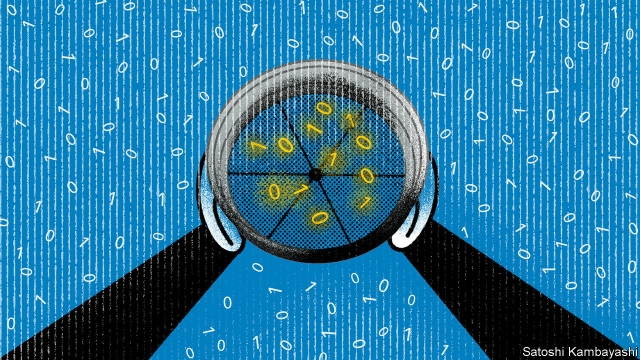

###### Buttonwood

# How machine learning is revolutionising market intelligence 

 

> print-edition iconPrint edition | Finance and economics | Nov 23rd 2019 

THE THAMES seems to draw people who work on intelligence-gathering. The spooks of MI6 are housed in a funky-looking building overlooking the river. Two miles downstream, in a shared office space near Blackfriars Bridge, lives Arkera, a firm that uses machine-learning technology to sort intelligence from newspapers, websites and other public sources for emerging-market investors. Its location is happenstance. London has the right time zone, between the Americas and Asia. It is a nice place to live. The Thames happens to run through it. 

Arkera’s founders, Nav Gupta and Vinit Sahni, both have a background in “macro” hedge funds, the sort that like to bet on big moves in currencies and bond and stock prices ahead of predicted changes in the political climate. The firm’s clients might want a steer on the political risks affecting public finances in Brazil, or to gauge the social pressures that could arise as a consequence of an austerity programme in Egypt. It applies machine learning to find market intelligence and make it usable. 

For many people, the use of such technologies in finance is the stuff of dystopian science fiction, of machines running amok. But once you look at market intelligence through the eyes of computer science, it provokes disquieting thoughts of a different kind. It gives a sense of just how creaky and haphazard the old-school, analogue business of intelligence-gathering has been. 

Analysts have used text data to try to predict changes in asset prices for a century or more. In 1933 Alfred Cowles, an economist whose grandfather had founded the Chicago Tribune, published a pioneering paper in this vein. Cowles sorted stockmarket commentary by William Peter Hamilton, a long-ruling editor of the Wall Street Journal, into three buckets (bullish, bearish or doubtful) and attached an action to each (buy, sell or avoid). He concluded that investors would have done better simply to buy and hold the leading stocks in the Dow Jones index than to follow Hamilton’s steer. 

The application of machine-learning models to text-as-data might seem a world away from Cowles’s approach. But in concept, it is similar. The relevant text is sought. Values are ascribed to it. A statistical model is applied. Its predictions are tested for robustness. Of course, with bags of computing power and suites of self-learning models, the enterprise is on a different scale from Cowles’s rudimentary exercise. The endless expanse of the internet means far richer source material. The range of possible values ascribed to it will be broader than “bullish, bearish or doubtful”. And self-learning algorithms can test and retest the combinations that yield the best predictions. 

It is tempting to focus on the black-box elements of all this: the language software that “reads” the source text and the algorithms that use the data to make predictions. But this is like judging a hi-fi system by its speakers. A lot of the important work comes earlier in the process. Arkera, for instance, spends a lot of effort finding all the relevant text and “cleaning” it—stripping it of extraneous junk, such as captions and disclaimers. “A good signal is crucial,” says Mr Gupta. 

He gives Brazil’s pension reform as an example. The country has 513 parliamentarians. They have social-media accounts, websites and blogs. They speak to the press—Brazil has scores of regional newspapers. All are potential sources of useful data. If you cut corners at this stage you might miss something that even the best statistical model cannot fix later. There is little point in having a cool amplifier and great speakers if the stylus on your record-player is worn out. 

Any good emerging-market analyst knows this, too. If you bumped into one shortly after Brazil’s elections last year, he was probably on his way to Brasília to sound out prospects for a crucial pension reform. Without it, Brazil’s public debt would be certain to explode, sparking capital flight. In July a pension bill finally passed Brazil’s lower house. Arkera’s models tracked the leanings of Brazil’s politicians to get an early sense of the likely outcome. It would be hard for an analyst working unaided to mimic this reach, even if he was always on the ground and spoke perfect Portuguese. 

Intelligence-gathering is a labour-intensive business. It is thus ripe for automation. That this is happening in finance is also natural. There is a well-defined objective (to make money). There is a well-defined end-point (buy, sell or avoid). Without such clarity of purpose, intelligence is an endless river. It is one undammed thing after another.■ 

