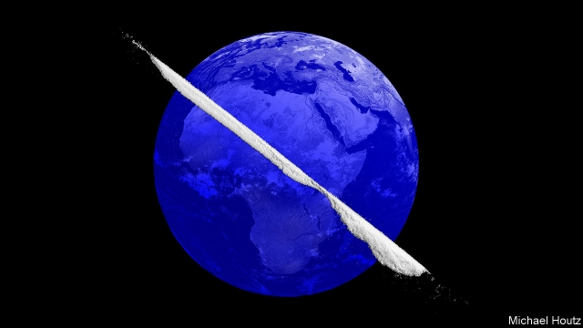
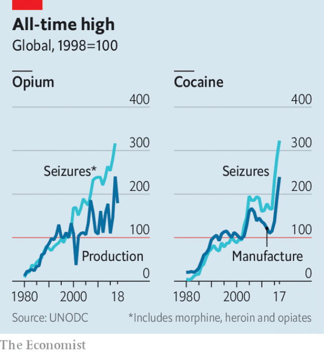

###### Changing gear

# The global drugs trade shifts to west Africa 

 

> print-edition iconPrint edition | International | Nov 23rd 2019 

ONE OF AFRICA’S biggest-ever drug seizures took place on September 1st at a modest bungalow outside the town of Canchungo in Guinea-Bissau. Hidden behind a fake wall, Bissau-Guinean judicial police found 1,660kg of cocaine—enough to cut 100m lines. At two other houses nearby, they found a further 250kg of drugs. They arrested a dozen people, including three Colombians and a Mexican, and nabbed 18 cars and a speedboat. The drugs were destined for Mali and ultimately, Europe. 

The seizure was the second big one this year in Guinea-Bissau. In March police got their hands on almost 800kg. Before that, they had reported no drugs hauls to the UN Office on Drugs and Crime for over a decade. For most observers the surprise was not that a big shipment of drugs was passing through the country, but that the police stopped it. In Guinea-Bissau, a small, poor west African state of just 1.9m people, where over 90% of formal exports are cashew nuts, cocaine-smuggling has been a huge business since at least 2005. UN officials warned more than a decade ago that the country risked becoming a “narco-state”. The drugs trade has only become more embedded since then. International officials in Bissau, the capital, guess that at least ten tonnes of cocaine pass through each year, probably more. At European street prices, that would be worth about the same as Guinea-Bissau’s GDP. Across west Africa, coke is propping up kleptocratic political systems and fuelling violence. 

Having fallen during the global financial crisis, production of hard drugs is now as high as it has ever been (see chart). In Colombia, since a peace deal with the FARC, a Marxist insurgency, was signed in 2016, the coca crop has increased dramatically. When the FARC disbanded, new traffickers rushed to take control of their territory. Competition between buyers has pushed up coca prices so farmers have planted more. Opium in Afghanistan has flourished since most NATO forces pulled out of the country in 2014. The Afghan state, battling the Taliban, has all but given up on trying to stop the drugs trade. Poppies bloom outside Kandahar, the second-biggest city. And the production of synthetic drugs such as ecstasy is up everywhere. 

 

In the rich world, too, drug use is climbing again. In Britain the share of 16- to 24-year-olds who say they have taken a class A drug (such as ecstasy or cocaine) in the past year almost doubled between 2012 and 2018, to 9%. In America cocaine use is rising and drug overdoses, mostly of opiates, continue to kill around 70,000 people a year. And in countries from eastern Europe to Asia, demand for recreational drugs is growing with incomes. 

Most of these drugs have to be smuggled from places such as Afghanistan and Colombia to users, mostly in America and Europe. Traffickers are finding ever more sophisticated ways to hide their product, says Lawrence Gibbons of Britain’s National Crime Agency (NCA). Some hide cocaine within the walls of shipping containers, or inside fruit. They are also exploiting new routes. Police from Britain and the Netherlands have cracked down on shipments through the Caribbean, so traffickers are moving their product through west Africa instead. That means that the violence and corruption that has long afflicted Latin America is spreading. 

The increase in production of drugs “probably affects Africa more than anywhere else”, says Mark Shaw of the Global Initiative against Transnational Organised Crime, a think-tank, because many African states are fragile. Smugglers easily bypass or co-opt their institutions and officials. Drug markets, like other forms of organised crime, thrive best in places where the governments cannot or will not resist them. Trafficking then makes weak, dirty institutions even weaker and dirtier. 

Guinea-Bissau’s appeal is partly geographic. The country is a mere 3,000km from Brazil—about as close as Africa and South America get—and reachable by small aircraft fitted with fuel bladders. With over 80 islands, most uninhabited, it is easy to drop off drugs undetected, or to smuggle them in from boats. In the early days of the trade, when cocaine washed up on beaches, locals did not know what it was and used it as detergent or make-up. Now they know. 

Guinea-Bissau’s politics are ideal for drug barons. Politicians need money and violence to gain and hold high office. Cocaine can pay for both. On November 24th voters will choose a new president. Campaigns involve hundreds of cars, huge wodges of cash and even helicopters, none of which is readily available in a poor country. “The relationship between state weakness and the emergence of the drugs trade is seen very clearly” in Guinea-Bissau, writes Hassoum Ceesay, a historian. 

Colombian traffickers probably arrived in the country some time before the 2005 election, on the invitation of João Bernardo “Nino” Vieira, Guinea-Bissau’s longest-serving president, who needed to raise money to fund his electioneering. Traffickers were brazen—in the military airport in Bissau sits an abandoned Lear jet flown from Venezuela full of cocaine—and the drug money quickly exacerbated Guinea-Bissau’s long-standing instability. 

Soldiers killed Vieira in 2009, hours after his army chief of staff died in a bomb blast. Many locals suspect that Latin American cartels set up both murders. In 2012 the then head of the army, Antonio Indjai, launched a coup d’état, possibly to try to protect his alleged cocaine-trafficking business. He is still wanted by America’s Drug Enforcement Administration (DEA), which in 2013 arrested an accomplice, the former head of the shipless navy, José Américo Bubo Na Tchuto, who served four years in an American prison. 

Latin American cartels probably controlled the cocaine seized in September. Elements of the National Guard and the customs authorities are said to have waved through the drugs. Powerful Bissau-Guineans protect it for a cut of the profits and less powerful ones do the grunt work. “Everybody knows what the deal is,” says a former DEA agent who worked in west Africa. “Drugs are protected by big people, the top people,” says one Bissau-Guinean justice-department official. 

The judicial police force, which grabbed the drugs, is among the cleanest parts of the state. It gets international support. But the government starves it of the resources it needs to investigate the drugs trade. Officers lack boats or cars; sometimes they cannot even pay for mobile-phone credit, says Fernando Jorge Barreto Costa, the force’s deputy director. Judges refuse to issue arrest warrants, or order the release of suspects. According to the Journal of Modern African Studies, in 2007 the public prosecutor released several Colombians on bail using cash that had been seized during their arrest. When the judicial police refused to release them, Aristides Gomes, the prime minister at the time, intervened, arguing that the men should be released and the “bail money” forfeited to the state. 

Guinea-Bissau is not the only place in west Africa to be afflicted by cocaine. In February nine tonnes were found in a ship in Cape Verde. In June police in Senegal seized 800kg hidden in cars on a boat from Brazil. And traffickers have political allies throughout the region. The eldest son of Lansana Conté, the late president of Guinea-Conakry, was jailed for 16 months there for his involvement in the drugs trade. 

East Africa is plagued by heroin. Better enforcement in Turkey has pushed traffickers south. Their product is smuggled out of Afghanistan via Pakistan or Iran, and moved on fishing dhows around the Gulf of Arabia and down to Kenya and Mozambique. From there, it can travel to Europe and America hidden on container ships or inside passengers on commercial flights. 

What are the consequences of the shift in smuggling routes? Drugs need not cause wars—if they did, the Netherlands, which produces much of the world’s ecstasy, would be a hellhole. But they do give people something to fight over, and bankroll armed groups that were already fighting for other reasons. The police say the drugs seized in Guinea-Bissau this year were on their way to Mali. Tuareg and Arab rebels wrestle for control of drug routes across the Sahara desert. In July the UN imposed sanctions on a Malian, Mohamed Ben Ahmed Mahri, for funnelling gains from drug-trafficking to Al-Mourabitoun, a militant group from northern Mali. Gangs that have built up political connections and stashes of weapons can move easily into new rackets such as kidnapping or extortion. 

In more peaceful countries, drugs still strain weak political systems. Suspicions have been voiced in Kenya’s parliament about the alleged past involvement of Mike Sonko and Hassan Joho, the governors of Nairobi and Mombasa, the two biggest cities, in drug-trafficking. Both men deny involvement. Kenya’s government generally co-operates with international efforts to stop trafficking, say local diplomats—probably because the trade helps to finance the opposition. In Mozambique the dominant political party, Frelimo, mostly controls heroin-smuggling itself, says Joseph Hanlon of the London School of Economics. The revenues pay for local power-brokers to get out the vote. 

Being a transit country has other downsides. Smugglers often pay their contacts in drugs to sell locally. (This is easier and cheaper than laundering money.) The world’s second-biggest market for cocaine is Brazil, a major transit country. Heroin is a scourge in east Africa; crack cocaine bedevils west Africa (though it is dwarfed by the abuse of prescription opiates). At a treatment centre run by Catholic priests in Bissau, young men, most of them crack-cocaine addicts, say the drug can be bought for 2,000 west African francs ($3.50) a gram, a tenth of the price in Europe. 

Mexico offers a glimpse of how drug-trafficking may further evolve. As demand in the United States has changed, due to the partial legalisation of cannabis and a surge in opioid use, traffickers have diversified. Tighter security on the border also favours heroin and fentanyl, which are less bulky. A truckload of marijuana is worth about $10m, says Everard Meade of the University of San Diego. $10m of cocaine would fill the boots of several cars. But $10m of heroin can be smuggled inside two briefcases. 

So long as drugs are illegal, criminals will profit from them. Whatever the police do, cartels will adapt. Mr Gibbons of the NCA says that in Britain some Colombians now run vertically integrated businesses—controlling supply at every level from production in the Amazon down to distribution in British cities. In Brazil the First Command of the Capital, a São Paulo-based drug cartel, has taken control of nearly all of the value chain by building plants to process cocaine paste in Bolivia and forging links with crime bosses in Europe. Italian traffickers have hired divers in Brazil to attach magnetic boxes filled with drugs to the bottom of ships, to be removed by a second set of divers when the ships arrive in Europe. As Allan de Abreu, a Brazilian journalist, points out: “The police are always one step behind the traffickers.”■ 

