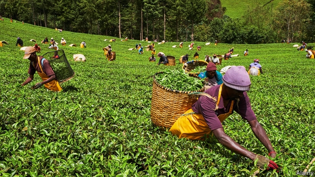

###### Trouble brewing

# A row over who owns Kenya’s land is making life hard for foreign firms 

 

> print-edition iconPrint edition | Middle East and Africa | Nov 23rd 2019 

MANY KENYANS still resent the British colonists who once ruled them, an attitude their schools encourage. The colonists bilked the natives of choice land and ruthlessly suppressed the Mau Mau rebellion, a land-related insurgency waged against them in the 1950s. 

Land grievances remain a powerful undercurrent in Kenyan politics today. At independence in 1963 the departing British set aside money to buy back land in the “White Highlands”, which had been reserved for settlers, and redistribute it among land-hungry Africans. Though many benefited, much of the land went to those with political connections. The family of Kenya’s first president, Jomo Kenyatta, was among the biggest winners. The politicians, however, were happy to let foreign companies own big tea and coffee plantations, so long as they got seats on the board and a share of the profits. The colonists had turned tea and coffee into mainstays of the economy; it was too risky to hand over all the big estates to cronies. 

In the past land in Kenya was less explosive an issue than in some other African countries. In Zimbabwe and South Africa white farmers owned a far greater share of the best land, making them a visible sign of racial inequality and historical injustice, as well as an easy target for populist politicians. In Kenya this was not the case. 

However, thousands of Kenyans have been killed in ethnic clashes linked to land, as tribal groups of smallholders face off against each other, often egged on by politicians. Big commercial farms have largely escaped trouble. But times are changing and multinational firms that own large tracts of land are feeling the heat. 

In 2010 Kenya adopted a devolved constitution that hands hefty powers to 47 newly created counties. It also created a National Land Commission with a mandate to address “historical land injustices and recommend appropriate redress”. In addition it lopped a nine off the 999-year leases granted to foreign owners of big farms in the former White Highlands. But it failed to specify when the 99 years started, allowing some governors to make the dubious claim that land confiscated by Britain before 1920 is now fair game. 

Kericho, the capital of Kenya’s tea country, is a verdant spot. Emerald-green estates stretch as far as the eye can see, hugging the western escarpment of the Rift Valley. Set 7,000 feet above sea level, the climate is perfect for growing tea, Kenya’s biggest export, which fetched $1.4bn last year. For Paul Chepkwony, the governor of Kericho County, these plantations are a reminder of the way the British stiffed his Kipsigis tribe of their land. 

Under British rule the colonists took half the land on which the Kipsigis grazed their cattle, turning it into tea estates. Mr Chepkwony demands that the British government pay compensation to 115,000 Kipsigis and their descendants, who lost their land. (It will not.) Mr Chepkwony also says that a ruling in February by the new land commission allows him to increase land taxes on tea estates and demand a preposterous $20bn or so in profits that he claims were illegally acquired—equivalent to nearly a quarter of Kenya’s annual GDP. 

The burden, he feels, should fall primarily on three firms that grow tea on disputed land: Finlays, Unilever and George Williamson. If they cough up, they would be welcome to stay on as tenants of the Kipsigi people, he says. 

To Mr Chepkwony’s irritation, the multinationals are not playing ball. They have resisted his demands to surrender their title deeds for inspection. They have also challenged the land commission’s ruling. Kimutai Bosek, the governor’s legal adviser, warns that such recalcitrance could prompt frustrated Kipsigis to take the law into their own hands. The tea companies do not take such threats lightly. In June the governor of a neighbouring county led an invasion of an estate, uprooting tea bushes. 

Historic land disputes are vexing multinationals in other sectors, too. Kakuzi, a big British agricultural firm, and Del Monte Kenya, which grows 13,000 acres of pineapples, have faced demands to surrender large chunks of their plantations. 

County governors are also using their new powers to make life difficult off the farm. Tata Chemicals, an Indian soda-ash miner, has been slapped with a $166m land-tax bill it says it cannot pay. Local politicians are also complicating things for Tullow, an Anglo-Irish company trying to extract oil in northern Kenya. 

All this leaves Uhuru Kenyatta, Kenya’s president and Jomo’s son, in a bind. Aside from fears that those with land grievances could one day turn to his family’s vast holdings, he presents himself as a champion of foreign investors. Yet, preoccupied by a power struggle in his government and wary of alienating voters ahead of an election in 2022, Mr Kenyatta has remained aloof. His silence may damage the economy. 

Multinationals are not just big taxpayers but also sizeable employers. Del Monte is Kenya’s largest exporter of canned pineapples. Nearly two-thirds of tea processed by big firms comes from smallholders. When landless peasants organised by the ruling party seized big commercial farms in Zimbabwe, the economy collapsed. 

Some say Kenya’s land commission should look at under-utilised farms owned by politicians. Or that Mr Kenyatta could do more good by reducing corruption, boosting urban employment and helping smallholders make their farms more productive. Many Kenyans have legitimate land grievances, but making implausible demands of profitable firms does not seem the best way of addressing them. ■ 

