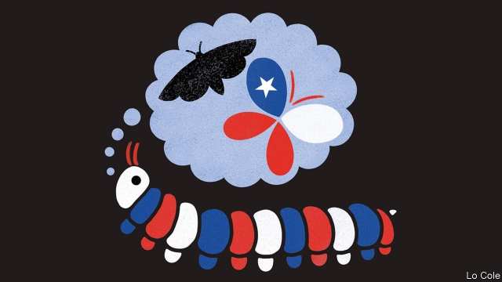

###### Bello

# Chile staggers towards a new constitution 

 

> print-edition iconPrint edition | The Americas | Nov 23rd 2019 

IN 2014 MICHELLE BACHELET, a Socialist, swept into Chile’s presidency for a second time on a programme of radical reform of tax, education and pensions. She also aspired to enact a new constitution that would guarantee “more balance between the state, the private sector and society”, as she told your columnist over tea at the Moneda presidential palace. She argued that her “struggle against inequality” was a last chance to deal with discontents that, if neglected, could push Chile towards populism. 

At the time that seemed alarmist. And several of Ms Bachelet’s reforms were poorly designed. They faced implacable opposition from business and the right. Her public standing was hurt by a scandal involving a bank loan secured by her son. But in retrospect Ms Bachelet was right on the big things. For the past month, because of the discontents she identified, Chile has been seared by a social conflagration. This has seen huge peaceful protests, savagely violent disorder and heavy-handed policing. 

A different country is set to emerge. Chile inherited from the dictatorship of Augusto Pinochet both a fast-growing market economy and a “market society” of pay-for-it-yourself pensions, health care and education. Under democratic governments over the past 30 years, social provision has been incrementally reformed. Chileans are much less poor and their incomes are less unequal. But that is not how many of them see it. The protests are a cry for more redistribution and better public services. 

Ms Bachelet’s successor, Sebastián Piñera, a billionaire businessman turned politician of the centre-right, was elected on a promise to boost economic growth by correcting her reforms. Lacking a congressional majority, he made little progress. His handling of the protests has been erratic. After the Santiago metro suffered co-ordinated arson attacks last month, he declared that Chile was “at war” and sent the army to the streets. For many Chileans, that stripped credibility from his subsequent criticism of policing that has left six dead and some 2,400 hurt, more than 200 with eye injuries. Almost 2,000 police have been injured, too, but they failed to prevent the burning of churches, supermarkets and public buildings. 

Mr Piñera promised an immediate increase in the minimum pension (but to only $165 a month), a small increase in the minimum wage and measures to cut the cost of medicines and electricity. He resisted other changes: a cabinet shuffle was smaller than expected and he dodged demands for more taxes and for a new constitution. “It was too little, too late,” says Heraldo Muñoz, who was Ms Bachelet’s foreign minister. 

The president has now lost control of events. His new finance minister, Ignacio Briones, agreed with the opposition to raise taxes, to finance higher pensions and better health care. After a general strike and violent protests on November 12th, the president was talked out of reimposing a state of emergency. Instead, Gonzalo Blumel, his new interior minister, negotiated a national accord for a referendum in April on whether to have a new constitution and what kind of body should write it. All parties except some on the far left and the far right have signed it. The accord enjoys 67% popular support, according to one poll this week. 

Protests are starting to tail off. The agreement offers Chile a potential path back to peace and consensual reform. There are safeguards against a constituent assembly following the path of Hugo Chávez’s Venezuela. Its job will be purely to draft a constitution, and two-thirds of its members must agree on the text. “The great majority of Chileans are sensible,” says Patricio Navia, a political scientist. “They want to share out the cake better, they don’t want to blow up the cake.” 

Others are more pessimistic. “The neoliberal experiment is completely dead,” according to Sebastián Edwards, a Chilean economist. What will replace it? Some fear a descent into fiscal populism. The economy has already taken a hit, and investment is unlikely to recover until the outline of the new model is clear. Chile has discovered some harsh truths about itself. Its once-admired police force, the Carabineros, have shown themselves to be incompetent as well as brutal. The intelligence service has been proved to be clueless. 

Many in the moderate centre hope that from this catharsis will come a political model that preserves a competitive market economy while creating a European-style welfare state. That would be a breakthrough for Latin America. Getting there will not be straightforward.■ 

