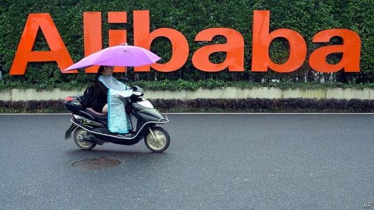
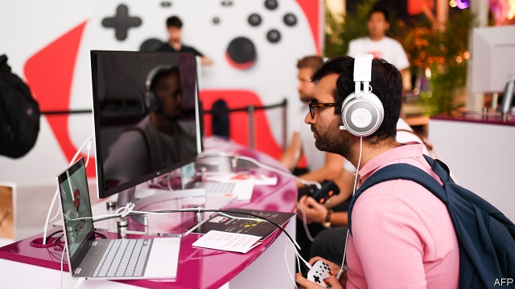

###### Hong Kong in revolt

# Business this week 

 

> Nov 23rd 2019 

Alibaba priced its forthcoming flotation on the Hong Kong stock exchange at HK$176 ($22.49) a share, which could see it raise up to $12.9bn if all the options are taken up. The Chinese e-commerce giant is already listed in New York. It had wanted to undertake a secondary listing in Hong Kong earlier this year, before the city plunged into political turmoil. Taking no chances, Alibaba’s Hong Kong stock code will be 9988, numbers that symbolise enduring fortune in China. 

Scaling back its IPO, the indicative price at which Saudi Aramco is to sell shares on the Riyadh exchange valued it at up to $1.7trn. That is short of the $2trn that Muhammad bin Salman, Saudi Arabia’s de facto ruler, had wanted. The state-owned oil firm could raise up to $25.6bn, below the $100bn it had once hoped for, but still pipping Alibaba’s record IPO, set in New York in 2014. Aramco is selling 1.5% of the company: 0.5% to retail investors in the kingdom and 1% to regional funds and institutions; it has scaled back plans to drum up investors outside the Gulf. The shares are expected to start trading in December. 

Under pressure to boost economic growth, China’s central bank cut its key interest rates, though by just 0.05 percentage points. The move is another signal of a shift at the People’s Bank of China towards a modest easing cycle. 

Australia’s financial-intelligence agency accused Westpac, the country’s second-largest bank, of failing to adequately monitor A$11bn ($7.5bn) in suspicious transactions, some of which were payments to child exploiters in South-East Asian countries. It is the country’s biggest-ever money-laundering scandal, which could result in huge fines for Westpac. 

HP rejected a takeover bid from Xerox, which proposed the offer earlier this month. But the maker of computers and printers left the door open to a potential combination of their businesses. 

America’s Commerce Department said it would issue licences to some companies that will allow them to supply goods and services to Huawei again. It had earlier granted another 90-day waiver for commercial sanctions it has placed on the Chinese maker of smartphones and network-equipment gear, enabling American firms to carry on supporting existing products they have sold to it. The sanctions have proved to be porous, with many firms finding ways through them. Huawei has so far shrugged off the effects. 

Amazon confirmed that it will appeal against the Pentagon’s decision to award a $10bn cloud-computing contract to Microsoft. Amazon had been favourite to win the contract, before Donald Trump, who has kept up a public feud with Jeff Bezos, the company’s boss, suggested it should go elsewhere. Amazon says that procurements should be administered “objectively” and “free from political influence”. Mark Esper, the defence secretary, said the process had been fair.  

 

After music, film and television, internet streaming came to gaming with the launch of Google’s Stadia platform. Users pay a subscription to access games in the cloud which can be played on any device with a strong Wi-Fi connection. Game streaming is unlikely to make consoles obsolete. Microsoft and Sony are bringing out new games consoles next year. Microsoft is also planning its own streaming service. See article. 

America’s National Transportation Safety Board found that an “inadequate safety culture” at Uber’s self-driving vehicle division had contributed to the death of a pedestrian in March 2018, the first time someone has been killed by an autonomous car. The proximate cause was the vehicle’s safety driver, who was distracted by her smartphone, glancing away from the road 23 times in the three minutes before the crash. The incident has pushed back the development of self-driving cars. 

General Motors filed a lawsuit against Fiat Chrysler Automobiles, accusing it of corrupting its negotiations with unions. The three executives at Fiat named in the suit have already pleaded guilty to charges in a lengthy federal investigation into their ties to the United Auto Workers. 

India’s three biggest wireless telecom firms said they would increase fees next month, ending a three-year price war that has given their customers the cheapest data packages in the world. Two of the companies need to raise cash in order to pay government fees following a court ruling. Their share prices surged after announcing the price rises. 

Investing in e-commerce and same-day delivery has paid off for Target, which reported another solid set of quarterly earnings. The retailer, which in 2017 struggled with a rapid decline in sales, has also revamped its stores. The turnaround has bolstered its share price, which has risen by 90% since the start of the year. 

