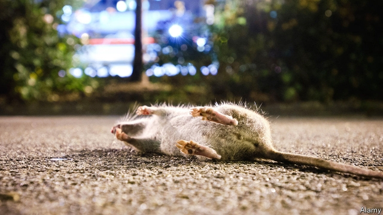

###### Something rodent in the state

# A Californian bill would make it harder to control the state’s thriving rats 

 

> print-edition iconPrint edition | United States | Nov 23rd 2019 

COUNTING RATS in a city may be impossible. But with plump specimens scurrying about during the day on State Street, the main shopping drag in Santa Barbara, a tourist destination in California, it appears that the beach town’s rodents are numerous. In fact, rats seem to be thriving statewide. Louis Rico, of American Rat Control, says Los Angeles’s rat population has probably grown by 50% in five years, bringing public-health problems. His Los Angeles County firm is “busy as heck”. Los Angeles comes second on a ranking of America’s “rattiest” cities by Orkin, a pest controller. 

What is behind the rat boom? Thanks to the end of California’s long drought, more fruit has fallen from trees or is tossed into the compost piles that rats love. Lengthening warm seasons have increased rodent breeding. Also to blame are policies that have restricted homebuilding in California and thereby driven up rents. Homelessness is soaring as a result—California is home to 12% of Americans but nearly half the country’s “unsheltered”, according to federal statistics. The resulting outdoor defecation feeds roaches for rats to eat. Clutter and food in homeless encampments offer rats hiding places and additional grub. 

Despite all this, California appears likely to become the first state to outlaw most use of a highly effective type of rat poison. California already restricts the use of single-dose rodenticide, as the anticoagulant poison is often known, to licensed pest controllers. But pressure groups pushing for a ban have gathered support from mostly liberal lawmakers. 

A rat that emerges from a bait box “weaving around sick” is like “a little ticking time bomb”, says Lisa Owens Viani, head of Raptors are the Solution, a Berkeley outfit that sponsored AB 1788, as the bill is named. The predators most vulnerable to death from secondary poisoning are coyotes, foxes, raccoons, skunks and birds of prey, says Stella McMillin, a scientist at California’s Department of Fish and Wildlife who supports the bill. Mountain lions are not too susceptible, she says. Many were outraged nonetheless after a mountain lion succumbed to rodenticide in September in California, raising to five a National Park Service count of such deaths since 2002. 

San Francisco’s experience sheds light on what might happen if the bill becomes law. Roughly five years after a moratorium in 2008 on single-dose rodenticide on city property, rat colonies began showing resistance to multidose poisons, says Luis Agurto of Pestec, which has a thriving rat-control business in San Francisco. Many rats had associated their illness with the slow-acting poisoned food and avoided it, a phenomenon known as “bait shyness”. San Francisco’s mayor when the moratorium was introduced was Gavin Newsom. Opposition to “super-toxic rodenticides” was part of his campaign last year to become California’s governor.■ 

