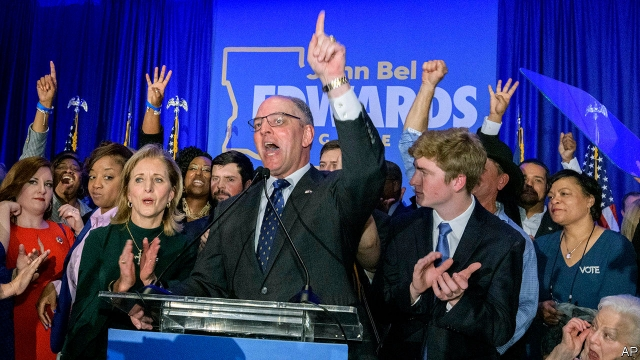

###### A familiar gumbo

# The Democratic victory in Louisiana is not a repudiation of Donald Trump 

 

> print-edition iconPrint edition | United States | Nov 23rd 2019 

LOUISIANA’S GOVERNOR John Bel Edwards, the only Democrat in the deeply Republican Deep South to hold his state’s top office, won a second term on November 16th, a result that was startling from nearly every angle. Mr Edwards hung on for a 51-49% victory over Eddie Rispone, a businessman, despite furious efforts by President Donald Trump to turn the race into a referendum on impeachment. The result has been misread in some corners as a repudiation of Mr Trump or as evidence of a turn towards the Democratic Party on the part of Louisiana voters. It was neither. 

Despite governing a state where 58% of voters plumped for Mr Trump, Mr Edwards is popular. His achievements—a balanced budget, criminal-justice reforms—have been cautious, bipartisan affairs. He is an avid hunter and a diehard pro-lifer, taking away two of the most reliable lines of attack on Democrats in this part of the country. Mr Trump told voters that Mr Edwards was coming for their guns, but it is not clear anyone bought that. 

The fact of Mr Edwards’s victory is important. But it is worth asking why an incumbent with a record of competent governance barely eked out a win over a feeble opponent, when four years ago, as a virtual nobody, he crushed a longtime Republican standard-bearer. The only explanation for the tight margin was what is going on in Washington. Mr Trump’s presidency, and the impeachment inquiry, have further hardened partisan divisions and nationalised races that used to be parochial affairs. 

Mr Edwards’s perceived strength explains why his opponent was Mr Rispone, the low-wattage owner of an electrical-contracting firm. Mr Rispone’s only competition in the primary came from Ralph Abraham, who shared some of Mr Rispone’s attributes but lacked his money. Mr Rispone ran a campaign that consisted largely of attaching himself to Mr Trump—he attacked Mr Abraham for briefly questioning Candidate Trump’s fitness after the “Access Hollywood” tape. He portrayed Mr Edwards as a “liberal trial lawyer”. He appeared at just one debate, rarely spoke to the media and offered few policies, saying only that he would hold a convention to rewrite the state constitution if elected. How? Mr Rispone did not say. 

Mr Edwards tried mightily not to antagonise Mr Trump. A day after the election he told Tyler Bridges of the Times-Picayune and the Advocate that he had avoided paying attention to the president’s appearances in the state for fear it would cause him to say something intemperate. He allowed himself one dig on election night. “God bless his heart,” he said of Mr Trump, to a jubilant crowd—a backhanded compliment which, in the South, roughly translates as “Forgive him; he’s a moron.” 

Mr Edwards promises to protect the achievements of his first term: less incarceration, a rise in teachers’ pay, balanced budgets. The biggest new idea he has put on the table is a promise to put more state money into early childhood education. Whether even such a modest agenda can be brought to fruition will depend on the legislature, which has a nearly veto-proof Republican majority. Four years of gridlock seems a likely outcome.■ 

