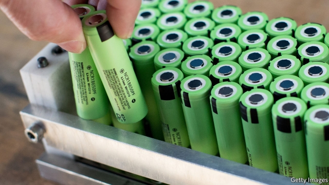
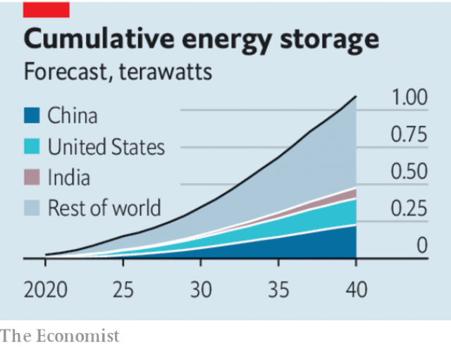

###### A bid for better batteries

# Power storage is the missing link in green-energy plans 

 

> print-edition iconPrint edition | Leaders | Nov 30th 2019 

SOLAR AND wind power are the glamorous twins of the clean-electricity revolution. It is thrilling to see a field of glistening panels absorbing the sun’s energy or a vast turbine twirling above the ocean. Stationary power storage does not have quite the same allure—think of a large metal shed stuffed with piles of big batteries. Nonetheless, the ability to stockpile energy on a massive scale will be of supreme importance if the world is to wean itself off filthy fossil-fuel power plants. The technology is gradually getting cheaper and attracting investment (see article). But more needs to be done to ensure that it sparks. 

To see why storage is important, work backwards from the most common strategy to limit climate change. Plans typically reduce emissions from electricity generation by switching it away from fossil fuels, then electrify other carbon-belching activities, such as driving cars and heating buildings. Abundant, reliable, clean electricity is the foundation on which many green investments and policies rest. And to work well, clean electricity in turn depends on storage. 

Nuclear plants could supply steady clean power, but they attract fierce opposition and are beset by cost overruns. Solar and wind are the fastest-growing alternatives. Today they account for 7% of global generation, twice the share in 2013. But the sun does not always shine and the wind may not blow. As the share of intermittent sources rises, so will demand for energy to offset swings in supply. In the short run, dirty coal and gas will have to provide flexibility. Eventually, however, storage must play that role, and the sooner the better. The aim is to capture solar and wind power when it is plentiful and release it as needed. 

 

Today pumped hydropower is the most common way to store energy. When it is sunny or windy any excess electricity from solar and wind farms can be used to pump water uphill into reservoirs, to be released later to generate hydropower. But lots of places lack mountains, rain and room. Batteries are an alternative. They can smooth jumps and drops in supply and store renewable energy when it is abundant, as in California on a sunny afternoon, and then release it in the evening, when demand rises. They could transform big emerging markets that still plan to expand their use of fossil fuels. The International Energy Agency reckons that, excluding coal projects already planned, batteries have the potential to cut the number of coal plants built in India after 2030 by three-quarters. 

If batteries are to realise their potential, they need to become cheaper and better. Progress is being made. Lithium-ion batteries have become 85% less expensive since 2010, as firms have poured capital into factories to mass-produce batteries for electric vehicles. Investment in storage capacity will hit about $9bn next year, predicts BloombergNEF, a data firm, four times the level in 2017. But technical problems persist. For example, lithium-ion batteries are bad at storing energy for long periods, which is important in countries with rainy seasons. Happily, firms are experimenting (see article). Tycoons, including Jack Ma of Alibaba and Jeff Bezos of Amazon, have invested in startups that are pursuing energy storage using everything from novel battery designs to molten salt to pressurised water pumped underground. 

For firms and capital markets to work their magic, a policy is needed—if only because, more than in other industries, the state sets the rules in power. Vested interests and out-of-date thinking lead to a bias against batteries. Last year America’s energy department granted $28m in research awards for long-term storage—a pittance compared with, say, the $150m the country spent on a tax break for coal royalties. Many places offer subsidies or mandates for wind and solar power, but not for the storage it will depend on to work at its best. 

All too often storage technologies do not enjoy the same access to power grids and customers as dirtier sources of power do. Last year America’s federal electricity regulator ordered the country’s regional power markets to be opened up to storage, but implementation has been sluggish. The shift to clean energy will not happen unless it can be more easily stored. It is time for a high-voltage jolt to help an essential technology thrive.■ 

