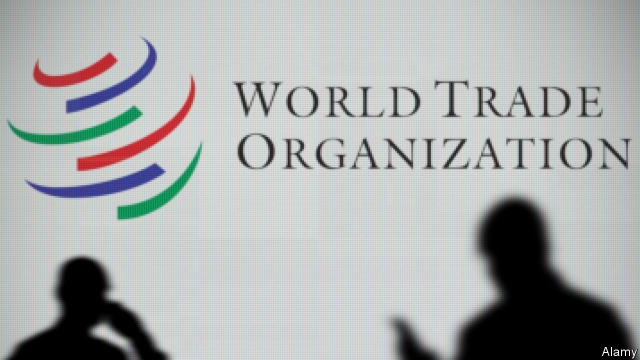

###### The twilight of the WTO

# The trading system’s referee is about to leave the field 

 

> print-edition iconPrint edition | Leaders | Nov 30th 2019 

ONE WAY of thinking about the world’s trading system is as a sports match featuring a sprawling, brawling international cast of players, each with their own tactics and tricks. The game works best when there is a referee, and for nearly 25 years a group of seven judges at the World Trade Organisation (WTO) has done the job. But on December 11th this body will cease to function, because America is blocking new appointments to it. The referee’s departure will make cross-border commerce unrulier and, in the long run, invite an anarchy that would make the world poorer. 

The WTO’s appellate body is one of those institutions that most people have never heard of, but which will be missed when it is gone. Set up in 1995, it hears appeals over trade disputes and grants the right to limited retaliation where there has been wrongdoing. Some 164 countries and territories follow its rulings, and the body has prevented some of the nastiest rows from spiralling into outright tariff wars—for example, the epic spat between America and the European Union over subsidies for Boeing and Airbus. Since it was created, it has been the enforcer-of-last-resort for over 500 cases (see article). 

Before 1995 the system was less stable and less fair. The General Agreement on Tariffs and Trade, the WTO’s predecessor, had rules but no judges to enforce them. Big countries had bullying rights. The legal clarity and independence provided by the appellate body is one reason why trade rose from 41% of world GDP in the year before it was created to 58% in 2017. 

The immediate cause of the judges’ downfall is the Trump administration’s refusal to appoint new judges to replace those who are retiring, a symptom of the president’s suspicion of multilateral institutions. But it is a mistake to blame everything on him. The WTO’s troubles expose deeper problems. 

Most countries like independent arbiters, until they suffer a critical ruling. American unease predates Mr Trump. The Bush and Obama administrations tried to influence outcomes by blocking the reappointment of judges. The WTO is also unwieldy. Ideally the rules would be updated every decade or so, giving countries a chance to modernise them and take on judgments they dislike. But the WTO’s membership has doubled since 1995, and because each country has a veto it has been impossible to update the rules to reflect, say, the disruption caused by China’s state-led model (it joined the WTO in 2001). Instead, grumbles have festered. 

What happens from December 11th? Some WTO members are trying to concoct an unofficial appellate body, drawing on retired judges, to resolve disputes. A new president elected in 2020 might reverse America’s stance, although several Democratic presidential contenders are lukewarm on free trade. 

Most likely, the appellate body will die, or remain dormant for years. If so, expect a deterioration in conduct—Japan and South Korea are already in an ugly spat. Some Americans believe that their country’s size gives them the raw clout to impose rules on others, but it has yet to wrest any big concessions from China. 

Indeed, as the legal framework for trade decays, even America will be vulnerable to escalating tensions. So far, trade frictions have not caused a global recession. But trade has stopped growing and long-term investment by multinational firms dropped by 20% in the first half of this year. If there is a recession, the temptation of tit-for-tat tariffs will rise across the world. When the referee leaves the field, anything goes. ■ 

