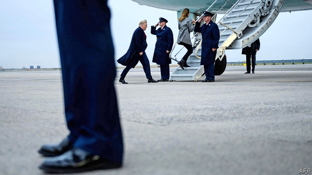
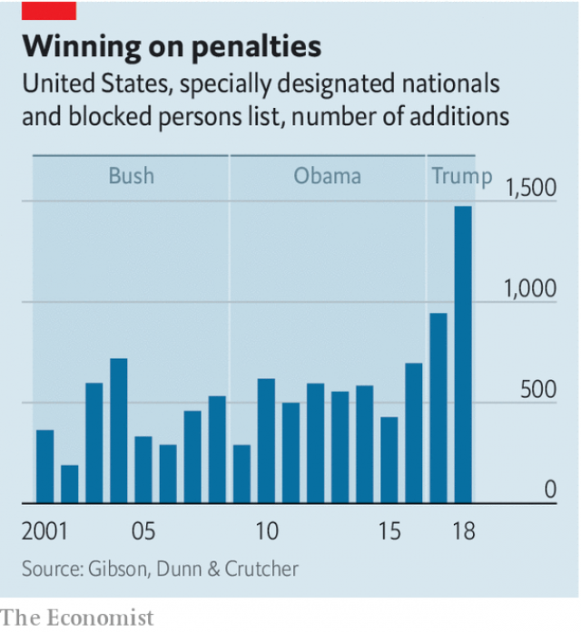

###### Financial carpet-bombing

# Donald Trump has shown a surprising enthusiasm for sanctions 

 

> print-edition iconPrint edition | United States | Nov 30th 2019 

IN DECEMBER 2017 the Democratic Republic of Congo was in ferment. Joseph Kabila, then the president, seemed to be weighing whether or not to stand in an election, even though he should have left office a year before, having served two full terms, his limit under the country’s constitution. In Kinshasa, the capital, Mr Kabila’s allies remarked casually that perhaps the president would stand again. It was at that moment that the American government imposed sanctions on Dan Gertler, an Israeli mining billionaire who is a close friend of Mr Kabila. Steven Mnuchin, the treasury secretary, announced that at the “direction of President Trump”, he was placing sanctions on Mr Gertler, together with 12 other “serious human-rights abusers and corrupt actors.” Mr Trump, he said, was “declaring a national emergency with respect to serious human-rights abuse and corruption around the world.” 

The imposition of sanctions on Mr Gertler came as a shock to many companies operating in Congo. According to Tom Perriello, formerly Barack Obama’s envoy to the Great Lakes region of Africa, it probably helped push Mr Kabila to his eventual decision to stand down in the elections that took place a year later, last December. Yet under the Obama administration, the Treasury had considered sanctions on Mr Gertler and backed off. Under Mr Trump, it did not hesitate. Indeed, his administration has been more enthusiastic than any other in history about using financial sanctions. Partly that is because the president is intent on bashing places like Iran and Venezuela. But that is not a complete explanation: sanctions have expanded everywhere. This stands in stark contrast to other parts of Mr Trump’s foreign policy. 

According to data gathered by Gibson, Dunn & Crutcher, a law firm, in his first three years in office Mr Trump has added over 3,100 people and entities to the sanctions list run by the Office of Foreign Assets Control, a division of the Treasury. That is only slightly short of the 3,484 that George W. Bush added in his entire eight years in office. Last year Mr Trump added 1,474 names to a list that is now around 7,500- strong. The Trump administration has not just expanded sanctions but innovated with them too—for example, by stopping the trading of Venezuelan sovereign bonds. 

America is not alone in imposing targeted sanctions: the European Union and the United Nations have programmes too. But America’s is of special importance because of the country’s position at the heart of the world’s financial system. When individuals suffer sanctions from the Treasury, their assets in America are frozen. But the effect goes further than that. Firms which operate in America, or make payments in dollars, cannot easily deal with individuals on the list. Such is the reach of the dollar that penalised individuals will struggle to open bank accounts, own assets or be paid, even in countries that are not close to Mr Trump’s America. When companies face sanctions from America’s Commerce Department, as Huawei, a Chinese telecoms giant, does, it has a similar effect—they cannot buy from American firms. 

Mr Trump has used sanctions as a bludgeon in high-profile disputes. In September, imposing measures on Iran’s national bank, he declared they would be “the highest sanctions ever”. Last month, when Turkey’s president, Recep Tayyip Erdogan, launched an invasion of Syria, Mr Trump threatened to “swiftly destroy Turkey’s economy”, as the Treasury imposed targeted sanctions on three Turkish officials. But more quietly, his administration has also punished unprecedented numbers of people accused of corruption and human-rights abuses in more unexpected places. Many such as Mr Gertler have been targeted under the Global Magnitsky Act, which came into force in 2016 and allows America to impose sanctions on people even from countries on which there is no national sanctions programme in place. 

In October the Gupta brothers, two Indians accused of working with Jacob Zuma, South Africa’s former president, to loot state institutions, were added to the Treasury’s list. Weeks later Mr Trump added Owen Ncube, the Zimbabwean security minister, to the list. America now has sanctions on 85 Zimbabweans. According to John Prendergast, an activist who co-founded The Sentry, a pressure group which investigates corruption and human-rights abuses in Africa, Mr Trump’s use of the Global Magnitsky Act to go after crooks and murderers has been “a game changer”. 

 

What has driven this surge in sanctions? According to Marshall Billingslea, an assistant secretary in the Treasury department, it reflects Donald Trump’s innovative “financial statecraft”. Certainly, sanctions seem an ideal tool for a man who wants to put foreigners under lots of pressure but is reluctant to send troops or bombers to do the job. “Sanctions are…an option for when words aren’t good enough but war is too much,” says Elizabeth Rosenberg of the Centre for a New American Security, a think-tank in Washington. 

Mr Trump’s personality is clearly a factor, too. Mr Mnuchin has announced sanctions in person more than two dozen times—instead of leaving it to more junior officials as previous treasury secretaries did. He has claimed to spend half his time working on sanctions. The commerce secretary, Wilbur Ross, has been almost as enthusiastic. Adam Smith of Gibson, Dunn & Crutcher argues that unleashing sanctions on people and firms is quicker and cheaper than most of the other things that Mr Mnuchin and Mr Ross can do to bring about change. In an administration “less steeped in the formal deliberative policy process” than most, this matters, he notes. 

That raises another question, however—do sanctions work? In a tactical sense, it seems fairly clear that they do. Targeted sanctions make people miserable, says Mr Smith. In October the Zimbabwean government declared a national holiday in order to organise protests against sanctions on its members. Mr Gertler has hired lobbyists including Alan Dershowitz, a prominent lawyer, to try to get off the list. The sorts of people who suffer sanctions in general find that they need to deal with America and American companies. 

Yet, in a strategic sense, it is not so clear that sanctions are achieving much. Mr Trump’s government says that for sanctions to be lifted, Venezuela’s president must step down, while Iran must transform its foreign policy. Such a full capitulation seems unlikely. Nor is it obvious that individuals are responding. Beyond increasing his lobbying bill, the sanctions on Mr Gertler did not change his behaviour much. He still flies to Kinshasa on his private jet each week and is still close to Mr Kabila, who retains considerable influence in Congo. He still collects royalties of around $30m per year on his mining interests. Glencore, one of the biggest mining companies in Congo, found a way around the Treasury by paying him in euros. If sanctions did help push Mr Kabila to step down, it was because they signalled America’s seriousness about seeing the back of him. 

In a research paper The Sentry, Mr Prendergast’s outfit, points to successes in places like Liberia and Sudan in changing the behaviour of individuals who are targeted. But all the sanctions programmes it analysed suffered from “poor conceptualisation, co-ordination, implementation, and enforcement.” Diplomats are not always engaged in sanctions policy, which comes from the Treasury and Commerce, not the State Department. The staff keeping the lists up to date are stretched thin. Many African sanctions programmes have nobody to manage them. That means sanctions can sometimes be dodged. Overall, officials have little idea how well sanctions work or what their effects are, according to a report released last month by the Government Accountability Office. 

Few will shed a tear for foreign officials who can no longer buy penthouses in Manhattan or yachts in Miami. But foreigners can be penalised in this way on the basis of entirely classified evidence. There is no way to appeal. And the costs affect more than just the individuals. One risk is that financial firms simply cut off whole countries to ease the cost of compliance. In Zimbabwe, for example, local banks by law cannot comply with American sanctions. That means that American banks will not deal with them. That is certainly not the cause of Zimbabwe’s economic problems, but it does not help. 

If they do not change behaviour, American sanctions risk becoming less a tool of coercion than an expensive and rather arbitrary extra-territorial form of punishment. Over time, foreign powers could begin to create avoidance schemes that would make them less effective. If that happens, the Trump administration will have weakened one of America’s strongest non-military weapons. But such schemes will not be easy to devise as long as America is the world’s pre-eminent financial centre. For the moment at least, Mr Trump’s sanctions policy is a bright spot in an otherwise lamentable foreign-policy record.■ 

