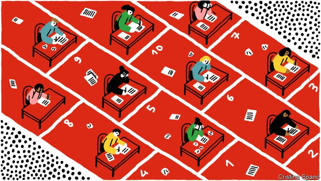

###### The parable of Finland

# PISA results can lead policymakers astray 

 

> print-edition iconPrint edition | International | Dec 5th 2019 

WHEN ESTONIA gained independence from the Soviet Union in 1991 it took the chance to reshape the country’s education system. Mailis Reps, the current education minister, says officials and politicians looked everywhere—from America to the Netherlands—for inspiration. But they kept coming back to their Nordic neighbours. As Ms Reps recalls, the concluding argument in any debate often ran: “Let’s try something like that because it works in Sweden or Finland.” 

Many others have done similarly. Every three years the OECD publishes results from the Programme for International Student Assessment, with the latest out on December 3rd. PISA tests the reading, maths and science skills of 15- and 16-year-olds in the OECD’s member states, as well as volunteers not in the club of mostly rich countries. The results provide a means to directly compare different education systems. It is now nearly two decades since the first batch were released. Back then, there was a surprise. Finland, not previously renowned for its education, topped the table when it came to reading, and excelled in other categories, too. 

The Nordic country appeared to have discovered a way to get brilliant results without the discipline and intense workload of East Asian champions like Japan and South Korea, which were the other top scorers at the time. Educationalists descended on Helsinki. They reported back that not only was education free and comprehensive, but teachers were highly respected, well trained and left to get on with their jobs, which frequently involved enabling children to discover things for themselves. Schools in countries from Scotland to South Korea sought to mirror Finnish education. Indeed, international visits became so popular that the Finnish government started to charge for them. Those arriving today pay more than €1,200 ($1,300) to visit a school. 

Yet Finland’s image as an educational Utopia now appears to be somewhat out of date. The latest PISA results show a fall in its average score, as they have every round since 2006. Gaps between rich and poor pupils are widening, something which is distressing for a country that prides itself on equality. Estonia, once a mere imitator, is now the highest achiever among OECD countries. Mart Laidmets, the secretary-general of Estonia’s ministry of education, notes with more than a hint of satisfaction that although Asian delegations still fly to Helsinki, they increasingly use it only as a connection on the way to Tallinn. 

The parable of Finland helps to explain why there has been little overall progress since PISA began. The hope at the turn of the millennium was that the wealth of new information provided by the tests would help identify why some school systems do so well. Others would follow their lead, causing results to rise across the board. But although spending per pupil in the OECD has risen by 15% in just the past decade, performance in reading, maths and science remains essentially the same as when the tests started. 

As ever, this year’s results include plenty of bright spots (see chart). Singapore’s sparkling scores have got better still. Even so, it is no longer the highest achiever overall. That is China—or to be more precise, Beijing, Shanghai, Jiangsu and Zhejiang (the OECD declines to include results from farther afield because it cannot guarantee their veracity). Less well-studied countries including Jordan, Poland and Turkey have also seen improvements. And yet for every Jordan, there is a Finland. 

 

Part of the reason for the lack of overall progress is that schools have less influence over results than is commonly assumed. Culture and other social factors, such as adult literacy, matter more, meaning that even well-informed policymakers can only make so much difference. As John Jerrim of University College London notes, “You are always going to have East Asian countries coming top.” And, as the data suggest, above a certain level (around $50,000 per pupil, cumulatively between the ages of six and 15) there is not much of a relationship between expenditure and PISA scores. 

The importance of culture can be seen in Estonia and Finland, both of which have long histories of high levels of literacy, often promoted by the local Protestant church. “There is this kind of general understanding” says Ms Reps, “that we don’t have, I don’t know, a golden diamond, but that education is the thing.” Finland created a series of children’s books featuring the Moomins—pale, rounded creatures that are beloved by youngsters around the world. Libraries are scattered throughout the country, including a spectacular, sloping one next to the train station in the centre of Helsinki, called Oodi, which was built to celebrate the country’s centenary at a cost of €98m. These kinds of things are difficult for other countries to replicate. 

Other factors are also beyond the control of education ministers. Immigration plays an important role, with recent arrivals scoring below locals in most countries. Finland has seen a small uptick in the number of migrant pupils taking PISA over the past decade. More than four-fifths do not speak Finnish at home, helping to explain the big gap in performance between them and local students. Estonia has seen a similar increase in the number of immigrant pupils, but new arrivals are much less likely to be poor than they are in its Nordic neighbour. 

Finland’s decline may make the wonks who rushed to copy its schools seem silly. But looking deeper there are still lessons to learn from Finland’s example. Despite the country having a reputation for cuddly teaching, it used to take a slightly more hardline approach. In 1996, four years before the first batch of PISA results, a group of British researchers visited the country. They found “whole classes following line by line what is written in the textbook, at a pace determined by the teacher...We have moved from school to school and seen almost identical lessons—you could have swapped the teachers over and children would not have noticed the difference.” As Gabriel Heller Sahlgren, an economist, has noted, most of the children who scored so highly in the first round of tests would have experienced this sort of schooling. 

 

By the time the results came out, many Finnish schools had started to move in a very different direction, confounding touring policymakers. A forthcoming study by Aino Saarinen and colleagues at the Universities of Helsinki and Oulu analyses PISA data from 2012 and 2015, finding that children in schools which gave pupils more freedom to direct their own learning had lower scores in maths and science. Those from poor and migrant families suffered the most. Eschewing the possibility of a happy midpoint between reading from a textbook and leaving children to their own devices, schools have continued to experiment in the years since. A wave of new institutions are being built without classrooms. A new curriculum, which began to be introduced in 2016, encourages lessons without defined subjects. 

Despite this, there remain many similarities in the organisation of the Estonian and Finnish education systems. There are very few fee-paying schools, for instance, and both seek to minimise exams and segregation by ability. Belying the slightly staid office in which he sits, replete with portraits of the country’s leaders and a large Estonian flag, Rando Kuustik, the head of the Jakob Westholm School in the centre of Tallinn, says that his first priority is his pupils’ happiness, and his second is to “help them manage better in the world than when they entered.” 

But although Mr Kuustik’s teachers are beginning to tweak their style of instruction by, for instance, making more use of group work, “we are still a very traditional school,” he explains. Before pupils work in groups, the teacher makes sure they have a thorough understanding of what they are working on. Rules are clear, and teachers lead lessons from the front of the class. Academics report a similar picture across the country. Tim Oates of Cambridge Assessment, a testing company, lauds the country’s rigorous, coherent curriculum. 

Much of this can be learnt from. But any country hoping to import the Estonian model in its entirety is likely to be disappointed. The country has seen fast economic growth over the past three decades, which is associated with better results. And migration out of the country, combined with a lower birth rate, means the school population has fallen by 29% since 2000, leaving an unusual education system. Andreas Schleicher, head of education at the OECD, notes there is a “healthy degree of competition” between schools to attract the remaining pupils. In rural primary schools, it is not uncommon to have classes as small as two or three pupils, says Ms Reps, meaning they receive something akin to private tuition. One school even managed to stay open for two years without any children—something other countries will probably choose not to copy. ■ 

