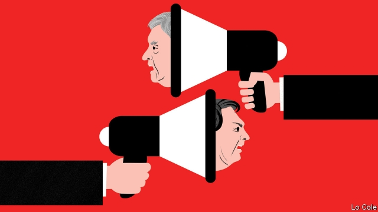

###### Bello

# The surprising similarities between AMLO and Jair Bolsonaro 

 

> print-edition iconPrint edition | The Americas | Dec 7th 2019 

TO ALL APPEARANCES they are opposites and foes. Brazil’s Jair Bolsonaro is a foul-mouthed former army captain of the hard right. Mexico’s Andrés Manuel López Obrador is a would-be revolutionary of the left. Mr Bolsonaro appeals to the worst in Brazilians, with his diatribes against women and gays, casual racism and fondness for guns and chopping down the Amazon’s trees. Mr López Obrador (known as AMLO) invokes the noble purpose of making Mexico fairer and less unequal. Yet for all their differences, the two most important presidents in Latin America are strikingly similar in many ways. After roughly a year in office, each faces difficulties. 

Both are reactionaries in the purest sense, conjuring up an imagined golden past. Mr Bolsonaro lionises Brazil’s military dictatorship of 1964-85. AMLO, who stresses that he is a democrat, believes that everything was better in Mexico before a turn to “neoliberalism” in the 1980s. Both are nationalists with little interest in the outside world and would rather the outside world reciprocated. They are believers, and have inserted religion into the political discourse of hitherto secular states. Mr Bolsonaro, a Pentecostal protestant, campaigned on the slogan “Brazil above all, God above everyone”. AMLO implicitly compares himself to Christ, who was “sacrificed …for defending the poor”. Both defend traditional family values, though they see different threats to them: left-wing political correctness in Mr Bolsonaro’s case, neoliberalism for AMLO. Although Mr Bolsonaro, whose cabinet is stuffed with officers, more obviously relies on military help, AMLO has also bolstered the army’s role. He called it “the people, in uniform” and put a retired general in charge of a new National Guard. 

Neither has much respect for the separation of powers. During Mr Bolsonaro’s election campaign one of his sons, Eduardo, said it would take only “a soldier and a corporal” to close the supreme court. Both Eduardo and Paulo Guedes, the economy minister, have mused about reviving A1-5, a decree under which the dictatorship suspended freedoms and purged congress. In Mexico AMLO’s government strong-armed a supreme-court justice into resigning. His critics fear that he will take control of the electoral authority when new members are chosen next year. Both men dislike NGOs, which they see as meddlers. Mr Bolsonaro has made preposterous claims that NGOs (and Leonardo DiCaprio, an American film star) were behind fires in the Amazon. AMLO cancelled government funding to outfits providing child care and fighting people-trafficking. 

Both presidents were elected on similar promises: to revive their economies and, by force of will, eliminate corruption and crime. They are going about these tasks differently, and with varying success. The efforts of Mr Bolsonaro’s economic team to shrink unsustainable fiscal commitments have found support in congress, despite the president rather than because of him. The economy grew by 0.6% in the third quarter compared with the second. Mexico had a solid fiscal position. But AMLO introduced his own version of austerity, cutting government salaries and what he sees as waste. He and private business are suspicious of each other. Mexico’s economy has sunk into a mild recession. 

On crime, Mr Bolsonaro can be blamed for a rise in killings by police, which he has encouraged. He can take little credit for a sharp fall in overall murders this year, which began before he took office and owes much to the end of a vendetta between drug syndicates. AMLO has even less to crow about: Mexico’s murder rate continues to rise, with massacres by drug gangs almost every month. His policy of “hugs, not bullets”, of helping unemployed young people, shows no sign of working. He has failed to strengthen corruption-fighting institutions. Mr Bolsonaro’s government has tried to block an investigation that has revealed links between his sons and paramilitary militias in Rio de Janeiro. 

What really unites these seemingly contrasting presidents is that both are populists. They see themselves as saviours, and claim a special bond with “the people”. Measured by popularity, AMLO is the winner. His approval rating is 68% compared with 42% for Mr Bolsonaro. How long will that last? Mr Bolsonaro, who has outsourced economic policy to Mr Guedes, knows what he doesn’t know, while AMLO thinks he knows better than anyone else. Brazil has more checks on presidential power than does Mexico. That means AMLO has nobody else to blame as things start going wrong. 

