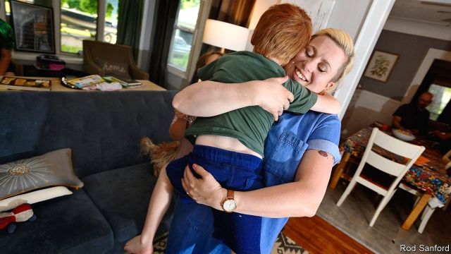

###### Fostering enmity

# Why Donald Trump wants to keep religious adoption agencies open 

 

> print-edition iconPrint edition | United States | Dec 7th 2019 

THE FIRST lesson Melissa Buck taught her eldest child was that she was not going to hit him. The 37-year-old stay-at-home mother from Holt, Michigan and her husband had fostered the then four-year-old and his two younger siblings after a parishioner at their church told them that the children, having been removed from their mother, were at risk of being separated. All three were traumatised by physical abuse and neglect. The little boy was plainly terrified, Mrs Buck recalled, that he would be beaten if his younger brother and sister made too much noise. 

Over the next five years the Bucks fostered two more children: a girl with a rare genetic condition who needed frequent hospital stays, and the autistic younger half-brother of two of their older foster-children. “I was so nervous at the beginning,” says Mrs Buck. “What if they started a fire or ran away; what if I loved them too much? But the Bible makes clear that taking care of the orphaned, the parentless, is our job.” She could not, she says, have coped without the agency that arranged the placements, St Vincent Catholic Charities in Lansing, Michigan. Though Mrs Buck and her husband have now formally adopted all five children, they still depend on the organisation to help them find the myriad medical and educational services needed by their children. 

St Vincent may soon stop doing this work—along with innumerable other Christian organisations that have long organised fostering and adoption placements in America. The reason is their refusal to consider placing children with LGBT parents, a requirement of the anti-discrimination laws that followed the legalisation of gay marriage in 2015. In 2017, after St Vincent told two lesbian would-be foster parents that it did not work with same-sex couples, the American Civil Liberties Union sued the state of Michigan, with which St Vincent has a contract. Settling the case this year, Michigan said it would cut funding to agencies that discriminate on religious grounds. In September, after St Vincent, along with the Buck family, sued the state, a federal judge ruled that religious agencies could continue to refuse to work with same-sex couples. The decision is likely to be appealed against. 

A similar battle is playing out in Philadelphia, where the city stopped funding a Christian foster agency because it would not work with same-sex couples. In other states which have passed laws protecting religious agencies from requirements that conflict with their beliefs, more cases are being fought. As long as Christian agencies go on insisting that marriage is only between a man and a woman, their continued existence is under threat. 

The issue, inevitably, has been politicised. President Donald Trump, who presented himself as a warrior for religious freedom to the evangelicals who helped elect him in 2016 and on whom he still depends, has entered the fray. This month his administration issued a proposed rule allowing religious providers to follow their beliefs. It would replace an Obama-era rule from 2016 that forbids recipients of federal funding to discriminate on the ground of sexual orientation. Though rules do not have the power of laws, the change is likely to lead to further legislation and more legal battles on the issue. Right-wing Evangelical leaders have greeted the planned rule-change with jubilation. 

Some conservative Christians argue that if religious adoption and fostering agencies are forced to close, fewer children will find proper homes. Assessing this claim is less straightforward than it might seem, because no data exist on the proportion of placements organised by religious agencies. But Christian organisations have undoubtedly played a huge role in finding homes for children who cannot live with their own families. Around a quarter of the more than 400,000 children now in foster care in America will never return to their families. Many religious agencies recruit in churches with great success. Research by the Barna Group, an evangelical research outfit, found that practising Christians were twice as likely to have adopted children as other Americans. Although some Christians would doubtless adopt and foster children from secular agencies if no religious ones existed, others would not. 

Yet it is unlikely that fewer children will be fostered or adopted if anti-discrimination laws prevail. Not all Christian agencies will be forced to close. A number of them have long placed children with LGBT parents, though they have tended to do so quietly. More important, the number of LGBT Americans who want to foster and adopt seems likely to make up for any shortfall that arises when Christian organisations lose their funding. Research by the Williams Institute, part of the University of California, Los Angeles, found that of the 114,000 same-sex couples raising children in America, 25% of them are bringing up adopted or fostered ones, compared with 3% of heterosexual couples with children. 

But in some places, especially in the South, where religious agencies dominate adoption and fostering services, their absence will be keenly felt. And Christian foster parents and adopters will mourn lost connections. Mrs Buck says she would like to offer a home to any future offspring of her children’s biological parents. But if St Vincent’s is no longer arranging placements, she may not get the chance.■ 

