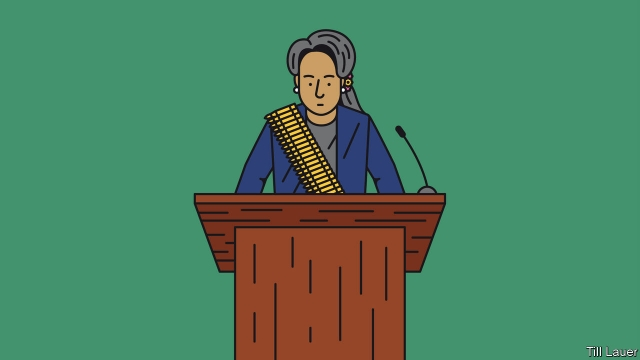

###### Banyan

# Aung San Suu Kyi has gone from hero to villain 

 

> print-edition iconPrint edition | Asia | Dec 12th 2019 

THE COMMITTEE that awarded the Nobel peace prize to Aung San Suu Kyi in 1991 described her as “an important symbol in the struggle against oppression” and an inspiration to those “striving to attain democracy, human rights and ethnic conciliation by peaceful means”. But to the crowd of protesters who gathered outside the International Court of Justice (ICJ) in The Hague this week, she is just the opposite: an apologist for military brutality, an oppressor of ethnic minorities and an abettor of genocide. “Aung San Suu Kyi, shame on you!” they chanted. As her motorcade glided past, windows tinted, the jeers and boos rose in a crescendo. 

Ms Suu Kyi, who since 2016 has been Myanmar’s president in all but name, was at the ICJ to defend her country against charges of genocide in a complaint brought by Gambia on behalf of the Organisation of Islamic Co-operation, a group of Muslim countries. The case concerns the Rohingyas, a Muslim minority group that has suffered varying degrees of persecution since Myanmar’s independence in 1948. In 2017 the Burmese army went on the rampage in Rohingya areas in the far west of the country, in response to attacks on military outposts by a small Rohingya guerrilla group. The court heard horrifying descriptions of mass shootings and throat-slittings, with babies tossed into burning houses and women gang-raped or stabbed in the vagina. Listening to the accounts, Ms Suu Kyi sat, poised and calm, with fresh flowers in her hair, just as there always had been during her decades doggedly opposing military rule. 

That a woman who was herself locked up by the Burmese army for 15 years would travel halfway around the world to defend it has astonished many. In a certain sense, her battle with the generals continues. Despite heading the civilian government, she is not in charge of them. The constitution they put in place before allowing democratic elections to be held in 2015 makes the army a law unto itself, and awards it a quarter of the seats in parliament—enough to veto any constitutional amendments. Many of Ms Suu Kyi’s admirers had attempted to exonerate her of the pogrom against the Rohingyas, saying she was powerless to prevent it and would only have made herself look weak by railing helplessly against it. 

Ms Suu Kyi’s trip to The Hague has put paid to that argument. It is one thing to maintain a pragmatic, if reprehensible, silence, quite another to come showily to the army’s defence. Ms Suu Kyi could, after all, have sent a drab functionary to present Myanmar’s case. Instead, she loudly advertised her trip, knowing full well that few Burmese have any sympathy for Rohingyas, whom they see, wrongly, as illegal immigrants from Bangladesh who threaten the Buddhist character of the nation. Rallies have been held across Myanmar, hailing her as a dauntless defender of national pride. It is hard to escape the conclusion that she is exploiting the Rohingyas’ misery to boost her party’s prospects in elections due in 2020. 

When the moment came for Ms Suu Kyi to make her case, she was oddly muted. She disappointed those who had hoped she would reveal herself, once and for all, to be an unapologetic villain by denying that the Rohingyas had suffered any abuses, as some in her government have claimed. But she also failed to admit the scale of the atrocities or the army’s leading role in them. Instead, she argued that the burning of villages and the flight of almost 1m Rohingyas to neighbouring Bangladesh should be seen as unfortunate side-effects of the army’s ongoing war with various guerrilla groups. Where there was clear evidence of wrongdoing by soldiers, she claimed, the authorities were attempting to bring those responsible to book—although she also hinted at her government’s lack of influence over military justice. Nonetheless, the fact that any courts martial were being held at all, she argued, proved that her government did not intend to commit genocide. 

It was neither a ringing defence of the army, nor any sort of admission of guilt. This ambiguity probably reflects the true Ms Suu Kyi. She is clearly a nationalist, unhappy to see her country excoriated. She obviously wishes its institutions worked better, but is not ready to countenance outside interference to compensate for their deficiencies. She is not a full-throated apologist for the army, but does not trust anyone else to take on the top brass. The same stubborn self-belief that helped deliver Myanmar from military rule, in other words, is now standing in the way of justice for some of its most vulnerable inhabitants. 

