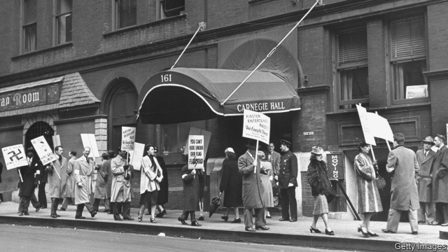

###### Stars and bars

# The classical musicians who were enlisted in the cold war 

 

> print-edition iconPrint edition | Books and arts | Dec 14th 2019 

Dangerous Melodies. By Jonathan Rosenberg. W.W. Norton; 512 pages; $39.95 and £28. 

NOT EVEN classical music, politest of art forms, is safe from politics. In the mid-20th century, when performers affiliated with the Third Reich visited American concert halls, patriotic audiences howled. The Norwegian soprano Kirsten Flagstad—whose husband was a lumber magnate and Nazi collaborator—had to sing in Philadelphia in 1947 amid stink bombs and protest signs. When Herbert von Karajan, an Austrian maestro and former member of the Nazi party, brought the Berlin Philharmonic to New York in 1955, demonstrators released pigeons bearing anti-fascist messages from the balcony of Carnegie Hall. 

During the first world war, the concert-going public in America had targeted foreign composers as well as musicians. Audiences evinced a particular distaste for any works featuring the German language, and disdained pieces by living or nationalistic Germans. Hence Wagner and Richard Strauss were struck from playbills, while the humanistic Beethoven generally got a pass. Prominent German conductors of American symphony orchestras were dismissed from their posts and locked up. 

Jonathan Rosenberg chronicles these instances of musical nationalism in “Dangerous Melodies”, his survey of classical music’s intersection with politics in the 20th century. The competing strain of thought, he writes, is musical universalism: the squishy notion that music “could act as a balm, a unifier, a force for uplift, and even as a catalyst for global co-operation”. Mr Rosenberg is as sceptical of the universalists as he is of the nationalists, but he ably covers both in his informative (if occasionally repetitive) book. 

The two great musical universalists of the century were Arturo Toscanini, a legendary Italian maestro, and Leonard Bernstein, an American composer who conducted, too. Toscanini declined to perform at Bayreuth while Nazi banners flew, instead lending his prestige to the fledgling Palestine Symphony Orchestra. He refused to lead the fascist hymn “Giovinezza” at the beginning of a performance of “Falstaff”, breaking his baton and declaring, “La Scala artists aren’t vaudeville singers.” In 1943, as he walked to the podium to lead a radio broadcast celebrating the collapse of the fascist Italian government, tears of joy streamed down his face. “Nothing should interfere with music,” he later declared. 

Bernstein went further. Rather than simply resisting the efforts of nationalists to co-opt music, during the cold war he actively sought to use the art form to bring adversaries together. Touring Europe and the Soviet Union with the New York Philharmonic in 1959, he stressed the ability of symphonies to break down barriers and calm hostilities. Music is “uncluttered with conceptual notions, no words are involved”, he said. “You can’t argue with a G-sharp.” With lectures and concerts—not to mention podium histrionics full of passion and anguish—Bernstein charmed audiences on both sides of the Iron Curtain. 

Yet despite these idealistic gestures, Mr Rosenberg notes, all sides in the cold war persisted in trying to weaponise their musical stars, with mixed success. The Soviet composer Dmitri Shostakovich, twice denounced by Stalin, said whatever his handlers told him to say in public but would rather have been left alone to work. Van Cliburn, a lanky American pianist, played the great concertos of Rachmaninoff and Tchaikovsky in a lush romantic style, proving that America could compete with Russia culturally as well as militarily. But he was a clumsy statesman. When Dwight Eisenhower hosted him at the White House, he brought a Soviet friend uninvited. The president, no music-lover, paid Cliburn back by skipping his evening concert. ■ 

