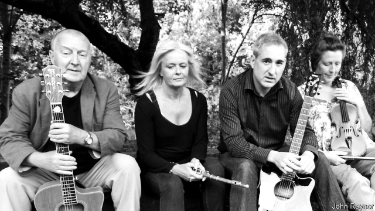

###### Life after Parliament

# Rock singer, razor dealer, humanist celebrant: ex-MPs with odd jobs 

 

> print-edition iconPrint edition | Britain | Dec 14th 2019 

“THROWN OUT of the frying pan, now looking for a fire,” croons the singer. “Walking around my old haunts but I’m feeling like a ghost.” The song is “Silver Lining” and the band is Summercross, a Yorkshire six-piece. Greg Mulholland, on vocals, is used to fame—but not as a rock star so much as in his former life as a Liberal Democrat MP. “When you’re an MP, everywhere you go you’re the MP. Even when you go to the pub you’re still the MP,” he reminisces. “‘Silver Lining’ is about that profound loss of identity I felt when I lost my seat.” 

After the people of Leeds North West voted him off stage in 2017, juicy work in the private sector was not forthcoming. “I knew that there would be no jobs for me, due to my crossing swords with corporate groups,” he says, before quoting his own lyrics: “Looking for a new life, but I see the bridges burning.” Instead, he believes there is a market for a centrist answer to left-wing singers like Billy Bragg. “There’s a misconception that political songwriters come from the left. It’s just about not being so preachy.” 

Mr Mulholland isn’t alone in pursuing alternative ambitions after Parliament. Corri Wilson, an MP for the Scottish National Party (SNP) from 2015 to 2017, is now a freelance celebrant, officiating at humanist weddings and funerals in the Ayrshire area. Aidan Burley, who stepped down as a Tory MP in 2015 after it emerged that he had attended a Nazi-themed stag party, runs a “friction-free” razor-subscription service. 

In 2015 the SNP’s Stuart Donaldson became the youngest male MP, aged 23. Two years later he was the youngest ex-MP. “I just took some time out to enjoy being 25,” he says, over a pint. “I went on holiday, and then started applying for jobs. It was really quite hard to quantify what I was good at.” Tabloids painted him as a binge-drinker, he says. Somewhat ironically, he has ended up working at the Campaign for Real Ale. A quarter of MPs who got the boot in 2017 sought re-election this week, but Mr Donaldson declined. “I could have hung around like a bad smell,” he says, “but I made the decision to be in control of my life.” 

