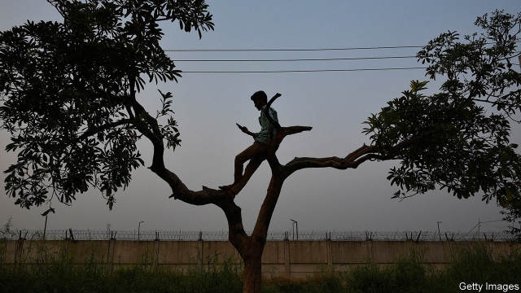
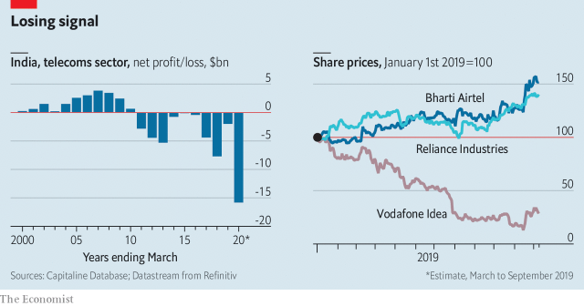

###### Fault on the line

# A price war has undermined India’s big telecoms companies 

 

> print-edition iconPrint edition | Business | Dec 14th 2019 

NARENDRA MODI often waxes poetic about “Digital India”: a country where clogged, dangerous roads are replaced by fast, ubiquitous cyber-motorways. The prime minister can be forgiven a touch of political hyperbole. In a world transformed by telecommunications technology, India has stood out. In the 1990s merely getting a fixed phone line required a deposit (and maybe a bribe), then waiting six months, or six years. Now it takes minutes. India has 1.2bn phone accounts, second only to China. Prices are among the lowest in the world. In 2001 one in 30 Indians had a phone. Now just two in 30 do not. India has more than 500m internet users, who shop online with Amazon or Flipkart (owned by Walmart), book rides with Uber and its homespun rival, Ola, and order takeaway with Zomato. Measured by users India is the biggest market for WhatsApp (400m), Facebook (300m) and YouTube (265m). At night the darkness of poorer streets is pierced by Bollywood films or cricket matches flickering on mobile screens. 

Look more closely, though, and the physical foundation of this buzzing digital marketplace looks shaky. Many of the companies that built the underlying telecommunications infrastructure are in trouble: unprofitable, indebted, overtaxed and exposed to political whims. In November Vodafone Idea (in which Britain’s Vodafone Group owns a 45% stake) and Bharti Airtel, two of the three big providers, and RCOM, which filed for bankruptcy in February, disclosed respectively the biggest, second-biggest and fourth-biggest quarterly loss ever reported in India—$14.5bn, all told. On December 6th Vodafone Idea’s chairman, Kumar Mangalam Birla, told a conference that without government support, “We will shut shop.” Whether or not Mr Modi hears Mr Birla’s plea, the contours of a massive industry critical to India’s development are about to be redrawn. 

The causes of the telecoms firms’ woes are not mysterious. In 2016 Mukesh Ambani, India’s richest man, launched Jio, which took on Vodafone Idea, Bharti and RCOM. His aim was to create a mobile network and a broad digital platform on top of it, offering services from e-commerce to video-streaming. To that end, Jio’s parent conglomerate, Reliance Industries, has increased its gross debt to $42bn. Lenders were happy to bankroll Mr Ambani’s project, given his group’s lucrative petrochemicals business. It helped that the government had awarded the company that would become Jio rights to spectrum for what many observers thought was a song. Spectrum accounts for only 18% of Reliance Industries’ capital invested in its telecoms business, compared with 37% for Bharti and 47% for Vodafone Idea, according to Morgan Stanley, an investment bank. 

In its first months Jio charged customers nothing, then next to nothing. Rivals had no choice but to slash rates. In the past three years average monthly revenue per user has fallen by a third, to 102 rupees ($1.4). Even so, Vodafone Idea has lost 100m customers in the past year. Jio has seized a third of the market—334m customers. 

 

The relentless price war combined with surging consumer demand has made India’s digital highway—on which the three big firms have spent $128bn—feel as clogged as its roads. Calls often drop and downloads stall. As telecoms troubles mount, network quality could slip further. Morgan Stanley expects Vodafone Idea, Bharti and Jio to spend just $7bn on capital investment and spectrum this fiscal year, down from $15.6bn in the previous one. 

Surviving this sort of brutal competition would be perilous at the best of times. And for Indian telecoms firms, these times aren’t. In October India’s Supreme Court ordered Bharti and Vodafone Idea to pay more than $10bn in charges for operations dating back to 2003. These stem from India’s mangrove swamp of formulas which tie licensing charges to revenues. The government defined revenue broadly, to include money made from rentals of office space or foreign exchange. Even money that the firms never actually collected—for example unpaid late fees or the difference between full and discounted plan prices—were included by the government. 

The judges dismissed the companies’ arguments that licence fees should be levied on licensed activity alone. It also ordered them to pay interest and penalties—and interest on penalties—which accrued over the years as they fought their way through India’s Kafkaesque legal system. These surcharges account for 88% owed by Bharti and 75% owed by Vodafone Idea. Dozens of other companies are caught up in the case, many of which have long since fled from the industry, either because they concluded it was unprofitable, rigged in Jio’s favour, or both. 

Of the 15 operators active in 2010, only four still operate independently today. Tata, India’s biggest conglomerate, ran out of patience with its money-losing telecoms arm and gave it away to Bharti in 2017. The court still slapped Tata with a $2bn bill. 

Reliance has shored up its balance-sheet with the proposed sale of a 20% stake in its petrochemicals arm to Aramco, the Saudi Arabian oil giant, for about $15bn. The other two mobile firms’ balance-sheets are vulnerable. The cost of the legal saga could push Bharti’s gross debts up to $16.7bn, according to Morgan Stanley, 4.3 times its earnings before interest, taxes, and depreciation. On December 5th the company indicated it may need to raise $3bn through a new share issue to help pay the tax liability. Vodafone Idea, whose $19.5bn in gross debt is a terrifying 33 times earnings, has neither the cash nor the appetite to pay. As Mr Birla put it, “It does not make sense to put good money after bad.” 

If either firm collapsed, India’s fragile banks would be stuck with a Ghats-worth of non-performing loans. Its embryonic bankruptcy courts could face untold perinatal complications. The government, too, would suffer. It had hoped to replenish its coffers, emptied by a slowing economy, with proceeds from an upcoming auction of 5G spectrum. With no one left to bid but Jio, too young to be ensnared in the tax debacle, the pickings may be slim. Large investments, which Mr Modi wants more of to boost growth, look ever more remote. 

Having helped create the mess with its heavy-handed treatment of some companies and coddling of others, the government is now trying to salvage a viable industry from the wreckage. An expensive bail-out of two mid-sized, state-controlled telecoms companies has been announced. With the government’s blessing, Vodafone Idea, Bharti and Jio all recently announced price increases of up to 50%. Spectrum charges have been partially waived. 

All this has buoyed Vodafone Idea’s and Bharti’s share prices. How long the rally lasts is another matter. Analysts are hastily redoing their spreadsheets to work out the impact of higher prices on revenues. The results are mixed. Morgan Stanley reckons that the announced tariff increases would boost revenue per user by 24-37%. Jefferies, another investment bank, thinks the figure is closer to 11-23%, as some customers downgrade plans or ditch them. 

That may be enough to save Bharti but not Vodafone Idea, which may need prices to rise by another third, licensing fees to be slashed and tax liabilities waived. Although the finance minister, Nirmala Sitharaman, insists she wants Bharti and Vodafone Idea to survive, markets appear to be pricing in a Bharti-Jio duopoly. Bharti’s shares have gained steadily in value as Vodafone Idea’s condition has grown sicklier. A committee of bureaucrats convened to come up with a fix appears to have been disbanded without providing one. And the clock is ticking—the court has set January 24th as the deadline for the companies to pay their tax obligations. 

The telecoms mess comes at an awkward time for Mr Modi. He plans to privatise national champions such as Air India and Bharat Petroleum next year. Airlines and energy are, like telecoms, industries with the ability to raise living standards. But, also like telecoms, they are capital intensive, highly regulated and politically sensitive. This time the world’s capitalists will study the telecoms tale carefully before piling in—as will, with trepidation, those who have already bet big on India’s digital transformation. ■ 

