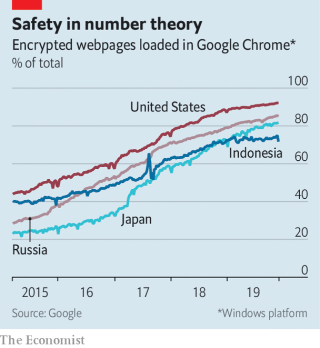

###### Computer security

# Offering software for snooping to governments is a booming business 

 

> print-edition iconPrint edition | Business | Dec 14th 2019 

ON OCTOBER 2ND 2018 Jamal Khashoggi, a Saudi journalist and critic of the kingdom’s government, visited its consulate in Istanbul in order to secure documents needed for his upcoming marriage. He did not come out alive. After initially denying responsibility, the Saudi government admitted that Mr Khashoggi was killed in a “rogue operation”. 

Two months later Omar Abdulaziz, another Saudi dissident, filed a lawsuit in Israel against NSO Group, an Israeli software company. Mr Abdulaziz alleges that the NSO Group had licensed Pegasus, a piece of spyware that snoops on smartphones, to the Saudi government, which used it to spy on him—and, through him, Khashoggi. NSO Group denies that its software was used against Khashoggi. In October WhatsApp, an encrypted-messaging firm owned by Facebook, also sued the firm, saying its software had been used to hack roughly 1,400 of its users. WhatsApp says it has urged America’s Department of Justice to open an investigation. NSO Group disputes WhatsApp’s allegations “in the strongest possible terms”. On November 26th a number of NSO Group’s workers filed a lawsuit against Facebook, claiming that the social-media giant has unfairly blocked their private accounts. 

The flurry of lawsuits has drawn attention to a little-known corner of the cyber-security industry. Most cyber-security firms focus on defending clients from hackers and malware. But some, including NSO Group, as well as Gamma Group (an Anglo-German firm) and Hacking Team (an Italian one which in April merged with another company to create Memento Labs), sell software to help governments access online data on persons of interest. Business appears to be brisk. 

The opaque nature of the market for “intrusion software” means the job of trying to compile figures falls mostly to academics and NGOs. NSO Group, which is unusually candid, says its revenue in 2018 was $250m. In February Novalpina Capital, a British private-equity firm, bought a majority stake in the firm. The valuation implied by the transaction reportedly placed the firm in the “unicorn” club of startups worth over $1bn. Most of NSO Group’s competitors are much smaller, says John Scott-Railton, a researcher at the University of Toronto’s Munk School of Government. Danna Ingleton of Amnesty International, a human-rights group, reckons that the market is worth at least several billion dollars. 

The firms are understandably coy about revealing their clients’ identities. But in 2015 a widely reported data breach appeared to reveal a list of Hacking Team’s clients. The list included a Saudi spy agency and the Sudanese government of Omar al-Bashir, as well as the FBI, Malaysia’s Anti-Corruption Commission and the state government of Bayelsa, a province of Nigeria. Memento Labs did not respond to requests for comment. 

 

The industry has been around for a while, but Mr Scott-Railton says that documents leaked in 2013 by Edward Snowden, an American spy—which lifted the lid on America’s electronic-surveillance capabilities—gave it a big boost. “Other states said ‘how do we get hold of something like that?’” The leaks also pushed Western technology firms to encrypt more web traffic and instant messages, making existing forms of eavesdropping harder (see chart). Some private firms now offer governments that do not have the expertise to breach such defences themselves the tools to do so. Many are staffed by former Western spooks. According to a leaked personnel roster obtained by the New York Times, DarkMatter, based in the United Arab Emirates, has hired several people who used to work for the National Security Agency, America’s main signals-intelligence organisation. DarkMatter did not reply to requests for comment. 

Most of the companies say they assist law enforcement in fighting terrorism, drug smuggling or other misdeeds. At a conference in November Shiri Dolev, NSO Group’s president, complained about the coverage of her firm. She argued that services such as WhatsApp are used by some “as a vehicle for terrorism and crime”, and that software such as Pegasus is vital. The firm insists its products are “not a tool to be weaponised against human-rights activists or dissidents”. In September it announced a new human-rights policy, based on UN guidelines; it reckons it is the first firm in the industry to do so. Even before that, says a spokeswoman, the firm had turned down around $100m of business on ethical grounds in the past three years. 

In theory the export of hacking software is controlled by the same laws that regulate the sale of weapons. In practice most observers think such restrictions have little bite. David Kaye, the UN’s special rapporteur on freedom of opinion and expression, has described the market for spyware as “out of control” and “unaccountable”. State use of the industry’s products to target political opponents, journalists and others seems common, says Ms Ingleton. 

Previous lawsuits have foundered, she adds, in part owing to their high-tech, international nature. Courts first need to be convinced that plaintiffs have suffered an injury, that the injury could be traced back to the defendant, and that the court can redress it. Even if this “standing” can be established, it is hard to procure evidence. “And even then it can be hard for some judges to understand what is being presented,” she says. In a recent case in America “Mr Kidane”, a pseudonymous American with links to Ethiopia, alleged that the Ethiopian government had been spying on him and his family using FinSpy, one of the Gamma Group’s products. A judge threw out the case on the grounds that the alleged spying did not occur entirely within America’s borders. The Gamma Group did not respond to requests for comment. 

All the recent publicity has nonetheless increased pressure on the companies. In November Ron Wyden, an American senator, called for an investigation into whether NSO Group’s products had been used against American citizens. Mr Kaye wants a moratorium on exports until stricter laws can be drawn up. And the WhatsApp lawsuits marks an escalation by the big technology companies, which want to safeguard their users’ data. 

A serious crackdown remains unlikely, thinks Edin Omanovic at Privacy International, another NGO, owing partly to the official background of many employees at such firms. “Enforcement has always been a problem within the arms industry,” he says. Until that changes, purveyors of snooping software can expect to thrive. ■ 

