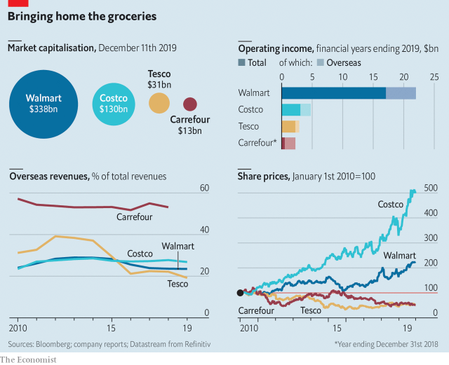

###### Aisle and hopper

# Tesco considers selling its Asian supermarkets 

 

> print-edition iconPrint edition | Business | Dec 14th 2019 

WHEN COSTCO, an American discount retailer, opened its first store in Shanghai this August, huge crowds of shoppers forced managers to shut it down. The world’s 250 biggest retail chains are present in ten countries on average and get about a quarter of revenues from international operations. Expansion into foreign markets looks like a no-brainer for retailers, then? 

Not so fast. Many firms’ foreign revenues have been tepid (see chart). This week Tesco was reported to be considering the sale of its 2,000 stores in Thailand and Malaysia. Since 2013 the British supermarket chain has folded its unprofitable Chinese operations into a state-run firm, unwound a $2bn foray into America and exited South Korea and Turkey. Germany’s MediaMrkt and America’s Best Buy, big electronics retailers, and Home Depot, an American home-improvement giant, all flopped in China. In June Carrefour, a French supermarket chain, said it would sell 80% of its Chinese business. Even Walmart, the world’s largest company by revenue, has found foreign expansion tough. It retreated from South Korea and Germany in 2006, and in 2016 said it would close 269 stores worldwide. 

 

Foreign revenues help insulate firms from downturns in domestic markets. But global retailers face nimble local rivals overseas, who often understand consumer preferences better than foreigners do. Foreign ventures do not always offer refuge from domestic competitors, either. Walmart paid $16bn in 2018 for a majority stake in Flipkart, a loss-making Indian e-merchant, hoping to profit from serving India’s rising middle class. Instead, it is battling Amazon for their custom. 

