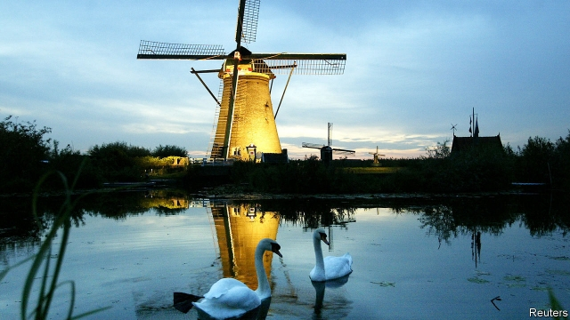

###### Europe’s plan for the planet

# The EU’s Green Deal is full of ambition but needs more detail 

 

> print-edition iconPrint edition | Europe | Dec 14th 2019 

THE WORLD’S climate experts, activists and officials were gathered in Madrid this week for the 25th annual UN climate talks. But the big news was unfolding far away in Brussels, where the European Commission’s new president, Ursula von der Leyen, barely 11 days in office, announced her eagerly awaited Green Deal. The 24-page document reads like a list of vows to transform Europe into a living demonstration of how a vast economy can both prosper and prioritise the health of the planet. It covers everything from housing and food to biodiversity, batteries, decarbonised steel, air pollution and, crucially, how the EU will spread its vision beyond its borders to the wider world. “Our goal,” declared Mrs von der Leyen, “is to reconcile the economy with the planet.” Her plan is large on ambition, but in many places frustratingly vague on detail. 

Top billing goes to a pledge to make Europe carbon-neutral by 2050. That is no surprise. The goal was endorsed by the EU Parliament in November, a strategy for reaching it was published in 2018 and EU heads of state began debating it at this week’s summit meeting, which was getting under way as The Economist went to press. Mrs von der Leyen’s green opus promises to draft legislation that would enshrine the 2050 target by March 2020. 

That would make the EU the world’s largest economic bloc (and biggest greenhouse-gas emitter) to adopt the recommendations of climate scientists that all emissions must cease or be offset by mid-century in order for global temperatures to rise by no more than 1.5-2°C above pre-industrial levels. It is also a considerable increase in ambition: existing policies put the EU on track to reduce emissions by a mere 60% from 1990 levels by mid-century. But long-term goals like this are easy to set, and hard to make binding. 

 

That last point makes the Green Deal’s second headline statement, regarding a nearer-term 2030 target, rather more significant. By summer 2020 the commission intends to present a plan to reduce emissions in 2030 by 50-55% from 1990 levels. This represents a step up from its existing target of cutting emissions by 40% within the same time frame (see chart), but independent analyses suggest that the 50% end of the range will not represent much of a stretch. Current policies on renewable energy and energy efficiency, for instance, should already help to achieve 45-48% cuts by 2030. Green NGOs would like to see the EU sweat a bit more and strive for 65% cuts by 2030, which is what models suggest is needed if the bloc is to do its share to limit global warming to 1.5-2ºC. 

All this green ambition comes at a price. The commission estimates that an additional €175bn-€290bn ($192bn-$320bn) of investment will be needed each year to meet its net-zero goals. Much of this will come from private investors. One way they will be encouraged to pitch in is with new financial regulations. On December 5th EU negotiators struck a provisional agreement on what financial products are deemed “green”. Next year large European companies will be forced to disclose more information about their impacts on the environment, including carbon emissions. These measures, the thinking goes, will give clearer signals to markets and help money flow into worthy investments. 

Another lever is the European Investment Bank, a development bank with about €550bn on its balance-sheet, which is to be transformed into a climate bank. Already it has pledged to phase out financing fossil fuels by 2021. By 2025 Werner Hoyer, its boss, wants 50% of its lending to go to green projects, up from 28% today, and the rest to go to investments aligned with climate-change goals. Some of that money will flow into a “just transition” fund, worth €100bn over seven years. Job losses are an unavoidable consequence of decarbonising Europe’s economy; the coal industry alone employs around 250,000 people, mainly in eastern Europe. The fund will try to ease some of this pain, and the political opposition it provokes. 

The Green Deal goes beyond the scope of previous climate policies. One area it enters with gusto is trade. Under the commission’s proposals, the EU will simply refuse to strike new trade deals with countries that fail to comply with the Paris agreement’s requirement that signatories must increase the scale of their decarbonisation pledges, known as “nationally determined contributions” or NDCs, every five years. That would mean no new deals with America while Donald Trump is president; it is set to drop out of the Paris agreement late in 2020. And, because the first round of enhanced NDCs is due next year, it would put pressure on countries that are dragging their feet on these, of which there are dozens—including China and India. 

The deal also sketches out plans for a carbon border-adjustment levy. Under the EU’s emission-trading scheme, large industries pay a fee of about €25 for every tonne of carbon dioxide they emit. Other regions have similar schemes with different carbon prices. A border-adjustment mechanism would level the playing field. 

The Green Deal’s proponents are the first to say this is only a road map for climate action. Many, many new policies and associated technical details will need to be ironed out and approved. Mrs von der Leyen declared the Green Deal “Europe’s man-on-the-Moon moment”. In reality, the landing is some way off yet. A more fitting analogy for this week’s announcement would be President Kennedy’s promise in 1961 that America would, by the end of the decade, reach that celestial body. It remains to be seen whether Mrs von der Leyen’s word is as good as Kennedy’s. ■ 

