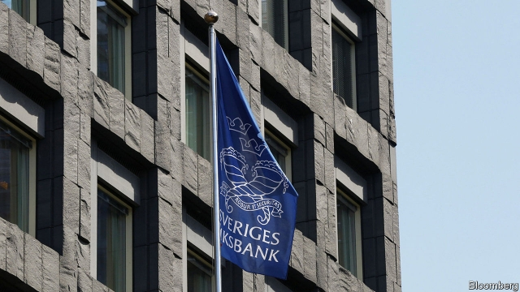

###### The Riks flips

# A Nordic pioneer of negative interest rates gets cold feet 

 

> print-edition iconPrint edition | Finance and economics | Dec 14th 2019 

THE WORLD’S oldest central bank, Sweden’s Riksbank, is a trendsetter. In July 2009, in the depths of the financial crisis, it was the first central bank to cut interest rates below zero. It set the global record, of minus 1.25%, for the lowest interest rate on deposits parked with it by domestic banks. Now, however, it looks set to bring the experiment to an end. On December 19th it is widely expected to leave negative territory, raising rates from minus 0.25% to 0%. 

Since the economy is in the doldrums, the rationale is unclear. Inflation is 1.7% and forecast to stay below the target of 2% for some time. Meanwhile, the most recent figure for annualised GDP growth was a paltry 1.1%, and the purchasing-managers index, a measure of business activity, is at its worst since the euro-zone crisis of 2012. 

The words and actions of the Riksbank’s five voting members seem to be all over the place. At the most recent meeting, in October, all expressed concerns about the economy. Stefan Ingves, the governor, argued for a more expansionary monetary policy, noting that Sweden is particularly exposed to weakening global trade. Yet he and his colleagues agreed to the plan to raise rates at the next meeting, on December 19th. 

Lars Svensson of the Stockholm School of Economics, a former member of the Riksbank, attributes the move back up to zero to ratesetters who have an “irrational fear of negative interest rates”. But the most recent monetary-policy report, in October, assessed negative rates and concluded that they have been a success for Sweden. 

If neither the economy nor economists seem to demand an end to negative interest rates, where does the demand come from? The minutes of the latest monetary-policy meeting hint at a possible answer: the general public. Henry Ohlsson, a member of the committee, commented that “it has become very clear that those who are not economists believe it is strange that interest rates can be negative.” 

Moreover, the Riksbank is under fire for its perceived role in causing Sweden’s currency to weaken. In February the krona hit its lowest level ever in real trade-weighted terms, notes Henrik Unell of Nordea, Scandinavia’s largest bank. Nordea has dubbed the Riksbank the “krona-killing monster”. 

In March Mr Ingves brushed off such criticisms. He wrote in Dagens Nyheter, a daily newspaper, that the central bank “cannot, and should not, stabilise both inflation and the exchange rate”. Since Sweden’s inflation target of 2% is in line with most other countries’, he added, there was no reason to think the krona would weaken indefinitely. The currencies of other small countries with substantial foreign trade had also suffered, he said. 

But the pressure continued. When Mr Ingves arrived at a conference in Stockholm in May with three bodyguards, many saw a link with public anger at the weak currency—and, by extension, monetary policymakers. “It’s embarrassing and painful to see how the Swedish crown continues to weaken against the euro,” tweeted Carl Bildt, Sweden’s prime minister from 1991 to 1994. Goran Persson, one of Mr Bildt’s successors, has complained publicly about how cheap Swedish assets have become for foreign investors. 

Perhaps the Riksbank has been worn down by all the criticism. It is one of five central banks with negative policy interest rates—including two giants, the European Central Bank and the Bank of Japan. Nearly a quarter of global GDP is supported by negative rates. If the Riksbank’s experience is anything to go by, the great experiment with negative rates will continue to unsettle people all over the world.■ 

