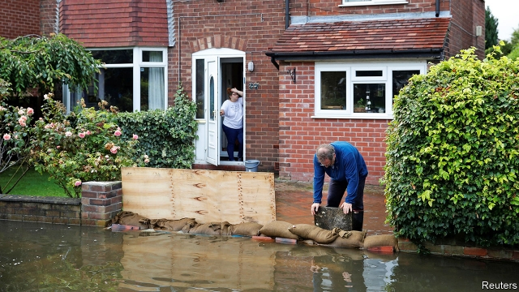

###### Carbon capture

# Central bankers debate tackling climate change 

 

> print-edition iconPrint edition | Finance and economics | Dec 14th 2019 

AS FAR AS interest rates are concerned, the new boss of the European Central Bank (ECB), Christine Lagarde, seems largely in agreement with Mario Draghi, her predecessor. Where she seems to differ is in wanting the bank to be greener. On December 2nd she told European parliamentarians that a planned review of its monetary-policy strategy should take in the impact of climate change. Other central bankers, too, are going green. In recent months ratesetters from Sydney to San Francisco have opined on the impact of climate change on economic and financial stability. The subject has long preoccupied Mark Carney, the governor of the Bank of England, who is soon to become the UN’s climate envoy. 

So far central banks have focused on the impact of climate risk on the financial system. But activists argue that, just as central bankers saved the global economy during the financial crisis, so too must they tackle the next emergency by shifting capital away from polluters and towards greener uses. Europe’s technocrats seem willing to consider the idea. Others caution that it should be a job for politicians instead. 

In 2015 Mr Carney set out the channels through which climate change could threaten financial stability. Financial firms are exposed to physical risks: floods, for instance, lead to big insurance payouts and sink the value of banks’ mortgage books. Then there is “transition” risk. New government policies, such as a carbon price, could see investors dump the assets of polluting companies. Share prices could collapse, and defaults on bank loans rise. Polluters also risk climate-related litigation. Exxon, an oil company, was accused of misleading investors over the costs of climate change, though on December 10th a court in New York found it not guilty. 

So it is important to understand companies’ exposures to climate risk. In 2015 central banks from the G20 group of large economies set up a “task force” to encourage disclosure. To date these suggest that exposures are significant but not daunting. As of June nearly half of the world’s largest 500 companies (by market capitalisation) had reported exposures, much of which are expected to be realised within the next five years. Those added up to $1trn—or 6% of the firms’ total market value. 

Some supervisors have started including climate risk in their assessments of banks and insurers. The Bank of England requires banks to have a plan for dealing with such risks. The Network for Greening the Financial System (NGFS), a group of 51 central banks and supervisors, collates guidelines for regulators and disseminates scenarios to help analyse potential losses to the financial system. The Dutch central bank was the first to conduct a stress test along these lines in 2018, finding the effects of climate risk to be “sizeable but also manageable”. Dutch banks, exposed mostly through their loans to companies, stood to lose up to 3% of their assets. Insurers and pension funds, exposed through holdings of corporate bonds and equities, could make losses of around 10%. 

The People’s Bank of China (PBoC) helped set up the NGFS, and has led efforts to firm up the definition of a “green bond”. Malaysia’s central bank is working on a similar taxonomy with the World Bank, and in September hosted a powwow on climate change. But one big emitter has been relatively reticent. Although America accounts for 15% of the world’s emissions, its Federal Reserve is not part of the NGFS—no doubt reflecting a lack of political interest. 

Even the Fed, though, is talking about how climate change might eventually affect the economy. In November Lael Brainard, a member of its board of governors, said climate-related disruption could affect productivity and long-term economic growth, with consequences for interest rates. Central bankers in commodity-producing countries such as Norway and Australia note that a shift from polluters would alter the structure of their economies. 

A far more controversial question, though, is whether central bankers should seek to change polluters’ behaviour. As part of its asset-purchase scheme, the ECB holds €183bn ($203bn) of corporate bonds. Its purchases are broadly representative of the market. Energy and utility firms, which are sizeable issuers of corporate bonds, account for roughly a third of the ECB’s corporate-bond holdings. On November 27th former central-bank officials and activists pressed Ms Lagarde to stop buying dirty assets or accepting them as collateral when it lends to banks. She plans to study the idea. 

Supporters argue that such steps would help correct investors’ failure to price polluters’ riskiness in full. They would not necessarily conflict with the day job of central banks, says Patrick Honohan, a former head of Ireland’s central bank. Many are charged first with ensuring price stability, and second with supporting wider government policy. But critics are unconvinced. In October Jens Weidmann, the head of Germany’s Bundesbank, worried that a climate objective could compromise ratesetters’ commitment to stable inflation. 

Greening asset purchases would mean deciding how much polluters should be penalised—a job for elected politicians, not technocrats, says Tony Yates, an economist formerly at the Bank of England. Notably, the PBoC accepts green bonds as collateral and gives banks’ green assets favourable regulatory treatment. But central banks in places where the government holds less sway may be loth to follow its lead. As its economic and financial effects become clearer, climate change is certain to loom larger in central banks’ thinking. What they do about it will depend on their willingness to tread on political turf. ■ 

