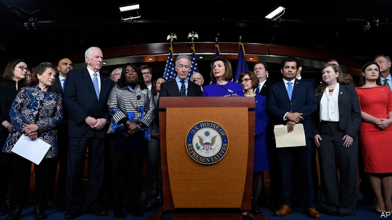

###### Common ground

# The revised USMCA pleases both Democrats and Donald Trump 

 

> print-edition iconPrint edition | Finance and economics | Dec 14th 2019 

UNION LEADERS and Democratic lawmakers were cool at first towards the USMCA, a replacement for the 25-year-old North American Free Trade Agreement (NAFTA) which was signed by American, Canadian and Mexican trade negotiators over a year ago. But on December 10th, after months of further talks, they swung behind a reworked version. Richard Trumka, the head of the AFL-CIO, America’s largest trade-union group, proclaimed a “new standard for future trade negotiations”. Nancy Pelosi, the Democratic Speaker of the House of Representatives, called it a “victory for America’s workers”. 

The reversal may seem surprising. The AFL-CIO has not endorsed an American trade deal in nearly two decades, and Ms Pelosi is trying to get President Donald Trump, whose deal this is, impeached. According to polling data provided to The Economist by YouGov and published on December 11th, though 79% of Americans say that “trade and globalisation” are important to them, only 37% say the same of replacing NAFTA with the USMCA. 

But both the politics and the content of the deal have led to unexpected alliances. Supporting the USMCA lets Democrats claim that they are not obstructing Mr Trump’s agenda for the sake of it. And on trade, Mr Trump has more in common with the left wing of the Democratic Party than with his own Republicans. Many Democrats agree that previous deals made trade too free, with too few of the benefits going to American workers. And several of the changes secured by the Democrats are meaningful. Some are sure to be to Mr Trump’s taste, too. 

Among the revisions are an end to intellectual-property protections for biologics, a specific class of drug, and weaker patents for pharmaceuticals in general. Democrats say such protections stifle competition from generics and raise drug prices. Unsurprisingly, those changes went down badly with the Pharmaceutical Research and Manufacturers of America, an industry lobby. Its president said they amounted to an abandonment of protections for American companies. 

Enforcement has been beefed up. Improvements to NAFTA’s dispute-settlement system are “probably the most important thing in the whole treaty”, says Jesús Seade, Mexico’s chief negotiator. Under NAFTA, countries could block the appointment of arbiters to hear awkward disputes. This should no longer be possible. 

The shared vision of the Trump administration and Democratic lawmakers is clearest when it comes to labour standards. The aim was to make it less attractive to move jobs from America to Mexico than had been the case under NAFTA by supporting Mexican workers’ employment rights. But in the first version of the USMCA, the AFL-CIO complained, the bar for proving a breach of the rules was too high and enforcement mechanisms were too onerous. Critics pointed to the only labour complaint ever to make it as far as a formal dispute as part of an American trade deal: a case against Guatemala in which arbiters agreed that the rules had been broken, but not that any harm to trade or investment had been demonstrated. 

The new deal shifts the burden of proof regarding such harm. To avoid penalties, defendants will have to show that it did not happen. Moreover, accusations that manufacturers are breaking Mexican laws covering freedom of association and collective bargaining will be sent for speedy consideration to panels of “independent labour experts”. Rule-breaking will lead to penalties on exports. Overall, the revised labour provisions are good for Mexico, Mr Seade says, and will reinforce its government’s own labour reforms. 

The revised USMCA will restrict trade a bit more than NAFTA did. It will probably not live up to the hype. Even if greater use of collective bargaining raises Mexican wages, the USMCA’s official impact assessment suggests that American wages would rise by just 0.27% in response. But for Mr Trump, his Democratic foes and their neighbours in Mexico, it counts as a win. ■ 

