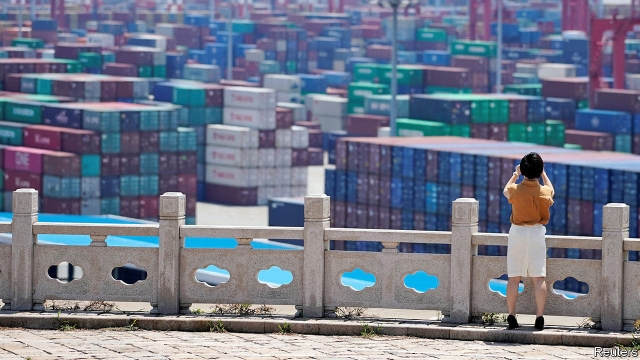

###### Life after tariffs

# Trade war? China’s exporters have expanded their global market share 

 

> print-edition iconPrint edition | Finance and economics | Dec 14th 2019 

A YEAR AGO an economic forecasting unit in the Chinese government published an outlook for the coming year. The big worry, it concluded, was the external environment. Shipments to America, China’s biggest customer, would suffer as the trade war dragged on. China had maxed out its exports to other big countries, and others were too small to make a difference. 

So China’s boffins are, like many others, surprised by how things have gone. Exports to America are indeed down, by nearly 15% so far this year. But exports to the rest of the world have been much stronger (see chart). China, it turns out, had more to sell to its big customers: exports to Europe are on track to surpass exports to America this year. Meanwhile exports to smaller markets in South-East Asia, such as Vietnam and Malaysia, have boomed. 

 

According to data from CPB World Trade Monitor, China’s share of global exports has reached 11.9%, slightly higher than in July 2018, when the first American tariffs hit. Sluggish imports—in part because of a domestic slowdown—mean the trade surplus is set to be about a quarter bigger in 2019 than in 2018. 

One explanation for China’s resilient exports is the yuan’s 6% depreciation against the dollar since the trade war began. That has blunted the tariffs’ impact. China’s currency has also weakened against other major trading partners. 

A second is goods routed through other countries to avoid tariffs. Some sent to South-East Asia have ended up in America. Vietnamese customs officials have stepped up checks of everything from seafood to aluminium to ensure that they are not relabelled Chinese goods. Julian Evans-Pritchard of Capital Economics, a research firm, estimates that American tariffs have cut Chinese GDP growth by about 0.6 percentage points, but that trans-shipments through South-East Asia may have lifted it back up by 0.3 percentage points. 

There is also a third, more positive explanation: Chinese companies are highly competitive. Once an assembly centre, China now makes more of the inputs that go into final goods. Its efforts in high-tech sectors such as semiconductors are well-known. But it is making lower-tech progress more broadly. The Chinese light-industry council, representing toymakers, food firms and the like, estimates that its 100 most technologically advanced members invest 2.5% of revenues in research and development, high by international standards; it is pressing them to hit 3%. 

The road ahead will not be easy for Chinese exporters. The longer American tariffs last, the more likely American buyers are to find alternatives. The fall in Chinese sales to America has accelerated recently. 

On December 4th Chinese exporters of machinery and electronics met for their annual conference. The theme was “flourishing together along One Belt, One Road”, in line with the government’s policy of promoting economic ties with Asia, Africa and Europe. In previous years that might have been politically astute positioning. Now it looks like a survival strategy. ■ 

