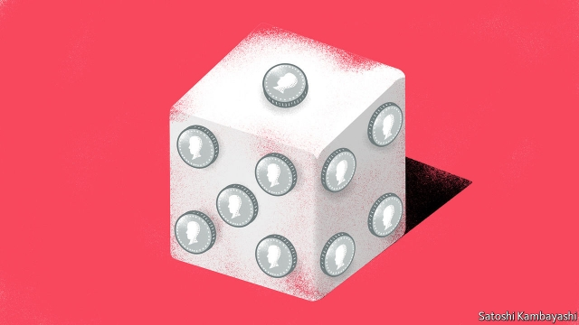

###### Odds and evens

# Why are people attracted to 50:50 probabilities? 

 

> print-edition iconPrint edition | Finance and economics | Dec 14th 2019 

BARACK OBAMA’S intelligence officers told him, variously, that there was a probability of between 30% and 95% that Osama bin Laden was in the Abbottabad compound in Pakistan in April 2011. The president was having none of it. “This is 50:50,” he said. “Look guys, this is a flip of the coin.” That bin Laden was found and killed does not reveal whose estimate of the odds was best. But new research argues that Mr Obama’s instinct—to treat probabilities as evenly split when they are uncertain—is widespread. 

In a working paper Benjamin Enke and Thomas Graeber, both of Harvard University, argue that the bias towards 50:50 has shown up in many contexts. One is decision-making under (known) risks, such as gambling at a (fair) slot machine. Economists have long realised that people are more sensitive to changes in probabilities, the nearer they are to the boundaries of 0% and 100%. For example, the chance of a big win of, say, $1m rising from 0% to 1% seems much more significant than the chance of the same win rising from 20% to 21%. At the extremes, there is a tendency to compress odds towards evens. 

Mr Obama did not face known odds, but ambiguous ones. Other researchers have found that such uncertainty has a similar compression effect: it can make people act as if they are facing known odds that are closer to 50:50 than might seem rational, given the information on offer. Messrs Enke and Graeber argue that this tendency even shows up in surveys of expectations about the performance of the economy and the stockmarket. 

The authors suggest a new theory to explain this behaviour: “cognitive uncertainty”. It could be described as a simple lack of confidence. If people know that they may not be doing the sums right, or that their memory may be failing them, or that they are not sure what their own preferences are, then their choices depend less on the information they are presented and more on a “mental default” of equal probabilities. 

In a series of online gambling experiments Mr Enke and Mr Graeber show that the more uncertain people are in their judgments, the more likely they are to hedge their bets—even when they have access to information that should, in theory, be useful. 

Researchers have in the past suggested that odds of 50:50 are really code for “I don’t know”. That may well have been what was going through Mr Obama’s mind when faced with such a wide range of estimates. Forecasters put odds on events because words like “probable” and “likely” are interpreted very differently by different people. But numbers mean nothing without confidence. 

