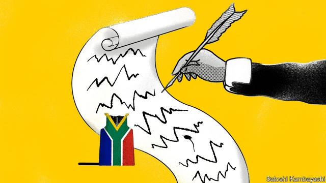

###### Buttonwood

# Why it is hard for foreign investors to be bullish on South Africa 

 

> print-edition iconPrint edition | Finance and economics | Dec 14th 2019 

THE FIRST question to consider in any reckoning of South Africa is whether you can get through it without a story about Nelson Mandela. You can’t, of course. So here is one that seems apposite. Mandela and his fellow prisoners on Robben Island were allowed one book other than the Bible. They opted for the collected works of Shakespeare. Each marked a favourite passage. Mandela chose one from “Julius Caesar”: “Cowards die many times before their deaths; the valiant never taste of death but once.” 

Fast-forward from the struggle against apartheid to today. South Africa’s economy has shrunk in two of the past three quarters. The state-owned power company has announced a series of rolling blackouts. An unchecked budget deficit means public debt is on track to rise above 70% of GDP by 2022. The national airline has sought protection from its creditors. The country’s investment-grade credit rating is hanging by a thread. 

The situation cries out for a valiant response. Remedies have been discussed ad nauseam. If the production of reform blueprints were the key to wealth, South Africa could be the world’s richest country. Instead it suffers an unending series of small deaths. It is why, for many investors, it is often a tactical trade but never a strategic one. It is a reform story endlessly sketched out but never written. 

The need for fixes is increasingly desperate. This year will be the fifth in which GDP growth has failed to keep up with population growth. The unemployment rate is 29%, a grim statistic that does not fully capture the extent of joblessness. One legacy of apartheid is that many blacks live far from where the jobs are. Since poor public transport makes searching for work costly, many simply drop out. The trouble runs even deeper. South Africa is a cartelised country, in which insiders—big businesses and their employees; government workers—flourish and outsiders languish. Labour laws intended to reduce inequality have instead reinforced it. Wage deals are fixed by unions and big firms. Small firms must comply, but struggle to do so. Startups and the jobless suffer as a result. 

The fixes are well-rehearsed: an end to restrictive labour practices; a dose of competition in industry; a clean-up of state-run power-transmission and transportation monopolies. Countless commissions and development plans have urged such measures. In its annual health-check of South Africa’s economy in 2018, the IMF concluded that “bold structural reforms are urgently needed”. It was hardly a new message. In 2011 the fund had deemed reforms “critical”; by 2013 they were “imperative”; by 2016 “urgent and imperative”. But little has changed. 

The wonder is that these simmering problems have never boiled over. A system of welfare grants helps contain some of the population’s anger, but weighs on public finances. South Africa is thus vulnerable to a shift in investors’ mood. It runs a persistent deficit on its current account. It relies on overseas capital to bridge this gap between what it spends and what it earns. Ideally this would come through foreign direct investment, which would add to the country’s capital stock and create jobs. But it is hard to attract such investment when you do not have a reliable power supply. 

So South Africa relies on portfolio inflows to stocks and bonds. It has had enough residual appeal to keep these coming. It has a range of well-run companies that are not especially sensitive to the struggles of the local economy, says Rob Marshall-Lee of Newton Investment Management. Oligopoly in many industries makes for handsome profit margins. Bond investors, with one eye on the country’s credit rating, are able to earn higher yields than are available elsewhere. There is still confidence in South Africa’s key institutions, says Yacov Arnopolin of PIMCO, a big bond firm. The central bank has stuck to its task of controlling inflation. The Treasury has shrewdly extended the average maturity of public debt to 13 years, which buys the country a bit more time to deal with its problems. 

The buying of time seems to have become an end in itself. There is still a great deal of goodwill towards South Africa among the money-men. The memory of Mandela still evokes respect and admiration. But the management of money involves a cold-eyed calculus. Investors are tactical on South Africa; they will buy if the gloom seems overdone or the rewards eclipse the risks, even if barely. Few are valiant enough to be outright bullish. They do not wish to taste of career death even once. 

