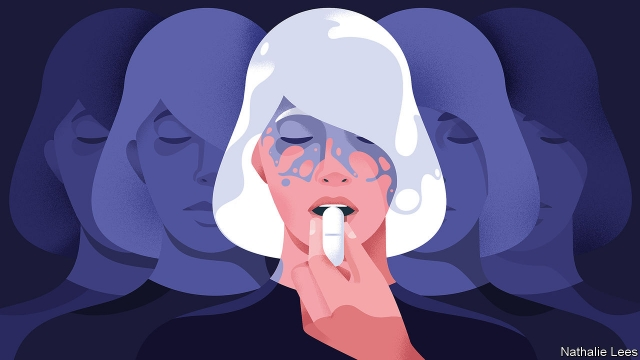
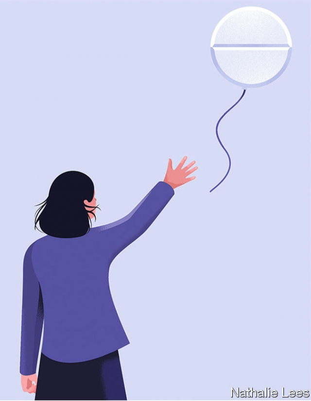

###### Managing menopause

# Millions of women are missing out on hormone replacement therapy 

 

> print-edition iconPrint edition | International | Dec 14th 2019 

IT WAS A combination of things. An unusual feeling of depression. Constant forgetfulness. An irregular menstrual cycle. Lucy, a British woman in her early 40s, knew that something was wrong. Two years before she had been training at the gym five times a week. Now she could barely find the energy to exercise at all thanks to chronic insomnia, a new affliction. Her demeanour had shifted from one of cheeriness to constant anxiety. Her work and her home life were suffering as a result. 

Unsure what was causing these changes, she visited her doctor. The physician blamed stress. She suggested Lucy return in a year. Frustrated, Lucy turned to the internet. Her research led her to believe that she was entering the transition into menopause. Menopause is the time in the middle of a woman’s life—which can begin in the early 40s—when her levels of hormones such as oestrogen, progesterone and testosterone plummet. This eventually causes her ovaries to stop producing eggs and her periods to cease. After a year without periods, a woman is considered to be menopausal. The symptoms of menopause can include hot flushes, depression, aches and pains, insomnia, anxiety and transient memory loss. 

Lucy’s experience is unremarkable in two ways. First, every woman experiences menopause. Second, doctors all over the world often fail to provide them with treatment that could alleviate their symptoms. Research suggests that 70-80% of women experience symptoms and for just over a quarter they are debilitating. On average they last for seven and a half years. 

And yet doctors often encourage women to grin and bear it. Some suggest eating well and exercising more, which may ease the symptoms. Some prescribe antidepressants or anti-epileptics, which do not treat the cause of the problem. A cheap, effective alternative exists: hormone-replacement therapy (HRT). But as a result of misinformation and scaremongering, millions of women are missing out on it. 

Menopause harms women’s bones, brains, hearts and immune systems. It is associated with a higher risk of osteoporosis and fragility fractures, increased abdominal fat, and a heightened risk of contracting diabetes, explains Susan Davis, a professor of women’s health at Monash University in Australia. 

The hormonal changes of menopause also seem to make women age faster. They speed up cellular ageing by about 6%, when age is measured by the genetic changes in the blood. It is suspected that the insomnia associated with menopause could be causing this. Oestrogen is particularly important in maintaining the health of women’s hearts. Before menopause women have fewer heart attacks than men. After menopause the risk increases as the elasticity of the coronary arteries decreases along with their oestrogen levels. 

In 1966 Robert Wilson, a doctor, wrote a book called “Feminine Forever”. In it, he argued that women’s loss of hormones after menopause give rise to a serious, painful and often crippling illness, known as oestrogen-deficiency disease. A regular course of oestrogen supplements was the solution, he suggested. They would preserve women’s youth, sex appeal and marriages. 

The book was divisive. Some women embraced taking oestrogen as a way to defeat the ravages of time. Others resisted what they saw as an attempt to pathologise a natural stage in a woman’s life. Nonetheless, by the turn of the millennium hormone-replacement therapy was extremely popular. In America before 2001 some 20% of post-menopausal women used it at some point. By then a synthetic form of progesterone was being administered alongside oestrogen; it had been shown to protect women from an increased risk of uterine cancer caused by giving oestrogen on its own. 

The benefits of HRT seemed clear. Most immediately, it offered relief from the miserable symptoms of menopause. In the longer term it reduced the risk of osteoporosis (which rises after menopause) and therefore the risk of bone fractures. Women liked that it seemed to stop their skin thinning (probably because it boosts the levels of collagen, a protein). It was thought to reduce the risk of cognitive decline. But most importantly, studies suggested that it prevented the onset of cardiovascular disease—one of the biggest killers of women. 

By 1997 a report in the Journal of the American Medical Association concluded that HRT extended life expectancy for postmenopausal women by as much as three years. It had become a standard treatment. But then a bombshell dropped. 

In 2002 the results of a large randomised trial conducted by America’s National Institutes of Health, known as the Women’s Health Initiative (WHI), were rushed into publication. It concluded that taking oestrogen with synthetic progesterone increased women’s risk of breast cancer, heart attacks, strokes and blood clots. Women were told that the dangers of HRT mostly outweighed any benefits. 

This finding overturned decades of medical practice. As a final kicker, it emerged that Mr Wilson had received money from Wyeth-Ayerst, a company that made oestrogen, while writing his prohormone book. HRT went from wonderdrug to killer pill peddled by profit-hungry pharmaceutical firms. Within six years fewer than 5% of American post-menopausal women were taking it. In Western countries use of HRT increased rapidly during the 1990s but halved in the early 2000s. To this day doctors are reluctant to prescribe hormones to their patients. 

But the first conclusions of the WHI study, on which so much antipathy to HRT is still based, were almost entirely wrong. The study had hoped to look at strategies for preventing heart disease, cancer and osteoporosis in post-menopausal women. Avrum Bluming, an oncologist and co-author of a recent book, “Oestrogen Matters”, says that instead of recruiting healthy women in their late 40s and early 50s, who were entering menopause, the median age was 63. These older recruits were already unhealthy. Half were obese. Nearly 50% were current or past smokers and more than a third had been treated for high blood pressure. The women included in the study probably suffered from atherosclerosis—where plaque builds up inside arteries and makes heart disease more likely—when it began, says Mr Bluming. What the analysis in 2002 actually showed was that offering older and more unhealthy women HRT was a bad idea. It said nothing about the women at whom the treatment was aimed. 

There were other problems. The WHI study almost completely excluded from the trial women who were experiencing menopausal symptoms, fearing that those given the placebo would abandon the trial when their symptoms were not relieved. But these are the women who would be expected to benefit most from the preventive effects of HRT. Recent research suggests that hot flushes and night sweats are associated with an increased risk of heart attack and stroke. 

It is now clear that the long-term benefits of HRT for women given it as they enter menopause are significant. A careful reanalysis of the studies showed that women in their 50s were actually 31% less likely to die in the five to seven years that they were taking hormones. For women who have had their uterus removed or who start menopause before the age of 45, it is life-saving, preventing osteoporosis and heart disease for as long as 18 years. There is a tiny increase in the rates of breast cancer among HRT-users after five years of the treatment. This was lower than the risk from working as a flight attendant. 

A study published in the Lancet, a British medical journal, earlier this year has reignited controversy over the level of risk of breast cancer that comes with hormone therapy. But Ms Davis and others worry that its conclusions are not reliable. Moreover any increase in risk must be weighed against that of developing other diseases. 

 

Taking HRT reduces the mortality of women aged 50-59 by at least 20% and as much as 40%, mostly because they suffer fewer heart attacks. One in 25 of all women will die of breast cancer; one in three will die of coronary heart disease; and one in six will die of a stroke. Around 90% of women with breast cancer survive it in rich countries. If women are on HRT at the time of their breast-cancer diagnosis they are less likely to die from the disease. Weighing such risks is part of the decision about whether to embark on a course of HRT. 

In addition to the flaws in the structure of the WHI study, a change in the versions of hormones used in HRT explains the shifting scientific consensus on the treatment’s effects. The synthetic form of progesterone used in the WHI probably triggered cardiovascular problems. The progesterone that many women now take with an oestrogen supplement is thought less likely to do so. 

No long-term clinical trials of this specific combination of hormones have been carried out. But, in theory, it should bring all the benefits of oestrogen found in the WHI trial, with none of the risks of taking synthetic progesterone. 

In the absence of such studies, HRT remains in medical limbo. And so women in their late 40s and early 50s are losing out. The window of opportunity to begin HRT in order to capture its full benefits—including resisting the effects of cognitive decline—may be as little as two or three years. 

Lucy’s symptoms worsened after her doctor brushed her off. Convinced by her online research that she was transitioning into menopause, she paid to have blood tested. The results confirmed her suspicions that her hormone levels were the problem. She was prescribed personalised amounts of three hormones: an oestrogen patch, micronised progesterone and testosterone. Within three days her hot flushes had stopped, she was sleeping peacefully and her mood had returned to a happy equilibrium. She felt “superhuman”. 

But her happy ending is less common than it should be. In Britain more than 1m women are thought to be missing out on treatment. Elsewhere, the prevalence of HRT is even lower. In Hungary and Russia just 3% of menopausal women receive it. In the absence of prescribed hormone therapy, some women turn to natural potions which may alleviate the symptoms of menopause but will not reduce a woman’s future risk of a heart attack. Some types of black cohosh, a popular herbal supplement, have been associated with liver poisoning. In countries such as China, Japan and Singapore, Chinese traditional medicines are used. A diet rich in phytoestrogens, such as soya, may reduce the symptoms of menopause. This may explain why East Asian women suffer less. But nothing works as well as HRT. By shunning it, some women are harming themselves. ■ 

