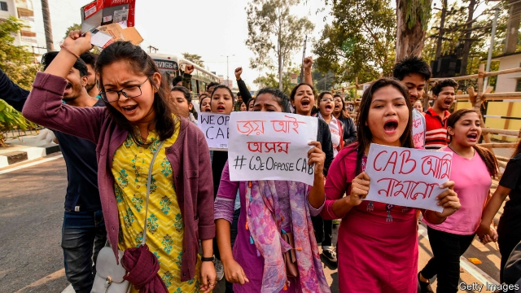

###### Secularism under siege

# India’s bill purporting to help refugees really seeks to hurt Muslims 

 

> print-edition iconPrint edition | Leaders | Dec 14th 2019 

THE IDEA seems anodyne, even laudable. India is amending its laws to make it easier for refugees from neighbouring countries to gain citizenship. The problem is in the fine print. While Hindus, Parsis, Jains, Sikhs, Buddhists and Christians from Afghanistan, Bangladesh and Pakistan will be put on a fast track to naturalisation, Muslims, Jews and atheists will receive no such benefit. That defeats the point of the change, since minority Muslim sects and secularists are among the most persecuted groups in those countries. Worse, it is a calculated insult to India’s 200m Muslims. And most alarming of all, the change undermines the secular foundations of Indian democracy. 

The Lok Sabha or lower house of the Indian parliament, where the ruling Bharatiya Janata Party (BJP) enjoys a large majority, approved the relevant changes to the law on citizenship on December 9th (see article). The bill passed through the upper house two days later, despite impassioned objections from across the political and social spectrum. The law has already been challenged in the Supreme Court. In the interest of social stability, of India’s reputation as a liberal democracy and of preserving the ideals of India’s constitution, the court should speedily and unequivocally reject it. 

After all, Article 14 of the constitution reads: “The State shall not deny to any person equality before the law or the equal protection of the laws within the territory of India.” To accept religion as a basis for speedier citizenship is to cock a snook at India’s own founding fathers, who proudly contrasted their vision of an open, pluralist society against the closed, Islamic purity of next-door Pakistan (see article). 

The government justifies its exclusion of Muslim refugees by saying they cannot be persecuted by states that proclaim Islam as their official religion. This is nonsense. Just ask the Ahmadis, a Muslim sect whose members have been viciously hounded in Pakistan as heretics, or the Shia Hazaras who are routinely murdered by the Taliban in Afghanistan. Also excluded are the Muslim Rohingyas fleeing mostly Buddhist Myanmar and the 100,000-odd Hindu Tamils who fled to India to escape civil war in Sri Lanka, a self-declared Buddhist state. And even as the government claims a wish to salve human misfortune, in parliamentary debate it brusquely rejected a proposal to extend the bill’s embrace to all immigrants fleeing persecution. 

The best explanation for the bill is politics. The BJP is the offspring of a larger family of Hindu-nationalist groups, whose long-term objective is indeed to subvert India’s secular constitution by redefining the country as an explicitly Hindu state. Politically speaking, the BJP has long profited from driving a wedge between India’s sects, with the aim of consolidating the Hindu vote in its own camp. The citizenship bill would be bad enough on its own, but combined with another initiative being energetically pursued by the BJP, the compilation of a National Register of Citizens, it could be explosive. 

In the state of Assam the government recently determined that 1.9m out of 33m residents are not pukka Indians, largely because they have no papers, as is common in poor countries. To the chagrin of Hindu chauvinists who demanded the citizenship checks in Assam, many of those who failed to prove Indian roots turned out not to be Muslims, but Hindus of Bangladeshi origin. The new citizenship rules will allow these people to be naturalised, leaving only the Muslims to be stripped of rights, shunted into camps or expelled. The government has budgeted an initial $1.7bn to extend this process nationwide. 

Not surprisingly, Muslims across the rest of India now fear that they, too, will be singled out and obliged to dig up generations of tattered family documents to prove their Indianness. Already, there are calls for civil disobedience to resist such humiliation. It is easy to see how violence might follow. Seldom has apparent magnanimity disguised such malevolence. ■ 

