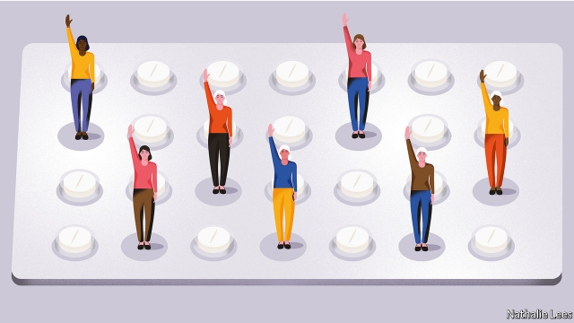
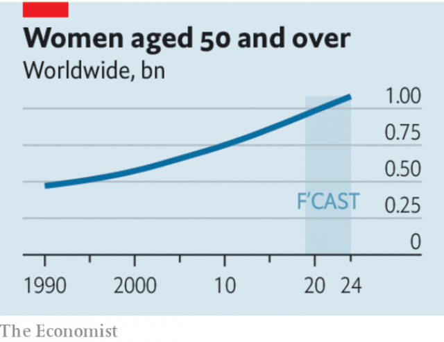

###### Coping with menopause

# More women should take hormone-replacement therapy 

 

> print-edition iconPrint edition | Leaders | Dec 14th 2019 

IT IS KNOWN colloquially as “the change”. The end of a woman’s natural child-bearing years is a moment of transformation that is welcome to some and miserable for others. But for too many, menopause is also a painful process that can damage their bones, heart and brain. As societies age, the question of how best to preserve women’s health during menopause is becoming more urgent. In 1990 nearly half a billion women were 50 or older (the age when menopause typically begins). Today there are almost twice as many. 

About 47m women around the world reach the age of menopause each year. In Western countries, where most research has been conducted, up to 80% will experience symptoms such as hot flushes, night sweats, depression, insomnia, anxiety and memory loss. Symptoms can last up to 12 years. Around a quarter of women going through menopause feel so wretched that their quality of life is dimmed, according to studies in rich countries. Almost half of British women experiencing it say that their work suffers as a result. 

Twenty years ago, doctors would routinely have prescribed hormone-replacement therapy (HRT) to women entering menopause. But in 2002 the results of a huge randomised trial were published, showing that the treatment brought health risks, including a slightly raised chance of breast cancer after five years. Women and doctors were alarmed. Around the world they abandoned hormonal therapy in droves. Before the study, 22% of menopausal women in America took HRT. Six years later that figure had fallen below 5%. In Australia, around 15% of menopausal women with moderate or severe symptoms receive the treatment. Take-up of HRT is now low in most countries. Women are scared and doctors wary. 

 

And yet the conclusions of the study in 2002 were rapidly debunked (see article). A re-examination of its results showed that women aged between 50 and 59 who took HRT were 31% less likely to die of any cause during their five to seven years of treatment with the hormones than those who did not. For a woman who has had her uterus removed or who starts menopause before the age of 45, HRT greatly reduces the risk of heart disease, a life-saving effect. It can also prevent osteoporosis, a disease in which bones become brittle. One study of post-menopausal American women over a ten-year period found that, of those who had had hysterectomies, between 18,000 and 91,000 died prematurely because they had shunned hormone therapy. HRT also lowers women’s risk of uterine and colon cancers. Fears about the increased risks of breast cancer have been overplayed. 

Hormonal therapies are typically off-patent and inexpensive. In Britain the annual price tag is only £125 ($165); in the United States generic pills are similarly affordable. And the benefits vastly outweigh the costs. Nothing else controls the symptoms of menopause so well, and a heightened risk of any one disease must be weighed against the lowered risks of contracting several others. 

Hormonal therapies are not appropriate for all menopausal women. For some, the symptoms are insufficiently severe for it to be worthwhile. The treatment might not be suitable for those with liver disease, or a history of blood clots, or breast or ovarian cancer. But for serious symptoms, alternative treatments are worse than taking HRT. Herbal supplements, yoga and faddy diets—to which some turn in the absence of medical help—may alleviate the unpleasantness of menopause but do not offer the long-term health benefits of HRT. Moreover, the symptoms can portend serious health problems in the future. Doctors could usefully prescribe HRT far more widely than they do today. ■ 

