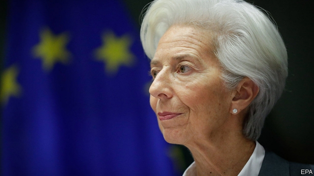

###### Green envy

# The rights and wrongs of central-bank greenery 

 

> print-edition iconPrint edition | Leaders | Dec 14th 2019 

MOST GOVERNMENTS are criticised for failing to do enough about climate change. Much rarer is the public body that is doing too much. Yet central banks, the institutions whose job it is to control inflation, tame the economic cycle and police the financial system, are in danger of falling into this lonely category. Since the global financial crisis, their power in pursuit of those limited economic goals has grown substantially. Now they face pressure to wield it in order to save the planet. 

Many are keen to rise to the challenge (see article). A global network of central bankers, led by those in Britain, France and the Netherlands, is working on standardised methods for incorporating climate risks into the stress-tests that banks must pass. Some insurers have already been put through their paces. China’s central bank has zealously promoted a new market in green—or at least greenish—bonds. Christine Lagarde, the new president of the European Central Bank (ECB), has declared that climate change should be a “mission-critical” priority for the institution. She wants to study whether the bank should tilt its bond-buying programme away from polluters’ debt—a policy dubbed “green quantitative easing” (or “green QE”). Europe’s regulators are also considering whether to give an easy ride to loans made to green projects. 

Some of what central banks have done so far is welcome. But too much greenery risks politicising them and compromising their core missions, which work best when politics is at arm’s length. Their leaders should ensure that they stick to tasks for which they were built—and for which they have a democratic mandate. 

Start with what is necessary and good. Climate change does not pose a critical threat to the financial system today. But extreme weather and changes in sea-levels could eventually leave insurers with vast bills and banks with dud loans (such as those secured against properties which end up under water). An imminent risk is a sudden change in climate policy. Were governments to impose a swingeing tax on carbon, many fossil-fuel firms would get into financial trouble, as would firms that depend on dirty inputs. There could be knock-on effects for banks exposed to them. It is within regulators’ remit to study such possibilities. Working out a coherent set of global standards for accounting for climate risk is a starting-point for such a task. 

 

Unfortunately this agenda could spread into something less desirable, particularly in Europe, which has just set out new climate targets (see article). It is easy to see the temptation of such policies as green QE. Pushing up the cost of capital that dirty firms pay could have a similar effect to a carbon tax, the holy grail of environmental policies. Firms that can cut emissions easily would do so to avoid the penalty. It might be attractive to outsource a politically risky policy to technocrats. 

Yet green QE and schemes like it are misguided, for three reasons. First, central banks lack a democratic mandate to deter emissions. True, climate policy could affect the economy—but so do all kinds of things, such as unemployment benefits, with which central banks would never dream of interfering. This is also true for other catastrophic risks: a pandemic that killed lots of workers would have huge economic implications, but nobody thinks central banks should incentivise medical research. And policies to avert global warming also redistribute wealth. That is why proposals for a carbon tax are typically paired with some sort of compensation for the losers—something that is far beyond central banks’ remit today. 

Second, green QE would be inferior to a carbon tax. The size of the cost-of-capital advantage it gave green firms would vary with the quantity of bonds the central bank was buying. Because QE is a tool designed to stimulate the economy, that volume depends on unemployment and inflation. Why should the incentive to be green vary with the economic cycle? 

Third, even if it carried democratic legitimacy, the expansion of central banks’ goals beyond their core remit would be unwise. Power is delegated to technocrats precisely because they are supposed to be neutral and can be easily held accountable against narrowly defined targets. But if it becomes normal for them to tilt capital allocation in a desirable direction, why stop at climate change? The left would leap at the chance to penalise companies that are deemed too ruthless or which have pay structures that offend. Populists might want central banks to favour firms that invest at home and buy local. The more politicised central banks became, the less they would be perceived as independent authorities on economic policy. 

If governments want to penalise polluters they can do so directly with taxes, or by empowering new environmental bodies. There is no need to muddy the waters over the responsibilities of central banks. And the banks themselves should resist the perennial temptation to expand their territories. ■ 

