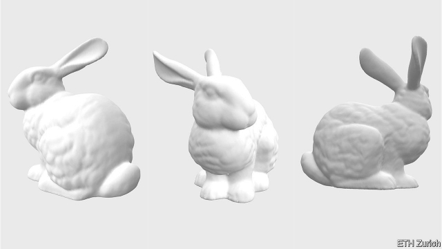

###### Data storage

# DNA could be used to embed useful information into everyday objects 

 

> print-edition iconPrint edition | Science and technology | Dec 14th 2019 

A HARD DRIVE is a miracle of modern technology. For $50 anyone can buy a machine that can comfortably store the contents of, say, the Bodleian Library in Oxford as a series of tiny magnetic ripples on a spinning disk of cobalt alloy. But, as is often the case, natural selection knocks humanity’s best efforts into a cocked hat. DNA, the information-storage technology preferred by biology, can cram up to 215 petabytes of data into a single gram. That is 10m times what the best modern hard drives can manage. 

And DNA storage is robust. While hard-drive warranties rarely exceed five years, DNA is routinely recovered from bones that are thousands of years old (the record stands at 700,000 years, for a genome belonging to an ancestor of the modern horse). For those reasons, technologists have long wondered whether DNA could be harnessed to store data commercially. Archival storage is one idea, for it minimises DNA’s disadvantages—which are that, compared with hard drives, reading and writing it is fiddly and slow. 

Now, though, a team led by Yaniv Erlich of Erlich Lab, an Israeli company, and Robert Grass, a chemist at the Swiss Federal Institute of Technology, in Zurich, have had another idea. As they describe in a paper in Nature Biotechnology, they want to use DNA data storage to give all manner of ordinary objects a memory of their own. 

The researchers describe a test run in which they encoded the Stanford bunny—a standard test image in computer graphics—into chunks of DNA. Those chunks were then given a protective sheath of silica nanoparticles. That served to protect them for the next stage, in which they were mixed with plastic and used as feedstock in a 3D printer, which printed a model of the bunny. The result was an object that contained, encoded throughout its structure, the blueprints necessary to produce more copies of itself. By clipping a tiny fragment of plastic from the finished bunny’s ear and running the DNA within through a sequencer, the researchers were able to recover those blueprints and use them to make further generations of DNA-infused bunnies. 

Satisfied with their proof of concept, they then repeated the trick by encoding a short video in DNA and fusing it in plexiglass, a transparent plastic. They used the plexiglass to make a lens for a pair of spectacles. Once again, clipping a tiny sliver from the lens and dissolving the plastic away was able to liberate the DNA, which could be used to recover the video. 

The cost of both producing and reading DNA is falling precipitously. The price of reading a million letters of the genetic alphabet has fallen roughly a million-fold since the start of the millennium. For that reason, Drs Erlich and Grass hope their idea might one day have all sorts of uses. One, they think, could be to embed relevant information into manufactured goods. They give the example of custom-fitted medical implants that contain a patient’s medical records and the precise measurements needed to make another implant. 

A second use, for the privacy-minded, could be steganography—the art of concealing information within something apparently innocuous (this was the idea behind the DNA-infused spectacles). Their most futuristic idea is an entire world full of objects which, like biological life, contain all the information needed to make copies of themselves in every part of their structure. Drs Erlich and Grass have dubbed their technology the “DNA of things”, and it is certainly a clever idea. But the next job might be to come up with a snappier name. ■ 

