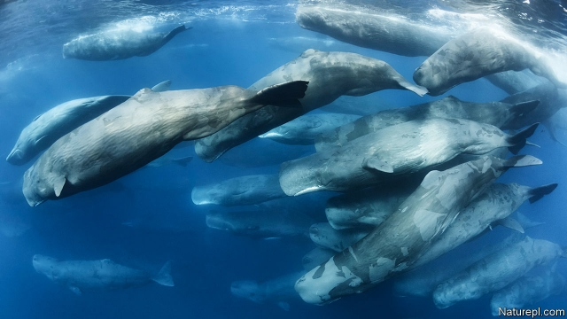

###### Evolution

# How cetaceans got so large 

 

> print-edition iconPrint edition | Science and technology | Dec 14th 2019 

WHY ARE whales so big? One answer is simply that they can be. The size of land animals is constrained in part by their need to support themselves against the force of gravity. Marine creatures have that support provided free, by the medium they live in. Even so, what is possible is not always sensible. Resources put into growth are unavailable for reproduction. Given that whales can and do become big, however, a second question arises: what, if anything, stops them being even bigger? Jeremy Goldbogen of Stanford University and his colleagues suspect that the answers to both questions are related to the animals’ food supply. And, as they describe in a paper in Science, they have gathered data that illuminate how this might work. 

Broadly, big whales come in two varieties. Toothed whales, such as sperm whales (pictured above), hunt individual prey. Baleen whales suck in mouthfuls of water and extract small organisms such as krill, using fibrous buccal filters. The biggest whales of all (blue, humpback and so on) are baleen whales. This might be viewed as paradoxical, because on land, as predators get bigger, so do their individual prey. 

Both toothed and baleen whales often hunt by diving deep—prey being more abundant at depth. To do this they have to hold their breath, which limits how long they can stay underwater. One explanation of giantism in whales is that because bigger whales can hold their breath longer, they can spend more time hunting. But that will only hold good as long as the extra time is spent productively. 

Dr Goldbogen and his team attached water-and-pressure-proof data-recording tags to a range of both toothed and baleen cetaceans, to see what they got up to on their hunting dives. In particular, accelerometers in the tags could record the sudden changes of speed, such as lunging movements, that are associated with predatory behaviours. 

Counting whale hunts per dive in this way, and knowing from previous studies what types of prey particular cetaceans favour, the researchers were able to work out the feeding efficiencies—energy in versus energy out—of the two sorts of whale. Toothed whales, they found, are living on the edge, size-wise. The number of individual prey they are able to chase and capture in a single dive is just enough to sustain animals of their size. By contrast, the baleen whales the researchers looked at, once they have encountered a shoal of prey, are in nutritional nirvana. A single lunge by a large rorqual, they reckon, can capture ten times as much food as the largest individual prey taken by toothed whales. 

Toothed whales thus do seem to have hit some sort of size limit. Perhaps, though, baleen whales might continue to evolve and get bigger still. The blue whale is, at the moment, the largest animal, extant or extinct, known to have lived. Might its descendants be larger yet?■ 

