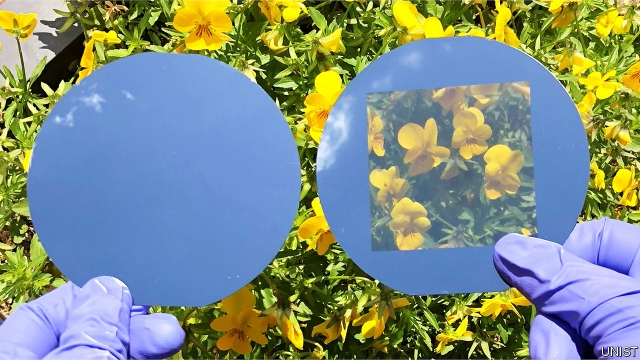

###### Solar powered buildings

# Transparent solar cells could be used to glaze office blocks 

 

> print-edition iconPrint edition | Science and technology | Dec 14th 2019 

OVER THE past few decades, photovoltaic cells have gone from being exotic and expensive power-packs for satellites and similar high-end applications to quotidian generating equipment for grid-scale power stations. One area where they have not yet fulfilled their potential, though, is as local sources of electricity to keep office buildings and the like supplied with energy. The main reason is that no one has a good answer to the question: where do you put them? Roof-top cells can power a one- or two-storey house. They will not power an office block. You could array them on the walls. But office blocks tend to have high window-to-wall ratios and to be governed, for fire-safety reasons, by strict rules on wall cladding. 

What is left is to replace the windows themselves with solar cells. Unfortunately, commercially available solar cells are opaque to the point of blackness. But Seo Kwanyong of the Ulsan National Institute of Science and Technology, in South Korea, plans to do something about that. As he and his colleagues report this week in Joule, they have created solar cells that are as transparent as tinted glass. 

Dr Seo’s approach is, in retrospect, blindingly obvious. It is to punch—or, rather, etch—holes in the material of which a cell is made, in order to let light through. Getting the size and layout of the holes right, though, proved tricky. 

Commercial solar cells are made from wafers of silicon. Dr Seo and his colleagues worked with sheets of the stuff that were 200 microns thick—the sort of thickness employed commercially. The holes they etched were 90-100 microns across, a diameter calculated to be the minimum needed to permit the passage of visible light without creating awkward diffraction effects that would distort what was seen through the wafer. 

Despite this precaution, their first efforts still suffered from strange colours and opaque regions caused by diffraction and consequent interference patterns. But these turned out to be a result of the random spacing and arrangement of the holes, rather than their size. Tweaking the etching process so that it produced holes which were regularly rather than randomly arrayed abolished these distortions and resulted in a material that was evenly transparent and which generated no chromatic aberration. And, crucially, when wired up as a photovoltaic cell it did indeed produce electric current. 

Clearly, there is a trade-off between the transparency of a wafer and the amount of light that can be harvested for electricity generation. By adjusting the spacing of the holes, the team were able to make wafers with transmittances of between 20% and 50% of incident light. Commercial tinted and coated glass generally has a transmittance of between 30% and 70%. 

Wiring up a wafer with 20% transmittance created a device with an efficiency of 12.2%. That compares with 20% for the best commercial cells, but is not negligible. So, though 20% transmittance is a bit on the dark side for office-window glass, what Dr Seo and his colleagues have created is a prototype that is within shouting distance of numbers that might make it commercially viable. Clearly, it would cost more than standard window glass. But, unlike window glass, it would pay back its cost in free electric current.■ 

