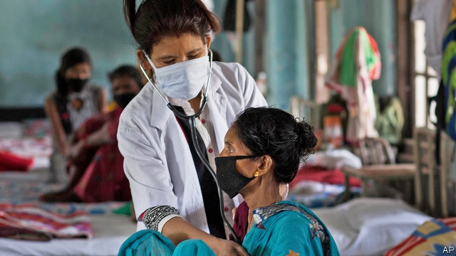
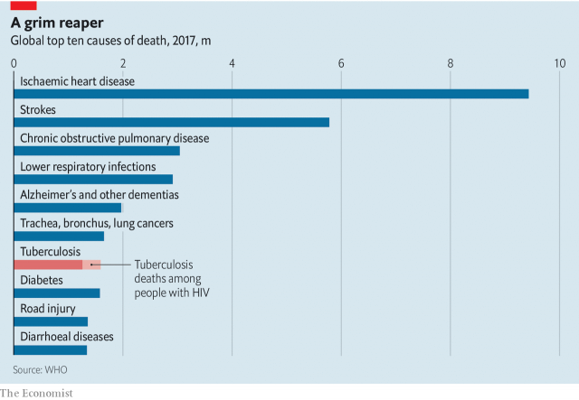
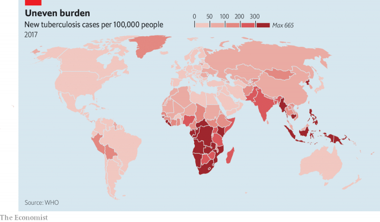

###### Fighting tuberculosis

# Tuberculosis kills more people than any other pathogenic illness 

 

> print-edition iconPrint edition | Science and technology | Dec 14th 2019 

IN 1882, WHEN Robert Koch discovered Mycobacterium tuberculosis, the microbe that causes tuberculosis, the disease caused one in seven deaths in America and Europe. Transmitted through droplets from coughs, sneezes or just talking, tuberculosis felled rich and poor alike. In the century that followed, TB (as the illness is called for short) beat a retreat thanks to antibiotics and a vaccine that protected infants. By the 1990s wiping it out completely seemed tantalisingly within reach. 

Since then, however, progress has been glacial. New cases are falling by just 1-2% a year. Today, M. tuberculosis kills more people than any other single pathogen (see chart). The World Health Organisation (WHO) estimates that 10m people fall ill with it each year and 1.5m die. This is more than three times the number of those who succumb to malaria. A recent wave of scientific breakthroughs is, though, starting to bear fruit, and there is now widespread optimism that things will change dramatically over the next decade. “It is the first year in which we have some hope,” says Lucica Ditiu, head of the Stop TB Partnership, a global alliance of antituberculosis organisations. 

 

Realising that hope will need money, however. And on December 10th, at a meeting in Jakarta, Indonesia, the partnership published an estimate of how much. The goal, set by the UN in 2018, is to end tuberculosis by 2030. To have any hope of that, the partnership says, will require $15.6bn a year to be spent over the next five years. This is a doubling of the annual treatment and prevention budget to $13bn, and a tripling of the R&D budget to $2.6bn a year. 

One reason TB has been hard to crack is that M. tuberculosis has an unusual life cycle. When someone inhales the bug it is either killed by the immune system right away or takes up residence in the lungs. Instead of causing immediate symptoms, though, it usually remains dormant—a state called latent infection that is not contagious. About a quarter of the world’s population has such latent TB. But only about 10% of those so infected ever go on to develop symptoms. Often, those who do have weakened immune systems. People infected with HIV are at particular risk (about 40% of deaths among HIV-positive individuals are caused by TB). Others with higher than average risk of becoming symptomatic are the malnourished, smokers and alcoholics. 

Two developments have complicated the fight against TB since the 1990s. One is the spread of HIV. The other is the emergence of antibiotic-resistant strains of M. tuberculosis. Nearly 500,000 of 2018’s new cases were untreatable with standard first-line drugs. And 6% of those cases are classed as extensively drug-resistant—meaning that few or no drugs work for them. Drug-resistant TB has taken a particularly strong hold in Russia and other former communist countries, where it accounts for roughly one in five new cases. 

At the moment, the standard treatment for drug-resistant TB involves taking highly toxic medicaments for as long as two years. A patient may have to swallow as many as 20 pills a day, and receive injections with nasty side-effects, such as permanent deafness. Even this regime, however, has a cure rate of only 25-50%. But shorter and safer drug combinations tested in recent years are now being introduced. 

They may get shorter still. In August America’s drug regulator approved pretomanid, a medicine developed by the TB Alliance, a non-profit organisation with a research centre in South Africa’s capital, Pretoria, after which the drug is named. Used in combination with other drugs, pretomanid shortens treatment of the most drug-resistant forms of TB to just six months, with an 89% success rate and no injections. Trials are now under way to check whether simpler regimens that include pretomanid can work for strains of TB that are resistant to fewer of the standard drugs. 

Treating those who fall ill promptly is crucial to preventing the spread of M. tuberculosis. Someone with active TB may, according to the WHO, infect as many as 15 others in the course of a year. But, the WHO reckons, roughly a third of new cases in 2018 went undiagnosed. That is partly because the most widely employed diagnostic method today remains the one Koch himself used: examining a patient’s sputum under a microscope to look for telltale bacteria. This procedure, which Barry Bloom of Harvard University, a doyen of the field, calls “an embarrassment to science”, detects only about half of active TB cases. And on top of this, the most common test for drug resistance is also ancient: growing a sample in a Petri dish and sprinkling it with antibiotics to check whether they work. This is an exercise that can take up to 12 weeks to provide an answer. 

 

Fancier diagnostic machines that detect M. tuberculosis genes in sputum samples—and can determine whether they are of the drug-resistant variety—have been available for about a decade. These provide results in less than two hours. But at $10 a test they are out of the reach of most health centres in those countries which host the bulk of TB cases. A urine dipstick test for active TB is available, but it works reliably only for people who also have HIV. The pipeline of new tests, however, is packed. According to Stop TB, 18 new diagnostic products may be ready for evaluation by the WHO in 2020. 

Moreover, some of the old-fashioned tools are having a makeover. Diagnosing TB is made trickier by the fact that symptoms, such as a long-lasting cough, often do not present themselves during the early stage of illness. Someone who is seemingly healthy can thus be infecting others. 

Chest X-rays can nab such early-stage TB. Scanning people en masse in places where TB is common is therefore a sensible way to slow down transmission. A promising innovation on that front are mobile x-ray machines in which reading of the scans is delegated to artificial-intelligence technology. Vans containing such machines now roam around Africa and Asia. 

But the hardest problem to crack is predicting who among those with latent TB are likely to become ill—in order to treat them pre-emptively. Research in this area is concentrating on identifying patterns of gene expression in blood cells (which can be retrieved by pinprick) that might appear six months to a year before active TB develops. Those at risk can then be treated, for a single drug taken once a week for three months will clear their latent infection. 

In the end, the biggest hope for beating TB is a new vaccine. The only one now available is BCG (Bacillus Calmette-Guerin), which goes back to 1921. It is effective in preventing the most severe forms of TB in children, such as brain inflammation. But it is unreliable against TB of the lungs—the most common form of the illness in adults. 

Now, a century after the development of BCG, there seems to be light at the end of the vaccine-search tunnel. At least seven candidates are in advanced clinical trials. A particularly promising one, code-named M72/AS01E, has been developed by GlaxoSmithKline, a big drug company. In trials in Africa, the latest results of which were published in October, it was about 50% effective in preventing TB of the lungs in people with latent infection (a group in which no other candidate vaccine has worked). This seemingly low efficacy is in fact good news for a disease that kills so many people a year, says Dr Bloom. 

GlaxoSmithKline has not yet said whether it will proceed with the further trials needed to put M72/AS01E on the market. Who would pay for these is an important question, for the $500m price tag involved is commercially unattractive. The firm says it is in discussions with outside organisations about the matter, and that saying anything more at this stage would “compromise” progress. Observers worry, though, that delay will mean the stockpile of vaccine available for trials will expire—and that creating more will add to costs. Money, as Cicero observed, is the sinews of war, and human beings have been at war with M. tuberculosis for a long time. It does look now, however, as if the weapons needed to bring the conflict to an end are being forged. Whether people have the appetite to pay for them remains to be seen.■ 

Correction (December 12th 2019): The original version of this article suggested that the TB Alliance is based in Pretoria. In fact, that is where it has a research centre. The organisation’s headquarters are in New York. 

