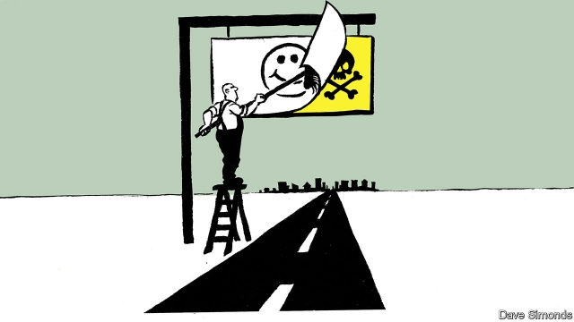

###### Welcome to Toxic Town

# Asbestos, Quebec wants a new name, maybe 

 

> print-edition iconPrint edition | The Americas | Dec 14th 2019 

OLDER RESIDENTS of Asbestos, Quebec remember when the substance for which their town is named was thought to be a miracle material. The furry silicate mineral was woven into textiles and incorporated into building materials so that they would not burn. Kaiser Wilhelm sheltered in a portable asbestos hut during the first world war. During the next one the American armed forces used the stuff to insulate ships, tanks and aircraft and to make fireproof uniforms. Asbestos found its way into cement, pipes, tiles and shingles. The Canadian navy launched a corvette in 1943 called the HCMS Asbestos. “It [would be] a fantastic material if it didn’t kill people,” says Jessica van Horssen, author of “A Town Called Asbestos”, a book about the town and its place in the global industry. 

Now it is known to cause a deadly form of lung cancer. The 2km (1.2-mile) open-pit Jeffrey Mine, once the largest asbestos mine in the world, shut down in 2012. It remains the most visible feature of the landscape near Asbestos. The town’s 5,000 inhabitants are now considering whether to change its name. That might make it easier to attract investment. 

Hugues Grimard, the mayor, says prospective investors treat councillors as if they had a contagious disease. Some even refuse to take their business cards. He believes that a new name is a matter of life and death for the town, which has lost half its population since the peak of asbestos production. The town council voted in favour in late November. 

Yet Mr Grimard expects resistance at a town-hall meeting with residents scheduled for January 9th. His predecessor suggested a couple of new names in 2006 (Trois-Lacs, which means Three Lakes, and Phoenix). Instead, residents changed the mayor. “It’s an emotional subject,” says Mr Grimard. “People are attached to the name because of our heritage and history.” 

Canada is more attached to asbestos than most countries. The Canadian Cancer Society did not call for a ban on the carcinogen until 2007, when a third of workplace deaths were caused by asbestos. Canada itself promoted the export of “safe” Quebec asbestos until the early 2010s, when it finally admitted that any use of the material is hazardous. The federal government did not ban asbestos products until 2018. Now the world’s biggest asbestos mine is Asbest, in Russia’s Ural mountains. 

It may help Mr Grimard’s cause that townspeople’s memories of work in the mine are less vivid, says Ms van Horssen. Other Canadian towns have changed their names to improve their image. The inhabitants of Berlin, Ontario, whose heritage is largely German, decided during the first world war to call the town Kitchener, after Lord Kitchener, the British field-marshal and secretary of war whose face appeared on recruiting posters. By contrast the 500 residents of Swastika, Ontario held fast to the name despite Adolf Hitler’s appropriation of the Hindu symbol of good luck. They had it first, the locals reasoned. It may have helped that the Swastika mine, after which the town was named, produced gold, not asbestos. ■ 

