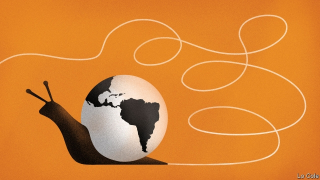

###### Bello

# Latin America’s second “lost decade” is not as bad as the first 

 

> print-edition iconPrint edition | The Americas | Dec 14th 2019 

THINK BACK to the start of 2010, when Latin America was awash with optimism. The region rode out the global financial crisis with only a brief economic dip and no damage to its banks. In Brazil Luiz Inácio Lula da Silva, preparing to step down after eight years as president with an approval rating of 75%, proclaimed that his country had shed its inferiority complex. The commodity boom had lifted tens of millions of people out of poverty. The 2010s, declared Luis Alberto Moreno of the Inter-American Development Bank, would be “the Latin American decade”. 

As these years come to an end, Latin Americans might think that they turned out to be a “low dishonest decade”, to echo W.H. Auden’s description of the 1930s. It started with a bang, with economic growth of 5.9% for the region in 2010, which quickly became a long whimper. Since 2013 growth has averaged 0.8%, meaning that income per person has fallen slightly. The UN estimates that 31% of Latin Americans are poor, the same share as in 2010. Income inequality is continuing to fall, but much more slowly than it did before 2014. Then there are political discontents. Polls show that Latin Americans see their politicians as corrupt and cynical. More than a quarter would like to emigrate, according to Gallup, a polling firm. Popular anger has exploded in street protests in half a dozen countries. 

No wonder that the 2010s are starting to be dubbed a “second lost decade” for Latin America. Yet a comparison with the 1980s, the original lost decade, is instructive. In 1982-83 debt defaults ricocheted around the region. This led to years of hyperinflation and austerity. By 1990 income per person was still 5% smaller than in 1981, the poverty rate had risen from 35% to 41% and in real terms the minimum wage was only two-thirds of its previous level. Politically, the 1980s were traumatic. Guerrilla wars raged in Central America, Colombia and Peru, while dictators were still in charge and human-rights abuses the norm in many places for much of the decade. 

Out of the woes of the 1980s, a better Latin America was born. Out went statism and protectionism and in came the market-oriented Washington Consensus. With all its faults (a certain dogmatism, privatisation without competition policy and a tendency for countries to have overvalued exchange rates) and omissions (an initial neglect of social safety-nets) it put the region on a more viable course. The pro-market shift coincided with a democratic wave that swept away the dictators, all except the Castros in Cuba. Social spending went on to rise, as did people’s access to education. 

In the 1980s almost all countries suffered slumps. In the 2010s the pain has been concentrated in Venezuela, Brazil and Argentina, where governments made macroeconomic mistakes. Elsewhere, policies are much sounder than in the 1980s. Except in Argentina and Venezuela debt is manageable. Despite the aberrations of Venezuela and Nicaragua (as well as Cuba), democracy has shown resilience. Amid recession, Argentina this week saw an exemplary transfer of power between political adversaries. 

In sum, the 2010s have seen stagnation, rather than a repeat of the cataclysm of the 1980s. None of this is to minimise Latin America’s plight. It has to find ways to return to growth in a world where the economy is expanding more slowly, while taking bolder steps to reduce the inequality that has scarred it since long before the 1980s. In the decade that is starting, it must deal with a demographic shift in which the workforce will grow more slowly than the population. In countries where farming and fishing are still important, it will have to cope with climate change. It must strengthen the rule of law and rebuild trust in democratic politics. 

Perhaps the biggest losses in the 2010s were intangible. Latin American politics no longer has heroes. In the 1980s, to take two examples, Raúl Alfonsín in Argentina put military dictators on trial and Luis Carlos Galán in Colombia defied drug barons, paying with his life. It is hard to think of any equivalents today. Lula, who might have been one, is tarnished by corruption cases. And there is a yawning deficit of new ideas. The brain-dead antagonism between “neoliberalism” (usually undefined) and leftist populism still looms far too large in academic debate about the region. Latin America needs both competitive markets and more effective states that redistribute better. In other words, it needs a new social contract for a new decade. 

