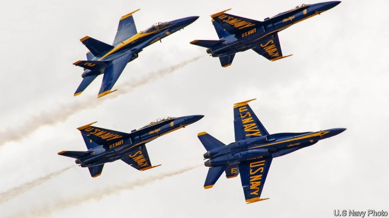

###### Friendly fire

# A shooting puts the spotlight on military training for allies 

 

> print-edition iconPrint edition | United States | Dec 14th 2019 

MOHAMMAD AL-SHAMRANI was at Naval Air Station Pensacola in Florida to hone his flying skills. On December 6th the Saudi Arabian pilot turned his gun on his hosts, shooting 11 people and killing three. That has put a spotlight on the 5,181 foreign students from 153 countries currently receiving military training in America. In fiscal 2017-18 foreign governments splashed out $462.4m for American security training, and the American government chipped in another $39.8m. The main exchange programme is the $115m International Military Education and Training scheme, funded by the State Department. It includes 4,000 courses across 150 American military schools. 

Such programmes have two aims. One is to improve foreign armed forces—“ideally in a manner that contributes to the development of a professional, apolitical military that respects civilian authority,” says Walter Ladwig of King’s College London. The other is to cultivate upwardly-mobile officers, who are likely to wind up as generals and admirals. “This might mean co-operation in a future crisis or a willingness to grant the US access to bases or overflight rights,” says Mr Ladwig. 

There is no doubt that America gains powerful friends. Between 1957 and 1994, 19% of international graduates from the US Naval Command College ended up leading their service. In April the US Army Command and Staff College inducted three alumni into its hall of fame: the current army or military chiefs of Argentina, India and Jamaica. More than 280 of the college’s 8,000 foreign graduates have gone on to lead their countries’ armed forces, and 15 have become heads of state or government. 

It is less clear whether the quality of soldiering goes up. Countries are supposed to send their best and brightest, but are often less exacting. “There were always comedy/horror stories floating around about the African militaries who sent personnel on US-funded diving courses who couldn’t swim,” recalls someone involved with counter-terror training. In May the Pentagon cancelled a training programme for Afghan pilots after 48% of trainees deserted. 

Critics also complain that American training simply boosts the repressive capacity of tyrannical governments. Saudi Arabia sent 1,652 students in fiscal 2019, more than any other country. Among other ruling despots, Abdel-Fattah al-Sisi, Egypt’s dictator, attended the US Army War College in 2005-06 (his thesis was aptly titled “Democracy in the Middle East”). 

In fact, the long-term political impact may be more positive. A paper by Carol Atkinson in International Studies Quarterly in 2006 found that military-to-military contacts with America between 1972 and 2000 were “positively and systematically associated with liberalising trends.” But it may be a dicey journey. In countries with weak civilian institutions, training talented and ambitious officers can skew the balance of power by making armies stronger and more cohesive—but not necessarily apolitical. Another study by Jesse Dillon Savage of Trinity College Dublin and Jonathan Caverley of the US Naval War College shows that American training doubled the risk of a military-backed coup between 1970 and 2009. In other words, America’s military protégés have usually posed more of a threat to those who sent them than those who train them.■ 

