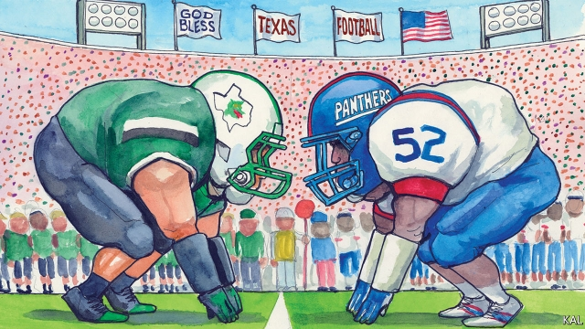

###### Lexington

# In praise of high-school football 

 

> print-edition iconPrint edition | United States | Dec 14th 2019 

AN HOUR BEFORE game-time, the vast parking lot outside the McKinney Independent School district stadium was almost full. But there was no end to the cars and trucks queuing outside it. They were backed up along the three-lane highway from Dallas—with the green flag of the Southlake Carroll Dragons hanging limply from the windows of many of the bigger, plusher ones. A smaller number displayed the purple of the Duncanville Panthers. 

Representing one of the richest towns in the Dallas-Forth Worth area, the Dragons were reckoned to be one of the best high-school football teams in Texas. The Panthers, representing one of the poorest towns, might be the best in America. Both had ended the regular season unbeaten, 13-0. The quarter-final of the Texas State Championship, a high-school contest followed as avidly as almost any professional league, promised to be an epic encounter. 

It was a pity, tailgaters in the parking lot agreed, that the game had been shunted from the Dallas Cowboys’ 100,000-seat stadium. Not that the McKinney facility was too shabby for schoolboys. A spanking new 12,000-seater, with a verdant turf pitch and 55-foot jumbotron, it had cost the local school board $70m. That was slightly more than the 18,000-seat palace in neighbouring Allen district had cost—which was no coincidence. Whereas the most athletic Texan youths pour their competitive spirit into football, Texan school administrators put theirs into building big stadiums. Local media call this the “schools’ stadium arms race”. The McKinney one, though bigger and more opulent than almost any high school facility outside America, is the 32nd-biggest in Texas. Together the state’s high-school stadiums can seat over 4.3m people. 

Sure enough, when the game began there was standing room only on the Dragons’ side of the stadium, and few empty seats on the Panthers’ side. This promised match-day revenue of around $130,000 (not counting advertising). It also made for a lot of noise. As the Dragons’ 60-strong squad ran out in their jade green shirts and black breeches, their half of the stadium erupted, egged on by over 400 cavorting cheerleaders and marching bandsmen. What the Panthers’ supporters lacked in numbers by comparison, they made up for with raucous confidence. Their best players, such as quarterback Ja’Quinden Jackson, are already household names in Texas. Even fans with little connection to the school shouted their names. Compared with the National Football League, said some amid the clamour, a big high-school game like this “was so much better”, “more enjoyable”, “more important”. 

Nothing in American sport is quirkier than this fervour for high-school football. Even an average Texan school team draws a couple of thousand spectators, and the best—such as Permian High School, subject of H.G. Bissinger’s bestselling “Friday Night Lights”—are fabled. “It’s just a Texas thing, how it’s bred here,” said a man wearing a green Santa hat from the Dragons’ online store. 

Yet the occasion also offered clues to what sustains this tradition. Above all, a yearning for local communion and champions that America’s hyper-commercialised franchises cannot satisfy. The Dallas Cowboys, perhaps the most popular team in the country, are godlike in their remoteness. For a poor town like Duncanville, by contrast, the school team is the main repository of youthful hope, parental pride and a general fear of anonymity. “You gotta support your neighbourhood, that’s what makes this better than the NFL,” said a Panthers’ fan gripped by his team’s strong start, including two touchdowns—one thrown, one run—for Jackson. 

Such passions are matched by the quasi-professional intensity of the Duncanville school’s football programme. Its 270 players practise for a couple of hours a day, year-round. Weightlifting and fitness work consume additional hours—and calories. The school provides its footballers, almost half of whom are from poor families, with nutritious food, rides to school and extra tutoring. (When Lexington asked Jackson how much of each day he spent on football—to the young star’s surprise, as TV crews and sports reporters crowded around him—he said: “Most of it, actually…”) 

Such intensity encourages more dubious practices than outsized stadiums. Illicit recruitment of athletes from neighbouring school districts is said to be rife. Yet the resulting excellence is astonishing. Teams like the Dragons and Panthers rarely drop a routine pass. And to see players such as Jackson run with the ball is alone worth the ticket money. One of the fastest athletes in America, he completed a thrilling 49-35 victory for the Panthers with a total of 312 yards and five touchdowns. In all, around a quarter of the Duncanville team can expect to win a college football scholarship. 

That represents a potentially life-changing opportunity. “Their future is really structured around how well they do in sport,” said the Panthers’ revered coach, Reginald Samples. “We don’t shoot for pro football, we shoot for careers—you know, being good people who are able to get a professional job and look after their families.” 

Among Panthers fans, an appreciation of how high the stakes are for the players is part of the drama. “They’re trying to make it,” said one, when asked to explain his enthusiasm. Inevitably, too, an awareness that their opponents at the McKinney stadium had a wider array of options was another element. The Panthers were mostly black with a few Hispanics; the Dragons were whiter than a Republican-rally crowd. Accentuating the contrast, they had also dyed their hair blonde for the play-offs—they looked like a Viking horde. Asked during the game whether such a stark racial division added spice to the contest, one Panther nodded: “It surely does.” 

How could it not? For all its great unifying power—the shared hopes and sorrows that flow through it—popular sport always reflects a society’s frictions and imbalances. And the more engrossing the sporting spectacle, the more powerful is that sociopolitical one. Top high-school football, a relentless quest for excellence mottled by local circumstances, is in this sense sport at its best.■ 

