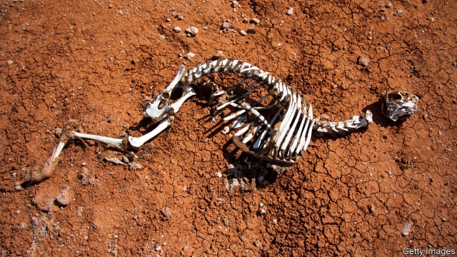

###### Roo pall

# An Australian drought is killing millions of kangaroos 

 

> print-edition iconPrint edition | Asia | Dec 18th 2019 

WELL BEFORE the current spate of bushfires started ravaging eastern Australia, they were already dying in droves. Lachlan Gall has seen “several thousand” kangaroo corpses splayed under trees or bogged in the mud of dried-out reservoirs on his 54,000 hectares (134,000 acres) in outback New South Wales. “It’s distressing for the animals,” he says. “And it’s distressing for us to see.” Across Australia’s most populous state, at least 5m kangaroos are thought to have died gruesome deaths since one of the country’s worst droughts began nearly four years ago. The crisis has prompted calls for changes to how Australia manages a national emblem. 

“Roos” once shared the landscape only with Aboriginals, who hunted them for food and revered them in rock art. The arrival of white settlers, and their sheep and cattle, sparked a competition for space and resources that remains unresolved. Aerial surveys indicate Australia has more than 40m kangaroos, nearly twice the number of humans. That marks a decline of about 16m in recent years, largely due to drought. Rangelands in eastern Australia, home to millions of kangaroos, have just had their driest three-year period on record. On a recent drive Geoff Wise, a veterinarian from Dubbo, says he spotted a kangaroo dead of hunger or thirst or killed by a passing vehicle roughly every 200 metres. 

Mr Wise chairs a body that recently convened a symposium about managing the kangaroo population better. State governments allow “commercial harvesting” of four kangaroo species for meat and hides. The kangaroo industry contributes about A$250m ($170m) a year to Australia’s economy. George Wilson of the Australian National University reckons it could be more if farmers could see kangaroos as livestock, not as competitors for the grass and water consumed by cattle and sheep. Expanding the industry this way would bring better controls over roos’ welfare, and help the environment. Kangaroos can survive on about 1.5 litres of water a day, a fraction of what cattle and sheep consume. They emit far less methane, a greenhouse gas, than cattle and sheep do. And their meat has less fat and more protein than beef or lamb. 

The states typically permit licensed professionals to kill up to 15% of the total kangaroo population. Last year, for instance, the limit across the four states with the biggest number of roos was set at 7m. But for some time, the kangaroo cullers have used only a fraction of their quotas, sometimes killing just 3.5% of the population. That is because demand for kangaroo meat and hides has been falling. A campaign by animal-rights activists prompted California, once a big market, to halt imports three years ago. Mr Wilson says this has made skins “worthless”, without bringing any improvement in kangaroo welfare. 

Sussan Ley, the federal environment minister, attended Mr Wise’s symposium and tut-tutted about the problem. Farmers complain that the federal government and the states are shirking responsibility for animal welfare. As Mr Gall notes, there is “inherent animal cruelty in allowing drought to be the main population management tool for kangaroos”. ■ 

